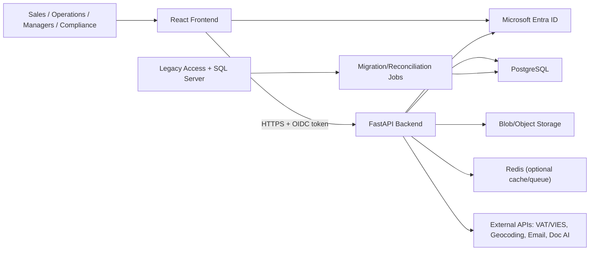
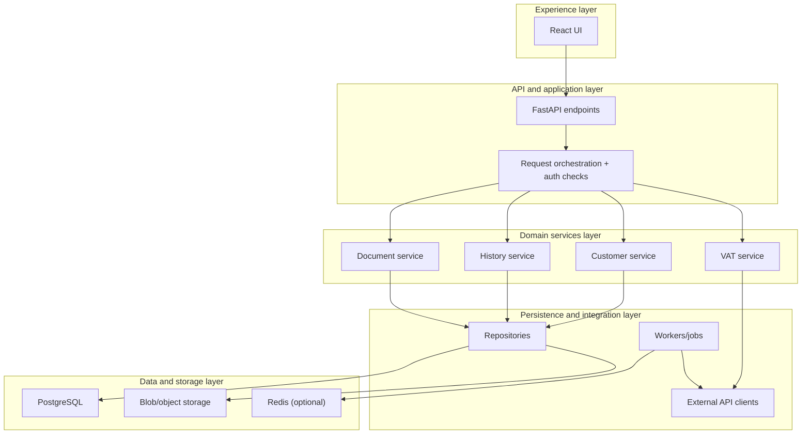
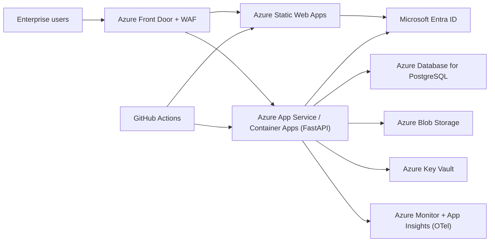
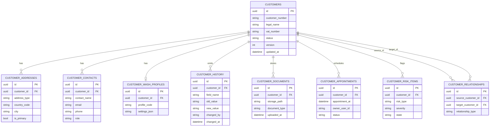
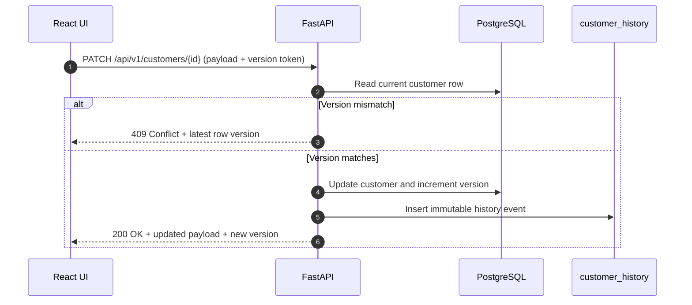

# DEMA Digital Core — Enterprise High-Level Design (HLD)

**Version:** 2.0  
**Status:** Proposed enterprise target-state HLD  
**Primary target:** Azure-first, Python backend, React frontend, PostgreSQL, enterprise governance  
**Current temporary hosting:** Vercel (frontend) + Render (backend) for demos/non-production  
**Legacy context:** Microsoft Access UI + legacy SQL Server / transitional customer blob state  

## 1. Executive architecture decisions
### 1.1 North-star product definition
DEMA is an enterprise operations platform that modernizes legacy customer and operational workflows into:
- a browser-based React application
- a Python service layer
- a governed operational data platform
- a documented, auditable, extensible foundation for future AI

### 1.2 Primary architectural decision
DEMA will be built as an Azure-first modular monolith, not as early microservices.

### 1.3 Target stack
- Frontend: React 18 + TypeScript + Vite
- Backend: Python 3.12+ + FastAPI + Pydantic v2 + SQLAlchemy 2.0
- Database: PostgreSQL 15+
- Migrations: Alembic
- Identity: Microsoft Entra ID (production), local/demo auth only for non-production transitional use
- Files: Object storage / Blob storage
- Cache/queue: Redis where justified
- Observability: OpenTelemetry + centralized logs/metrics/traces
- CI/CD: GitHub Actions
- Infrastructure: Azure landing-zone aligned deployment
- Temporary non-prod demos: Vercel + Render allowed until production cutover

### 1.4 Enterprise principles
1. Business rules are authoritative in backend services and data constraints, not only in the browser.
2. Legacy modernization is incremental and reversible.
3. Security, auditability, and data classification are first-class architecture concerns.
4. Documentation is part of delivery, not a later activity.
5. AI is additive, server-side, governed, and never a substitute for system design.

### 1.5 Architecture decision matrix
| Decision area | Selected option | Why this is needed for DEMA | Alternatives considered |
|---|---|---|---|
| Service style | Modular monolith | Faster delivery with clear domain boundaries and lower operational overhead in early phases | Early microservices |
| Cloud strategy | Azure-first production target | Aligns with enterprise IAM, security controls, and long-term operating model | Multi-cloud from day one |
| Frontend | React + TypeScript | Strong developer velocity with type safety and scalable component architecture | Server-rendered only UI |
| Backend | FastAPI + Python | High productivity, strong API tooling, good fit for data-heavy orchestration and AI adapters | Node-only backend stack |
| Primary database | PostgreSQL | Relational integrity, mature tooling, strong transactional consistency | NoSQL-first core store |
| Identity | Microsoft Entra ID | Enterprise SSO, centralized access governance, conditional access support | Custom auth in production |
| Delivery path | Incremental strangler migration | Reduces migration risk and allows reversible cutovers by domain | Big-bang rewrite |

## 2. Business scope and system intent
### 2.1 Primary business domains
The initial DEMA scope includes:
- customer master data and customer 360 workflows
- VAT/VIES validation and enrichment
- customer history and audit trail
- customer relationships
- appointments
- documents/attachments
- risk and compliance indicators
- wash profile / operational extensions

### 2.2 What this HLD covers
This HLD defines:
- target-state architecture
- cloud and environment model
- application structure
- security and governance model
- migration model from legacy
- data architecture
- delivery phases and release controls
- AI-ready foundation

## 3. Enterprise architecture goals and NFRs
### 3.1 Core non-functional requirements
Production target NFRs:
- Availability target for core customer workflows: 99.9% monthly
- RPO target: 15 minutes
- RTO target: 4 hours
- p95 API latency for standard CRUD/list/search operations: < 500 ms
- p95 latency for heavier reads / composed detail views: < 1200 ms
- Every customer mutation must be auditable
- No silent lost updates in shared edit mode
- All production secrets must live in managed secret stores

### 3.2 NFR measurement matrix
| NFR | Target | How measured | Primary owner |
|---|---|---|---|
| Availability | 99.9% monthly | Synthetic health probes + uptime dashboard | Platform/DevOps |
| Recovery point objective (RPO) | 15 minutes | Backup/replication lag checks and restore drill logs | Platform/DBA |
| Recovery time objective (RTO) | 4 hours | Incident simulation and recovery playbook timing | Platform + Operations |
| API latency (p95 standard operations) | < 500 ms | APM trace percentiles on `/api/v1/*` | Backend |
| API latency (p95 composed/heavy reads) | < 1200 ms | Endpoint-specific percentile dashboards | Backend |
| Audit completeness | 100% of mutations | Reconciliation between writes and `customer_history` events | Backend + Compliance |
| Concurrency protection | 0 silent overwrite defects | Conflict-rate telemetry + test suite assertions | Backend + Frontend |
| Secret governance | 0 production secrets in code/repo | CI secret scan + runtime vault policy checks | Security + DevOps |

## 4. Architecture principles
1. Modular monolith first
2. API-first, UI-second coupling
3. Database-backed source of truth
4. Incremental strangler modernization
5. Cloud foundation before production hardening
6. Identity and audit by default
7. Docs, migrations, and tests are delivery artifacts

## 5. System context
### 5.1 External actors
- Sales users
- Operations users
- Managers / admins
- Finance / compliance roles
- External APIs (VAT/VIES, geocoding, email providers, document AI providers later)
- Legacy data sources during migration
- Identity provider (Microsoft Entra ID)

### 5.2 Core context interactions
The browser application communicates with the Python API over HTTPS.
The Python API owns validation, business rules, persistence, audit generation, integration orchestration, and AI provider interaction.
The operational PostgreSQL database stores authoritative transactional data.
Object storage stores uploaded documents and derived file assets.
Optional background workers handle slow tasks.

### 5.3 System context diagram


### 5.4 External integration matrix
| Integration | Direction | Protocol/mechanism | Business purpose | Failure handling baseline |
|---|---|---|---|---|
| Microsoft Entra ID | Frontend/API <-> external | OIDC/OAuth2 | Enterprise authentication and identity claims | Token validation errors mapped to 401/403 with correlation ID |
| VAT/VIES services | Backend -> external | HTTPS REST | VAT validation and enrichment | Retry with backoff, then mark validation status as deferred |
| Email provider | Backend -> external | HTTPS API/SMTP bridge | Notifications and workflow messaging | Queue retry + dead-letter path |
| Geocoding service | Backend -> external | HTTPS REST | Address normalization and enrichment | Timeout budget + soft-fail fallback |
| Document AI provider (future) | Backend -> external | HTTPS REST | Document extraction/summarization | Feature flag gate + async retry workflow |
| Legacy SQL/Access feeds | Migration jobs -> internal | ETL/import pipelines | Historical migration and reconciliation | Reconciliation report + rollback script per batch |

## 6. Target logical architecture
### 6.1 Layered model
1. Experience layer
2. API and application layer
3. Domain services layer
4. Persistence and integration layer
5. Data and storage layer
6. Observability and security layer
7. Platform/infrastructure layer

### 6.2 Experience layer
Responsibilities:
- browser UI
- customer workflows
- search/filter/sort
- forms and validation hints
- visualization of audit/history
- user-facing conflict handling
- localized UX

### 6.3 API and application layer
Responsibilities:
- REST APIs
- request validation
- authN/authZ
- orchestration
- consistency handling
- transaction boundaries
- response shaping

### 6.4 Domain services layer
Responsibilities:
- customer domain rules
- concurrency checks
- history/audit generation
- relationship logic
- wash profile logic
- VAT orchestration and normalization

### 6.5 Persistence and integration layer
Responsibilities:
- repositories
- SQLAlchemy queries
- file metadata persistence
- outbound API clients
- data import pipelines
- legacy reconciliation logic

### 6.6 Logical architecture diagram


### 6.7 Layer responsibility matrix
| Layer | Owns | Must not own |
|---|---|---|
| Experience | User workflow presentation, form state, localization, conflict prompts | Direct database access or business rule authority |
| API/application | Transport contracts, validation, transaction boundaries, auth enforcement | Rich domain policy persistence logic in endpoint handlers |
| Domain services | Business invariants, rule orchestration, audit trigger decisions | HTTP transport or SQL-specific query composition |
| Persistence/integration | Repository implementations, query tuning, outbound adapters, import connectors | UI concerns or cross-domain policy decisions |
| Data/storage | Durable state, index/constraint integrity, backups | Application business behavior |
| Observability/security | Telemetry standards, policy enforcement, key/secret posture | Business-domain branching logic |

## 7. Cloud and hosting strategy
### 7.1 Strategic decision
Production target is Azure-first.

### 7.2 Temporary deployment
Until production hardening is complete:
- frontend may continue on Vercel
- backend may continue on Render
- this path is for demos, progress visibility, and limited non-production workflows only

### 7.3 Production target topology
Recommended production topology:
- Azure Front Door or equivalent entry point with WAF
- Azure Static Web Apps or static hosting behind Front Door
- Azure App Service or Azure Container Apps for API
- Azure Database for PostgreSQL Flexible Server
- Azure Blob Storage
- Azure Key Vault
- Azure Monitor / Application Insights with OpenTelemetry
- Microsoft Entra ID
- GitHub Actions
- Terraform or Bicep

### 7.4 Environment model
Required environments:
- local
- dev
- test / staging
- prod

### 7.5 Production topology diagram (Azure target)


### 7.6 Environment matrix
| Environment | Purpose | Data policy | Auth mode | Deployment pattern |
|---|---|---|---|---|
| Local | Developer productivity | Synthetic/sample data only | Local/demo auth allowed | Manual run or local compose |
| Dev | Integrated feature validation | Masked or generated data | Entra test tenant preferred | Auto deploy from feature/dev branches |
| Test/Staging | Pre-prod verification and UAT | Production-like but controlled | Entra with role-mapped test users | Promotion from tested build artifacts |
| Prod | Live business operations | Classified production data | Entra production tenant only | Approved release pipeline with rollback plan |

## 8. Landing zone and infrastructure requirements
### 8.1 Enterprise landing-zone requirements
Before production deployment, the platform must provide:
- resource hierarchy / subscription strategy
- identity and access control model
- network design
- private connectivity for DB
- secret and certificate management
- log and metric sinks
- tagging and cost allocation
- policy enforcement
- backup standards
- monitoring and alerting standards

## 9. Identity, access, and security architecture
### 9.1 Authentication
Production:
- Microsoft Entra ID with OIDC/OAuth2

Transitional/demo:
- local demo auth permitted only outside production
- demo auth must be explicitly isolated from enterprise auth code paths

### 9.2 Authorization
Use RBAC first, with optional ABAC expansion later.

### 9.3 Data classification
At minimum classify data as:
- public
- internal
- confidential
- restricted / personal

### 9.4 Secrets and keys
- no secrets in frontend bundles
- no secrets committed to Git
- all prod secrets in Key Vault / managed secret store
- service identities preferred over long-lived shared credentials

### 9.5 Security control matrix
| Control area | Mandatory control | Implementation baseline | Evidence |
|---|---|---|---|
| Authentication | Centralized enterprise SSO | Microsoft Entra ID with OIDC/OAuth2 | Auth flow integration tests + tenant policy docs |
| Authorization | Role-based access control | Backend-enforced RBAC checks per endpoint/service | Endpoint authorization tests + role matrix |
| Secret management | No hardcoded production secrets | Azure Key Vault + managed identities | Secret scanning in CI + vault access logs |
| Data protection | Encryption in transit and at rest | TLS 1.2+ and platform-managed encryption | TLS config checks + cloud policy reports |
| Auditability | Mutation-level history trace | `customer_history` records with actor/time/source | Audit reconciliation reports |
| Threat detection | Operational anomaly detection | Centralized logs/metrics/traces with alerts | Alert dashboards + incident tickets |
| Change governance | Controlled releases | PR approvals + CI gates + release tagging | PR history + pipeline records |

## 10. Data architecture
### 10.1 Primary data stores
- PostgreSQL: authoritative transactional domain store
- Blob/object storage: documents and file assets
- Redis: transient cache / queue state only
- Search/vector capability: optional, not phase-1 critical

### 10.2 Customer domain storage model
Core tables:
- customers
- customer_addresses
- customer_contacts
- customer_wash_profiles
- customer_history
- customer_documents
- customer_relationships
- customer_appointments
- customer_risk_items

### 10.3 Extensibility strategy
Use structured columns for stable fields.
Optional extensibility may use controlled JSONB fields for low-stability metadata, but not as a dumping ground for core business data.

### 10.4 Customer domain entity matrix
| Entity/table | Primary purpose | Key attributes (examples) | Integrity notes |
|---|---|---|---|
| `customers` | Master customer profile | `id`, `customer_number`, `legal_name`, `vat_number`, `status`, `version` | Source-of-truth root aggregate |
| `customer_addresses` | Address lifecycle and localization | `customer_id`, `address_type`, `country_code`, `city`, `is_primary` | One customer to many addresses |
| `customer_contacts` | Contact points and roles | `customer_id`, `contact_name`, `email`, `phone`, `role` | Role and uniqueness rules per customer |
| `customer_wash_profiles` | Wash/business-specific operational settings | `customer_id`, `profile_code`, `settings_json` | One active profile per customer policy |
| `customer_history` | Immutable audit trail | `customer_id`, `field_name`, `old_value`, `new_value`, `changed_by`, `changed_at` | Append-only, never in-place edited |
| `customer_documents` | File metadata and governance | `customer_id`, `storage_path`, `document_type`, `uploaded_by` | File object in blob, metadata in DB |
| `customer_relationships` | Parent/child and partner links | `source_customer_id`, `target_customer_id`, `relationship_type` | Referential integrity for both sides |
| `customer_appointments` | Scheduling and operational tasks | `customer_id`, `appointment_at`, `owner_user_id`, `status` | Time-zone-safe timestamps |
| `customer_risk_items` | Compliance and risk flags | `customer_id`, `risk_type`, `severity`, `state` | Traceable state transitions |

### 10.5 Customer domain ER diagram


## 11. API architecture
### 11.1 API style
- REST over HTTPS
- JSON payloads
- explicit versioning using /api/v1
- OpenAPI spec generated from FastAPI

### 11.2 Standard error shape
```json
{
  "code": "string_machine_code",
  "message": "human_readable_message",
  "details": [
    {
      "field": "optional.field",
      "message": "optional_detail"
    }
  ],
  "correlation_id": "uuid-or-request-id"
}
```

### 11.3 Customer API baseline
Required initial routes:
- GET /api/v1/customers
- GET /api/v1/customers/{id}
- POST /api/v1/customers
- PATCH /api/v1/customers/{id}
- GET /api/v1/customers/{id}/history
- GET /api/v1/customers/{id}/wash-profile
- POST /api/v1/vat/check
- GET /api/v1/health

### 11.4 Customer API route catalog
| Method | Route | Purpose | Auth policy baseline | Notes |
|---|---|---|---|---|
| GET | `/api/v1/customers` | List/search customers | Any authenticated customer-domain reader role | Paginated and filterable |
| GET | `/api/v1/customers/{id}` | Fetch customer detail | Reader role with scope to customer | Includes related aggregates by contract |
| POST | `/api/v1/customers` | Create customer | Editor/admin role | Emits initial audit event |
| PATCH | `/api/v1/customers/{id}` | Update customer | Editor/admin role | Requires concurrency token |
| GET | `/api/v1/customers/{id}/history` | Fetch audit timeline | Compliance/manager/authorized reader | Immutable history stream |
| GET | `/api/v1/customers/{id}/wash-profile` | Fetch wash profile | Reader role | Domain-specific extension |
| POST | `/api/v1/vat/check` | Validate and enrich VAT data | Authenticated internal roles | Integration with external VAT/VIES |
| GET | `/api/v1/health` | Service health endpoint | Internal/public monitoring policy | No sensitive payload |

### 11.5 Concurrency standard
Mutating customer APIs must use optimistic concurrency:
- row version or updated_at token
- stale updates return conflict
- client must handle reload/merge path

### 11.6 Customer update and audit sequence


## 12. Frontend application architecture
### 12.1 Structure
Target structure:
frontend/src/
  app/
  features/
    customers/
      components/
      hooks/
      repository/
      mappers/
      validators/
      services/
      types/
  shared/
  lib/
  contexts/

### 12.2 Repository rule
Frontend components must not know:
- local blob structure
- transport-level details
- storage version token behavior
- backend response normalization beyond DTO/repository boundaries

### 12.3 Form architecture
- typed form draft model
- explicit validation layer
- mapper from API DTO to form draft
- mapper from form draft to API payload

## 13. Backend application architecture
### 13.1 Structural decision
Backend is a modular monolith with domain packages and clean layering.

### 13.2 Target backend structure
backend/app/
  main.py
  core/
    config.py
    database.py
    logging.py
    security.py
    telemetry.py
  api/
    v1/
      router.py
      endpoints/
        health.py
        customers.py
        vat.py
        documents.py
  schemas/
    common.py
    customer.py
    vat.py
  services/
    customer_service.py
    history_service.py
    vat_service.py
    document_service.py
  repositories/
    customer_repository.py
    history_repository.py
    document_repository.py
  models/
    customer.py
    address.py
    contact.py
    wash_profile.py
    history.py
  workers/
  tests/

### 13.3 Layering rule
- endpoints: transport only
- services: business rules
- repositories: persistence/query logic
- models: DB schema
- schemas: API contracts
- workers: async jobs
- core: cross-cutting infrastructure

## 14. Legacy modernization and migration architecture
### 14.1 Modernization pattern
Use a strangler-style incremental replacement.

### 14.2 Migration stages
1. Understand legacy data and workflows
2. Build new UI and API around a transitional store if needed
3. Stabilize contracts
4. Introduce real database-backed persistence
5. Import and reconcile historical data
6. Cut over selected workflows
7. Decommission legacy slice-by-slice

### 14.3 Cutover rules
A domain cutover requires:
- data migration validated
- business owner signoff
- rollback path documented
- audit/history preserved
- smoke tests passed
- operational support readiness confirmed

## 15. Audit and history architecture
### 15.1 Policy
Every meaningful mutation of customer and operational data must produce auditable change records.

### 15.2 History event contents
Minimum fields:
- entity type
- entity id
- field name
- old value
- new value
- action type
- changed by
- changed at
- source
- correlation id where available

## 16. Observability and operational excellence
### 16.1 Required telemetry
- structured logs
- request metrics
- error rates
- latency distributions
- trace spans for API and DB operations
- job success/failure metrics
- audit event counts

### 16.2 Alerting baseline
At minimum alert on:
- API availability failures
- repeated 5xx spikes
- DB connectivity failures
- queue/worker failures if async is enabled
- backup/restore failures
- auth provider integration failures

## 17. DevSecOps and software delivery
### 17.1 Git strategy
- one branch per milestone or fix
- PR required for merge to main
- small commits
- main always represents latest stable milestone
- release tags for meaningful checkpoints

### 17.2 CI pipeline
Minimum CI steps:
- frontend install
- frontend build
- frontend tests where present
- backend lint
- backend tests
- migration checks
- security/dependency scan
- artifact build

## 18. AI architecture and governance
### 18.1 AI strategy
AI is phase-2+ functionality.
It must not destabilize core customer/operations workflows.

### 18.2 Initial AI capabilities
Priority order:
1. customer summary
2. missing-information/completion hints
3. duplicate suggestions
4. document summarization
5. semantic retrieval / memory
6. only later: agentic workflows

### 18.3 AI architecture rules
- provider access only from backend
- no API keys in frontend
- prompts/versioned configs in repo
- eval datasets required for productionized features
- human approval for high-risk outputs
- clear feature flags
- usage ledger and quotas

## 19. Domain decomposition roadmap
### 19.1 Phase 1 domain
Customer 360 domain:
- customers
- addresses
- contacts
- VAT/VIES
- history
- relationships
- appointments
- documents
- risk indicators
- wash profile

### 19.2 Phase 2 domains
- inquiries
- offers
- inventory
- reporting foundation

### 19.3 Phase 3 domains
- invoicing/finance
- workshop
- B2B
- HRM where approved

## 20. Program delivery model
### 20.1 Execution phases
Phase 0: Hygiene and documentation baseline
Phase 1A: UI stabilization
Phase 1B: UI redesign / Customer 360 refinement
Phase 2: Frontend architecture and repository layer
Phase 3: Python backend restructuring
Phase 4: Customer REST API
Phase 5: Concurrency and audit/history
Phase 6: PostgreSQL migration
Phase 7: Tests, docs, CI hardening
Phase 8: Deployment to Vercel + Render for stable demo/non-prod
Phase 9: Azure production-hardening path
Phase 10: AI v1

### 20.2 Release checkpoint after Phase 6
The first enterprise-meaningful checkpoint is:
- stable customer UI
- Python backend structure
- REST APIs
- official history
- concurrency protection
- PostgreSQL-backed persistence

### 20.3 Timeboxes
Recommended timeboxes:
- Phase 0: 1–2 days
- Phase 1A: 2–3 days
- Phase 1B: 3–5 days
- Phase 2: 3–5 days
- Phase 3: 3–5 days
- Phase 4: 3–5 days
- Phase 5: 2–4 days
- Phase 6: 4–7 days
- Phase 7: 3–5 days
- Phase 8: 2–3 days

### 20.4 Phase exit criteria matrix
| Phase | Exit criteria | Primary evidence artifact |
|---|---|---|
| Phase 1A-1B | Stable Customer 360 UX and approved redesign | Demo script + UX sign-off notes |
| Phase 2 | Repository boundary and typed frontend data flow enforced | Frontend architecture review checklist |
| Phase 3 | Backend modular structure in place with clean layering | Package structure diff + unit test pass |
| Phase 4 | Customer REST APIs contract-stable | OpenAPI snapshot + API smoke tests |
| Phase 5 | Concurrency and audit flow active | Conflict tests + history reconciliation report |
| Phase 6 | PostgreSQL migration complete for customer domain | Migration runbook + data validation report |
| Phase 7 | CI quality gates and docs hardening complete | Green CI runs + docs review checklist |
| Phase 8 | Stable non-prod deployment on Vercel/Render | Deployment logs + environment validation |
| Phase 9 | Azure production readiness complete | Security review + operational readiness checklist |

## 21. Mandatory standards to follow
### 21.1 Python
- type hints required
- Pydantic schemas for APIs
- SQLAlchemy 2.0 style only
- Alembic for schema changes
- services and repositories separated
- pytest for business-critical paths
- Ruff / Black enforced

### 21.2 Frontend
- TypeScript strict mode
- repository/data access layer required
- feature-based structure
- form mappers and validators explicit
- no any except tightly justified edge cases

### 21.3 Docs
- README maintained
- architecture overview maintained
- API docs maintained
- weekly progress log maintained
- ADRs maintained for major decisions

## 22. Exact build order to follow
1. Stabilize and improve the customer UI
2. Clean frontend architecture and repository boundary
3. Restructure Python backend into production shape
4. Expose real customer REST APIs
5. Add concurrency and official audit/history
6. Move customer domain to PostgreSQL
7. Add tests, docs, CI hardening
8. Keep Vercel + Render as temporary stable showcase
9. Prepare Azure production path
10. Add AI only after the core is stable

## 23. Final enterprise recommendation
The best enterprise path for DEMA is:
- Azure-first
- React + TypeScript frontend
- Python FastAPI modular monolith backend
- PostgreSQL authoritative data layer
- incremental strangler modernization from legacy
- audit, identity, observability, and docs built in
- AI added later as a governed server-side capability
