# DEMA Digital Core — Architecture Diagrams Pack

Professional diagram set for frontend, backend, APIs, database, cloud runtime, and Terraform/IaC.

**Single-cloud deep dive (Azure + logos + provisioning checklist):** [Blueprint-Azure-Complete.md](./Blueprint-Azure-Complete.md).

## 1) Visual legend and service logos

Use these names consistently in slides and docs:

| Layer | Service name | Suggested logo/brand |
|------|---------------|----------------------|
| Frontend | React SPA (Vite) | React, TypeScript, Vite, Tailwind |
| API | FastAPI Gateway | FastAPI, Python |
| Data | PostgreSQL | PostgreSQL |
| Cache/Queue | Redis | Redis |
| Workers | Celery/RQ Workers | Python, Celery |
| AI (phase) | AI Orchestrator | OpenAI / Azure OpenAI / Anthropic (provider choice) |
| IaC | Terraform | Terraform |
| CI/CD | GitHub Actions | GitHub |
| Cloud edge | CDN + WAF + LB | Azure Front Door / CloudFront / Cloud CDN |
| Secret management | Key Vault / Secret Manager | Azure Key Vault / AWS Secrets Manager / GCP Secret Manager |

**Logos in this file:** Each Mermaid diagram is followed by a **technology strip** (Simple Icons CDN). For rationale and accessibility notes, see [diagram-tech-logos.md](./diagram-tech-logos.md). For slide decks, you can hide the strip or rebuild the diagram in draw.io/Figma with the same assets.

---

## 2) System context diagram (C4-L1)

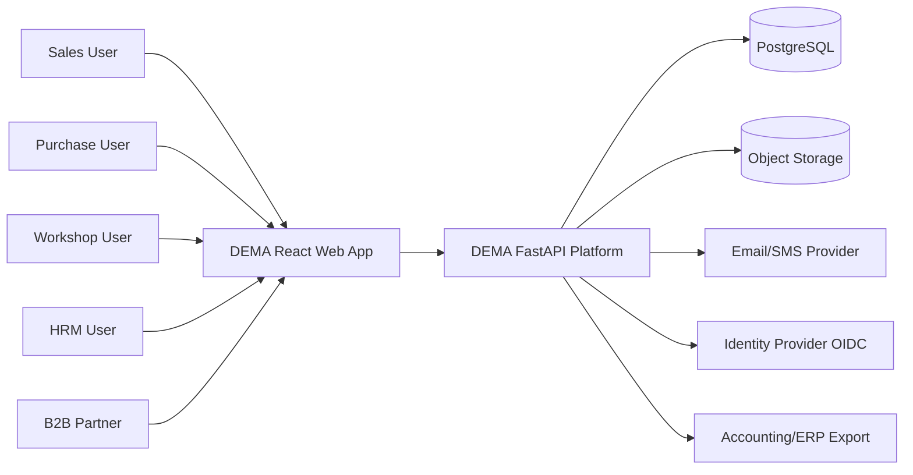

<p align="left"><strong>Technologies in this diagram:</strong><br />


</p>

---

## 3) Container diagram (C4-L2)

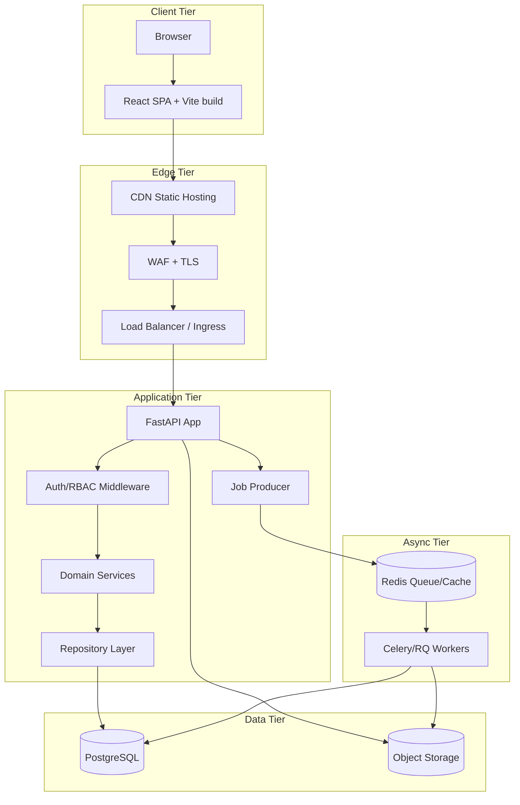

<p align="left"><strong>Technologies in this diagram:</strong><br />


</p>

---

## 4) Frontend module architecture

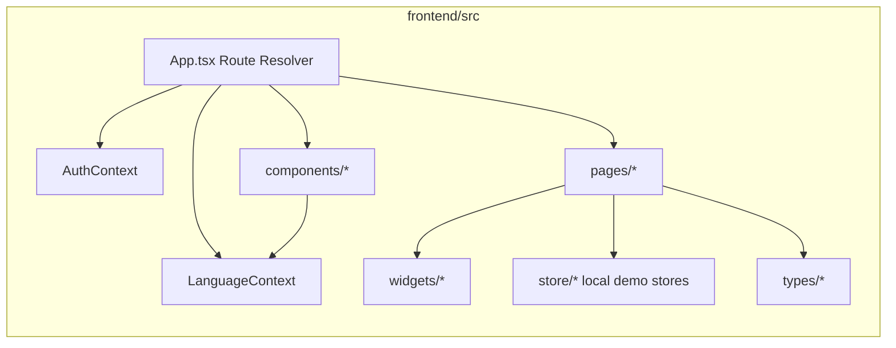

<p align="left"><strong>Technologies in this diagram:</strong><br />


</p>

### Frontend route-to-module map

| Route pattern | Page module | Domain |
|--------------|-------------|--------|
| `#/sales/kunden`, `#/purchase/kunden` | `CustomersPage` | Customer master |
| `#/sales/angebote`, `#/purchase/angebote` | `AngebotePage` | Offers |
| `#/sales/anfragen`, `#/purchase/anfragen` | `AnfragenPage` | Inquiries |
| `#/sales/verkaufter-bestand`, `#/purchase/verkaufter-bestand` | `VerkaufterBestandPage` | Sold inventory |
| `#/sales/abholauftraege`, `#/purchase/abholauftraege` | `AbholauftraegePage` | Pickup orders |
| `#/sales/kennzeichen-suchen`, `#/purchase/kennzeichen-suchen` | `KennzeichenSuchePage` | Plate search |
| `#/sales/rechnungen`, `#/purchase/rechnungen` | `RechnungenPage` | Invoices |
| `#/hrm/*` | `HrmPage` | HRM |
| `#/settings` | `SettingsPage` | System settings |
| unmatched routes | `DynamicDashboard` | Dashboard workspace |

---

## 5) Backend module architecture (target)

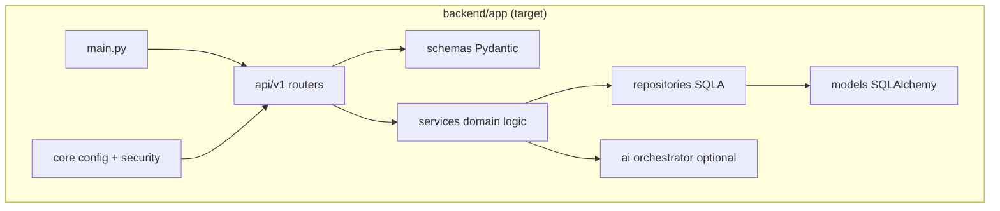

<p align="left"><strong>Technologies in this diagram:</strong><br />


</p>

### Domain services breakdown (target)

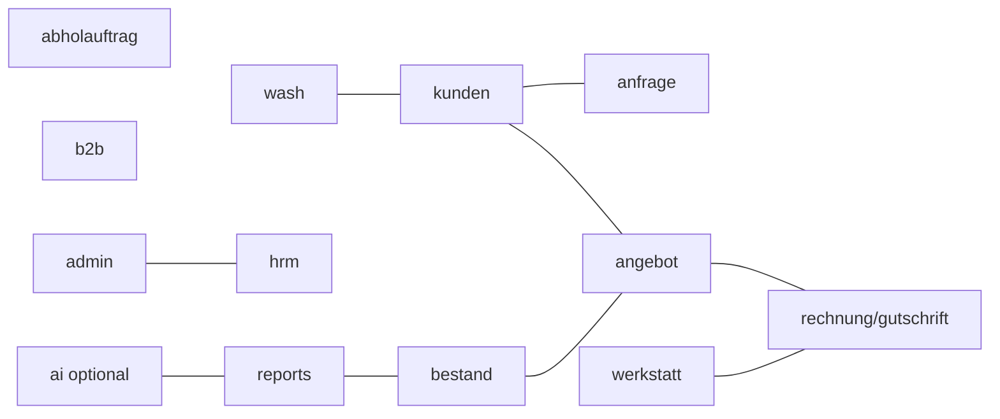

<p align="left"><strong>Technologies in this diagram:</strong><br />

</p>

---

## 6) API landscape (grouped)

```mermaid
flowchart LR
  Client[React Client]
  GW[FastAPI /api/v1]

  Auth[/auth/]
  Users[/users/]
  Kunden[/kunden/]
  Anfragen[/anfrage/]
  Angebote[/angebot/]
  Bestand[/bestand/]
  Rechn[/rechnung/]
  Werk[/werkstatt/*]
  Wash[/wash/*]
  HRM[/hrm/*]
  B2B[/b2b/*]
  Reports[/reports/]
  AI[/ai/* phase 2/]

  Client --> GW
  GW --> Auth
  GW --> Users
  GW --> Kunden
  GW --> Anfragen
  GW --> Angebote
  GW --> Bestand
  GW --> Rechn
  GW --> Werk
  GW --> Wash
  GW --> HRM
  GW --> B2B
  GW --> Reports
  GW --> AI
```

<p align="left"><strong>Technologies in this diagram:</strong><br />


</p>

### API execution sequence (example: invoice list)

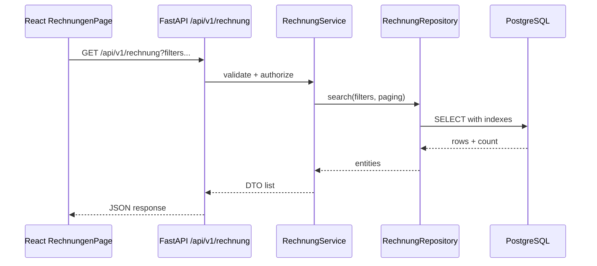

---

## 7) Database architecture

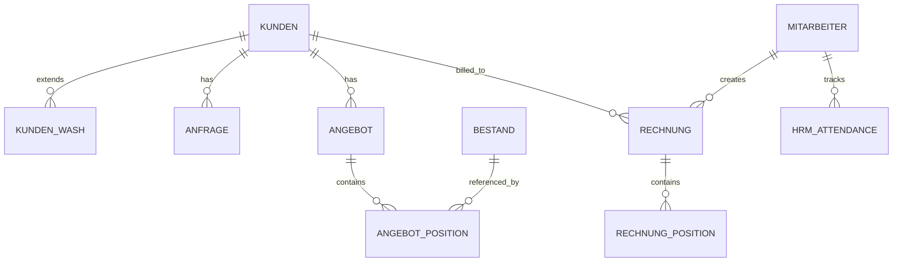

<p align="left"><strong>Technologies in this diagram:</strong><br />

</p>

### DB runtime topology

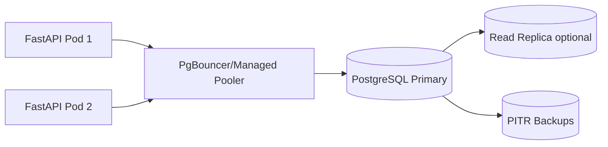

<p align="left"><strong>Technologies in this diagram:</strong><br />


</p>

---

## 8) Cloud deployment diagram (service names)

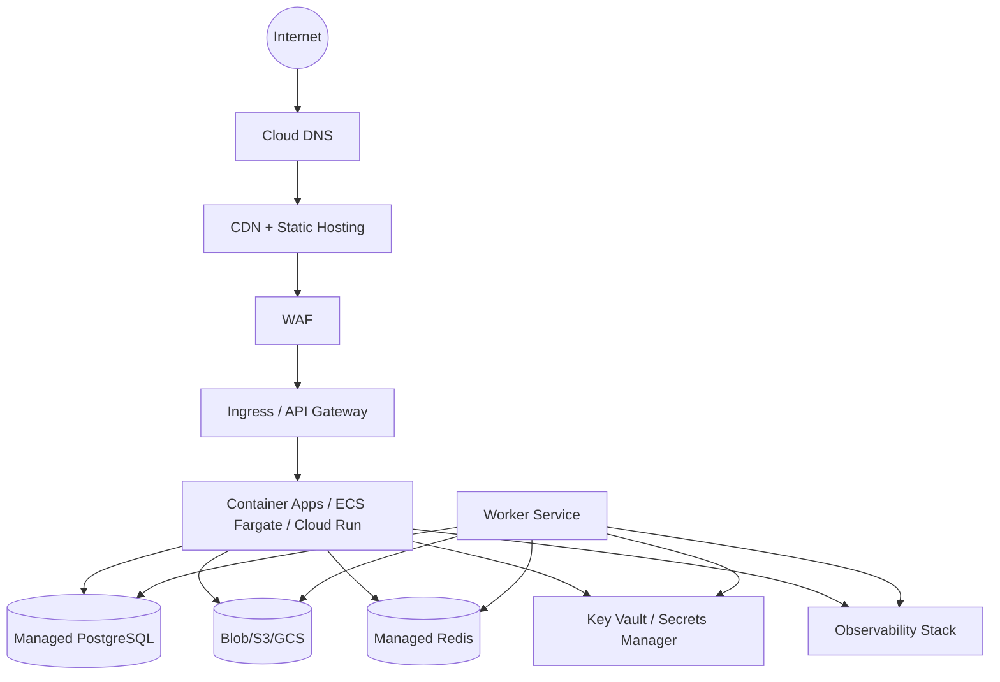

<p align="left"><strong>Technologies in this diagram:</strong><br />


</p>

### Cloud environment split

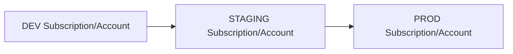

<p align="left"><strong>Technologies in this diagram:</strong><br />


</p>

---

## 9) Terraform/IaC architecture

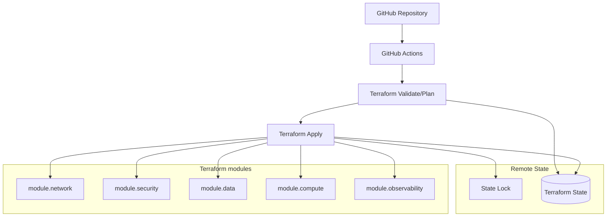

<p align="left"><strong>Technologies in this diagram:</strong><br />


</p>

### Suggested Terraform module boundaries

| Module | Resources |
|--------|-----------|
| `module.network` | VPC/VNet, subnets, route tables, private endpoints |
| `module.security` | KMS/Key Vault, secrets, IAM/roles, policies |
| `module.data` | PostgreSQL, Redis, object storage, backup policy |
| `module.compute` | API service, workers, autoscaling, ingress |
| `module.observability` | logs, metrics, alerts, dashboards |
| `module.edge` (optional) | CDN, WAF, TLS certificates, DNS |

---

## 10) Module execution diagram (end-to-end business flow)

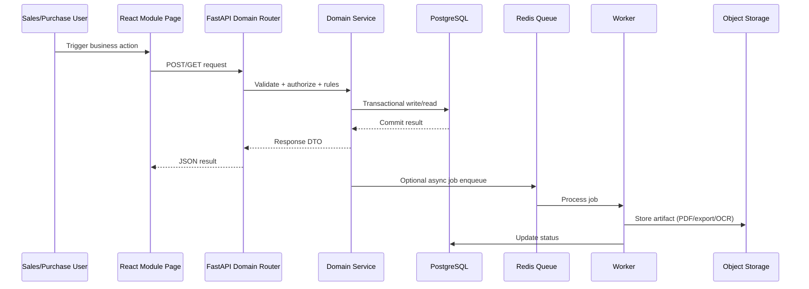

<p align="left"><strong>Technologies in this diagram:</strong><br />


</p>

---

## 11) Professional documentation checklist

- Keep one source file per diagram domain (context, runtime, data, IaC).
- Add diagram version/date footer in exported PNG/PDF.
- Use consistent naming in UI, API tags, DB schema, and Terraform modules.
- Include NFR overlays in each view: latency, RTO/RPO, security boundary, and ownership.
- Add a release checklist: schema migration tested, rollback path documented, alerts configured.

