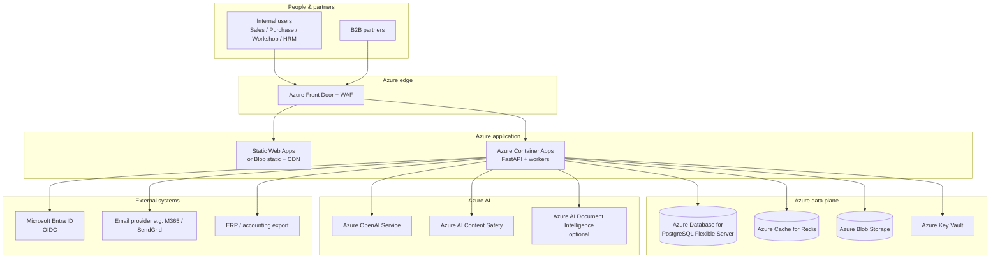
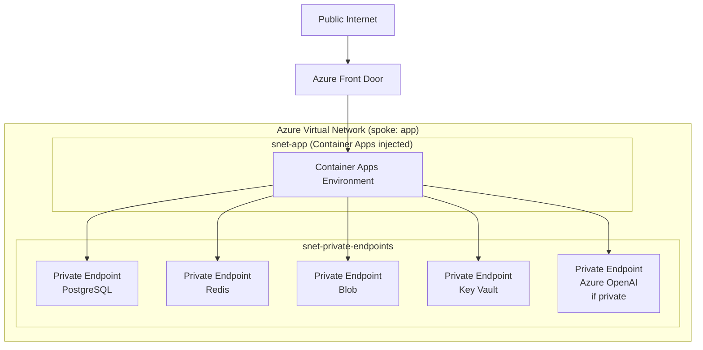
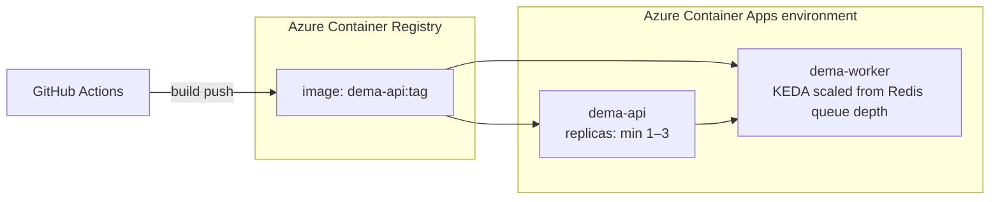
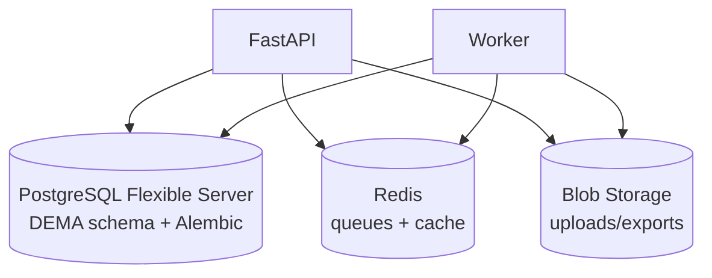
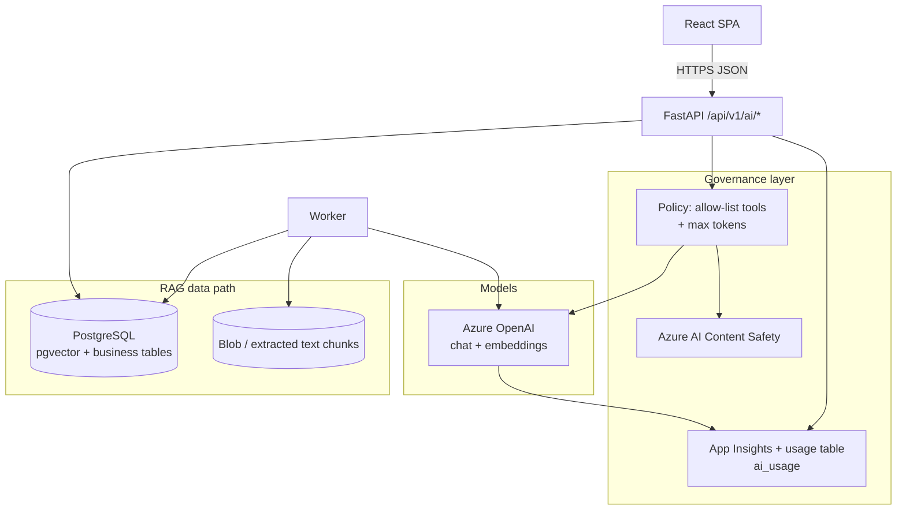
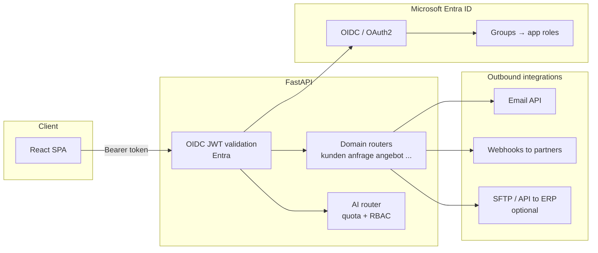
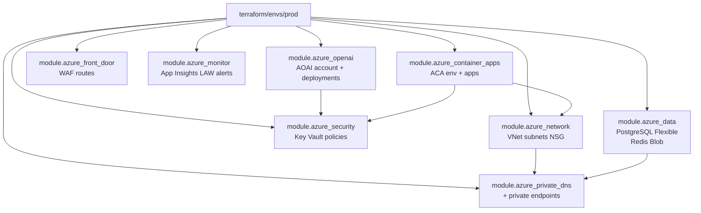
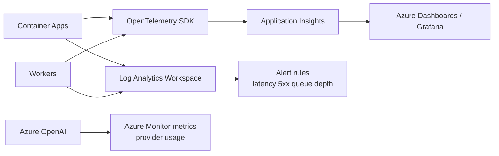

# DEMA Digital Core — **Microsoft Azure** complete blueprint

**Single chosen cloud:** **Microsoft Azure** (EU region, e.g. **Germany West Central** or **West Europe**).  
This document is the **authoritative Azure reference** for DEMA: which **managed services** to use, how **APIs**, **data**, **AI**, **identity**, and **IaC** connect, and **blueprint-level diagrams** (not ad-hoc boxes).

**Companion docs:** [HLD.md](./HLD.md) (strategy), [Architecture-Diagrams.md](./Architecture-Diagrams.md) (cloud-neutral views), [erd.md](./erd.md) (data model), [diagram-tech-logos.md](./diagram-tech-logos.md) (logo strip convention).

---

## How to read this blueprint

| Layer | Blueprint section | What it answers |
|-------|-------------------|-----------------|
| Business context | §3 | Who talks to what |
| Landing zone & network | §4 | VNets, subnets, private endpoints, egress |
| Application compute | §5 | Where React + FastAPI + workers run |
| Data & storage | §6 | PostgreSQL, Redis, Blob, backups |
| AI & automation | §7 | Azure OpenAI, content safety, RAG data path |
| APIs & integration | §8 | External IdP, webhooks, partner APIs |
| DevSecOps & Terraform | §9 | CI/CD, registry, IaC modules |
| Observability | §10 | Logs, metrics, traces, alerts |

**Logos in this file:** technology icons use the **Simple Icons CDN** (`cdn.simpleicons.org`) for consistent, license-friendly SVG rendering in GitHub, VS Code, and most Markdown viewers. Azure-specific naming follows **Microsoft Learn** terminology.

---

## 1. Technology stack with logos (Azure + open stack)

> **Legend:** Each cell = *product used on Azure* + *role in DEMA*.

### 1.1 Frontend & tooling

| Logo | Technology | Azure / role |
|:----:|------------|--------------|
|  | **React 18** | SPA UI (`frontend/`) |
|  | **TypeScript** | Typed UI |
|  | **Vite** | Build & dev server |
|  | **Tailwind CSS** | Styling |
|  | **ESLint** | TS quality gate |

**Host on Azure:** **Azure Static Web Apps** *or* **Blob Storage (static website)** in front of **Azure Front Door** + **WAF** (see §5).

### 1.2 Backend & runtime

| Logo | Technology | Azure / role |
|:----:|------------|--------------|
|  | **Python 3.12+** | API + workers |
|  | **FastAPI** | REST + OpenAPI `/api/v1` |
|  | **Pydantic v2** | Schemas & settings |
|  | **SQLAlchemy 2** | ORM |
|  | **Alembic** | DB migrations (no dedicated Simple Icon) |
|  | **Gunicorn + Uvicorn workers** | Prod ASGI (Gunicorn has no Simple Icon slug) |

**Run on Azure:** **Azure Container Apps** (scale-to-zero capable) *or* **Azure Kubernetes Service (AKS)** if you need maximum control (see §5).

### 1.3 Data platform (Azure managed)

| Logo | Azure service (official name) | Role |
|:----:|------------------------------|------|
|  | **Azure Database for PostgreSQL — Flexible Server** | System of record; optional **pgvector** for RAG |
|  | **Azure Cache for Redis** (or **Redis Enterprise** on Azure) | Queue broker, rate limits, session/cache |
|  | **Azure Blob Storage** | Invoices, uploads, exports, PDFs |
|  | **Azure Private Link** | Private connectivity to PaaS |

### 1.4 Identity & security

| Logo | Azure service | Role |
|:----:|---------------|------|
|  | **Microsoft Entra ID** | OIDC SSO, groups → app roles |
|  | **Azure Key Vault** | Secrets, certs, CMK integration |
|  | **Microsoft Defender for Cloud** | Posture, recommendations |
|  | **Azure DDoS Protection** (std/premium) | Edge hardening with Front Door |

### 1.5 AI & intelligent automation (Azure)

| Logo | Azure service | Role |
|:----:|---------------|------|
|  | **Azure OpenAI Service** | Chat, embeddings, guarded models in **your** tenant |
|  | **Azure AI Content Safety** (recommended) | Prompt/response filtering |
|  | **Azure AI Document Intelligence** (optional) | OCR / structured extraction for invoices |

Reference patterns: Microsoft Learn *AI integration with Azure Container Apps*; sample workloads combining **Container Apps + PostgreSQL Flexible Server + OpenAI** (e.g. community/Azure samples for RAG-on-Postgres).

### 1.6 Edge, networking, and delivery

| Logo | Azure service | Role |
|:----:|---------------|------|
|  | **Azure Front Door** | Global HTTP(S) entry, WAF, caching |
|  | **Azure DNS** | Public DNS |
|  | **Azure Virtual Network** | Isolation, subnets, NSGs |

### 1.7 Observability

| Logo | Technology / Azure | Role |
|:----:|--------------------|------|
|  | **OpenTelemetry** SDK → **Azure Monitor** | Traces & metrics |
|  | **Application Insights** | APM, live metrics |
|  | **Log Analytics workspace** | Central logs |

### 1.8 DevSecOps & IaC

| Logo | Technology | Role |
|:----:|------------|------|
|  | **GitHub** | Source |
|  | **GitHub Actions** | CI: `npm run build`, Docker build, `terraform plan` |
|  | **Docker** | API + worker images |
|  | **Azure Container Registry** | Image storage |
|  | **Terraform (HashiCorp)** | IaC modules (see §9) |

---

## 2. One-line architecture (Azure)

**Users → Front Door (WAF) → Static SPA + Container Apps (FastAPI + workers) → Private Link → PostgreSQL / Redis / Blob → Azure OpenAI (managed identity, no keys in app config).**

---

## 3. Blueprint A — System context (Azure-labelled)

<strong>Technologies in this diagram:</strong> 

---

## 4. Blueprint B — Landing zone & network (detail)

**Intent:** API and data planes have **no public PostgreSQL/Redis**; only **Front Door** and optional **bastion/jump** for break-glass.

<strong>Technologies in this diagram:</strong> 

**Controls:** NSGs on subnets; **Private DNS zones** linked to VNet for private endpoints; **Managed identities** on Container Apps for Key Vault + storage + database (AAD auth where supported).

---

## 5. Blueprint C — Application runtime (containers)

**Workload split (recommended):**

| Container app | Image | Responsibility |
|---------------|-------|------------------|
| `dema-api` | `fastapi` + gunicorn/uvicorn | Sync REST, OpenAPI, auth middleware |
| `dema-worker` | same repo, different CMD | Celery/RQ/Arq consumers: PDF, OCR jobs, embeddings |
| Optional `dema-scheduler` | same | Cron-style jobs (reports, reindex) |

**Scaling:** API on HTTP concurrency / CPU; workers on **queue length** (KEDA + Redis).

<strong>Technologies in this diagram:</strong> 

---

## 6. Blueprint D — Data platform

<strong>Technologies in this diagram:</strong> 

**PostgreSQL extensions (when needed):** `pgvector` for embeddings (align with HLD §8).  
**Backup:** Flexible Server **automated backups** + optional **geo-redundant**; Blob **RA-GRS** for critical exports (policy decision).

---

## 7. Blueprint E — AI plane (controlled, production pattern)

**Rules:** Only **backend** calls Azure OpenAI; prompts/responses **audited**; **Content Safety** on high-risk paths; **no customer PII** in prompts unless policy allows.

<strong>Technologies in this diagram:</strong> 

**Typical flows:**

1. **NL query:** API retrieves allowed context from PG → calls **chat** model → returns answer + citations.  
2. **Document analyse:** API enqueues job → worker uses **Document Intelligence** + optional **GPT** structured output → writes results to PG → client polls or subscribes.

---

## 8. Blueprint F — APIs, identity, and integrations

**API grouping (maps to HLD §6):** `auth`, `users`, `kunden`, `anfrage`, `angebot`, `bestand`, `rechnung`, `werkstatt`, `wash`, `hrm`, `b2b`, `reports`, `ai`.

<strong>Technologies in this diagram:</strong> 

---

## 9. Blueprint G — Terraform module map (Azure)

**Not random:** modules follow **Well-Architected** separation: network → security → data → compute → observability → edge.

<strong>Technologies in this diagram:</strong> 

**State:** Remote backend **Azure Storage** + **state locking** (blob lease or Terraform Cloud).

**CI/CD:** GitHub Actions → `terraform fmt/validate/plan` on PR; `apply` on protected branch with approval.

---

## 10. Blueprint H — Observability & operations

<strong>Technologies in this diagram:</strong> 

**SLO examples:** API p95 latency, error rate, worker backlog depth, OpenAI token budget burn rate.

---

## 11. What you must provision (checklist)

| Area | Azure resource | Notes |
|------|----------------|--------|
| Identity | Entra app registration | SPA + API scopes; optional B2B for partners |
| Edge | Front Door + WAF policy | Route `/` → static, `/api` → Container Apps |
| Compute | Container Apps env + 2+ apps | Managed identity enabled |
| Data | PostgreSQL Flexible | HA tier per RTO; private access |
| Cache/queue | Azure Cache for Redis | TLS; eviction policy for cache vs queue |
| Files | Storage account (Blob) | Lifecycle rules; virus scan optional (Defender) |
| Secrets | Key Vault | Keys for TLS, DB, third parties |
| AI | Azure OpenAI | Deployments: chat + embedding models; private networking optional |
| Safety | Content Safety | Integrated in API middleware |
| Registry | ACR | Admin disabled; use MI pull |
| Observability | App Insights + LAW | Sampling tuned for prod |

---

## 12. Exporting “pretty” diagrams with official logos

1. **Keep this file** as the logical blueprint (Mermaid = easy diff in Git).  
2. For **pitch decks / PDF**: import Mermaid into **draw.io (diagrams.net)** or **Figma** and drop **official SVGs** from [Microsoft Azure Architecture Icons](https://learn.microsoft.com/azure/architecture/icons/) and [Simple Icons](https://simpleicons.org/).  
3. Version exports: `docs/exports/blueprint-azure-v1.png` with date in footer.

---

## Document history

| Version | Notes |
|---------|--------|
| 1.0 | Initial Azure-only blueprint: stack table with logos, layered diagrams, Terraform map, AI path |

*Aligned with [HLD.md](./HLD.md) target stack and [Architecture-Diagrams.md](./Architecture-Diagrams.md). Azure service names verified against Microsoft Learn patterns (Container Apps, PostgreSQL Flexible Server, Azure OpenAI, Front Door).*
