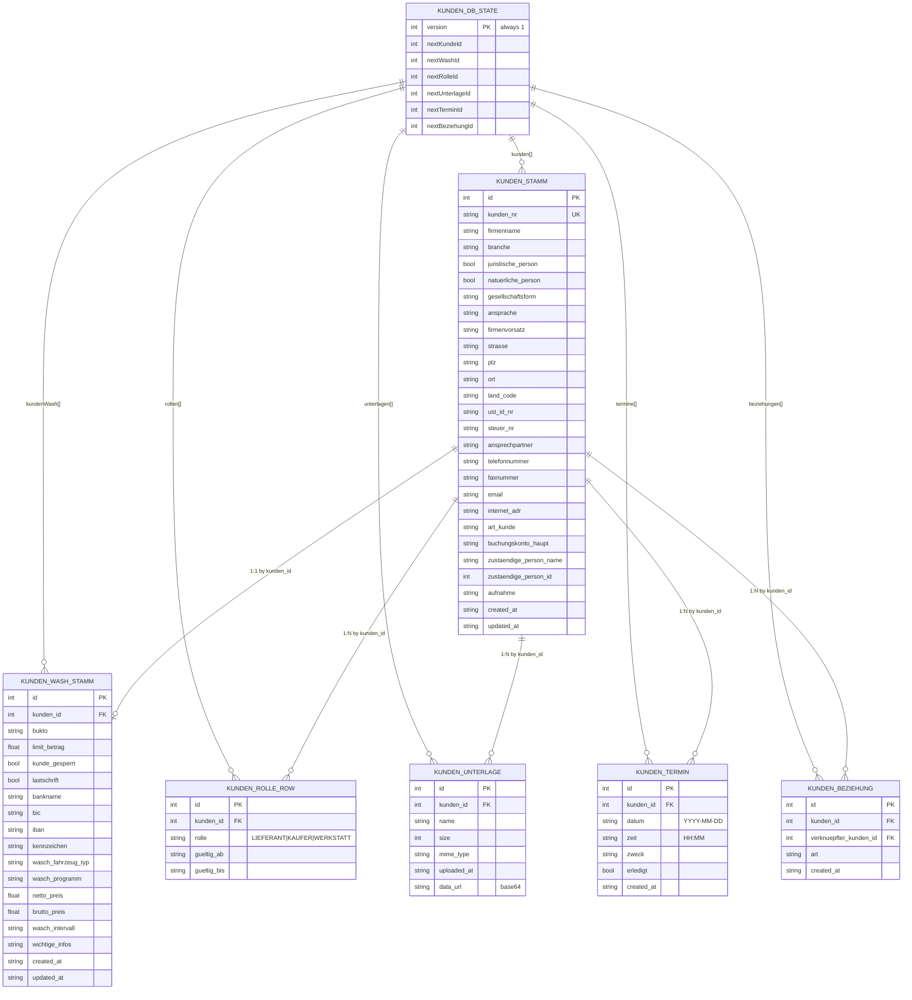
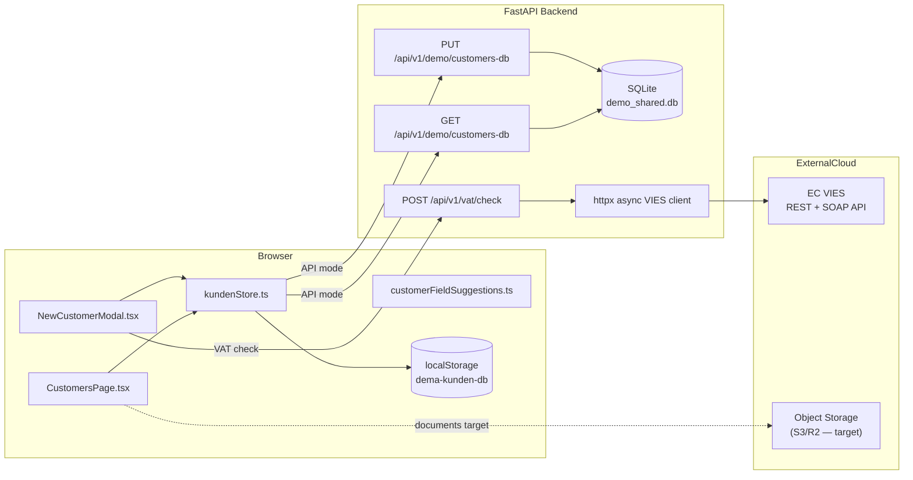
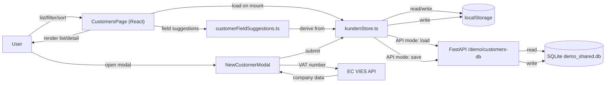

# Customers Service Specification (CustomersPage)

**Service:** Customer master data management (`CustomersPage`)  
**Module family:** CRM / KFZ-COMMERCE / WASCHANLAGE  
**Primary files:** [`frontend/src/pages/CustomersPage.tsx`](../../frontend/src/pages/CustomersPage.tsx), [`frontend/src/components/NewCustomerModal.tsx`](../../frontend/src/components/NewCustomerModal.tsx)  
**Status:** Frontend-rich, dual-mode persistence (localStorage + optional shared API); full production API target defined below  
**Version:** 1.0

---

## 1) Purpose and business value

The Customers service is the central master data hub for all customer-facing departments in the DEMA dealership platform. It provides a unified record for every company or individual that has a commercial relationship with the business, regardless of whether they are a buyer (Verkauf), supplier (Einkauf), workshop client (Werkstatt), or car wash customer (Waschanlage).

Business value:

- Single source of truth for customer identity, contact, and fiscal data across all departments
- EU VAT / VIES verification built into the new-customer creation flow to ensure tax-compliant records
- Waschanlage-specific extension model (wash programme, fleet, bank/SEPA) avoids duplicating base customer records
- Document management, appointment scheduling, and inter-company relationship tracking all within one record view
- Duplicate detection surface (`DoppelteKundenPage`) reduces data quality debt proactively
- Shared demo sync API means multi-user demo sessions share consistent customer state without a full database

---

## 2) Scope: current vs target

### Current (in repository)

- Full CRUD UI in `CustomersPage.tsx` and `NewCustomerModal.tsx`
- Persistence via browser `localStorage` (key: `dema-kunden-db`, schema version `1`)
- Optional shared API mode controlled by `VITE_CUSTOMERS_SOURCE=api` env flag
- When API mode is active: GET/PUT to `/api/v1/demo/customers-db` on Python backend with optional API key auth
- EU VAT validation via `/api/v1/vat/check` (FastAPI VIES proxy)
- Seed data of 15 German demo customers pre-loaded on first use
- Department context routing: same component serves Sales, Purchase, Werkstatt, Waschanlage pages
- Documents, appointments, and relationships stored as arrays within the same `KundenDbState` JSON blob
- Duplicate-detection page reuses the same store

### Target (production-grade)

- Customer master records persisted in managed PostgreSQL (`kunden` and `kunden_wash` tables)
- Per-entity REST API: `GET/POST/PUT/DELETE /api/v1/customers` and `/api/v1/customers/{id}/wash-profile`
- Document files stored in object storage (S3/R2); only metadata rows in DB
- Appointments and relationships in relational tables with proper FK constraints
- Real-time multi-user updates via WebSocket or SSE broadcast
- Role-based department scoping (Sales can only see kunden with `KAUFER` role, etc.)
- Full audit trail on every create/edit/delete

---

## 3) Feature catalog

### 3.1 Customer list (main view)

- Paginated/filtered list of all `KundenStamm` records
- Column-sortable by `kundenNr`, `firmenname`, `ort`, `plz`, `termin`
- Free-text quick search with `SuggestTextInput` and field-level autocomplete suggestions
- Per-field filter dropdowns (Branche, Ort, PLZ, Land, etc.)
- Department header context derived from the active route (`sales/kunden`, `werkstatt/kunden`, etc.)
- "New customer" button → `NewCustomerModal`

### 3.2 Customer detail drawer

- Inline right-panel drawer on row click showing full `KundenStamm` fields
- Tabs: **Kundendetail** (general), **FZG** (vehicle/Waschanlage), **Info** (notes)
- Documents section: upload file (max 2 MB), view/download, delete
- Appointments section: add/toggle-done/delete `KundenTermin` records
- Relationships section: link another customer by type (`KundenBeziehung`)
- Edit mode opens `NewCustomerModal` pre-populated with existing data
- All mutations write back through `kundenStore` → `saveKundenDb` + optional `saveSharedKundenDb`

### 3.3 New/edit customer modal (`NewCustomerModal`)

- Multi-tab form: **VAT** → **Kunde** (core) → **Art/Buchungskonto** → **Waschanlage** (conditional) → **Zusatz**
- VAT tab: EU VIES lookup via `POST /api/v1/vat/check`; enriches company name, address, UID on match
- Kunde tab: legal form, name, address, contact, assignee
- Art tab: customer type code (`art_kunde`), booking account (`buchungskonto_haupt`)
- Waschanlage tab (shown when department is `waschanlage`): SEPA/bank, wash programme with auto price fill, fleet vehicle list, blocking flag
- Auto-increments `kunden_nr` (starts at 10001) with duplicate guard
- Duplicate `kunden_nr` validation before save

### 3.4 EU VAT / VIES check (backend)

- `POST /api/v1/vat/check` proxies to EC VIES REST API
- Serial queue + exponential backoff retry (up to `VIES_MAX_RETRIES=3`)
- Hard wall-clock budget `VIES_MAX_TOTAL_SEC=12s` to stay inside cloud reverse-proxy limits
- SOAP `checkVatApprox` fallback when REST fields are missing
- Trader detail matching (name + address sent for qualified confirmation)
- Response fields auto-fill customer form fields
- `VIES_OMIT_RAW_IN_JSON=1` strips raw VIES JSON from response in production

### 3.5 Document management

- File picked by user → validated (max 2 MB) → read as base64 data URL
- Stored as `KundenUnterlage` in `kundenStore` under `unterlagen[]`
- Download via dynamic anchor click; delete removes the row
- Target: files go to object storage, only `name/size/mime_type/storage_key` in DB

### 3.6 Appointments (`KundenTermin`)

- Create: date (ISO), time (HH:MM), purpose text
- Toggle done (`erledigt` flag) and delete
- Listed chronologically per customer

### 3.7 Customer relationships (`KundenBeziehung`)

- Link two customer records with a relationship type string
- De-duplicated (one link per pair)
- Displayed in detail drawer with linked company name resolved

### 3.8 Waschanlage wash profile (`KundenWashStamm`)

- 1:1 extension of `KundenStamm` by `kunden_id`
- Wash programme selection (22 options with netto/brutto price auto-fill)
- Fleet (`kennzeichen`) and vehicle type
- SEPA direct debit fields (IBAN, BIC, Bankname)
- Credit limit (`limit_betrag`)
- Blocking flag (`kunde_gesperrt`)

### 3.9 Duplicate customer detection (`DoppelteKundenPage`)

- Separate page that loads the same `kundenStore`
- Identifies customer pairs sharing identical phone, contact name, or address
- Links to detail view for merge/review

### 3.10 Shared demo state sync (API mode)

- `VITE_CUSTOMERS_SOURCE=api` enables
- On mount: `loadSharedKundenDb()` → GET `/api/v1/demo/customers-db` → merge into local
- On save: `saveSharedKundenDb()` → PUT `/api/v1/demo/customers-db`
- Backend uses SQLite (`demo_shared.db`) with `demo_store(key, value, updated_at)` table
- Optional `DEMO_API_KEY` / `x-demo-key` header authentication

---

## 4) Technologies used in this service

| Layer | Technology |
|-------|------------|
| UI component | React + TypeScript (`CustomersPage.tsx`, `NewCustomerModal.tsx`) |
| Styling | Tailwind CSS utility classes |
| Icons | `lucide-react` |
| State management | React `useState`, `useEffect`, `useCallback`, `useRef`, `useMemo` |
| i18n | `useLanguage()` from `LanguageContext` |
| Store / persistence | `kundenStore.ts` (pure functions over `KundenDbState`) |
| Local DB | Browser `localStorage` (key: `dema-kunden-db`) |
| Shared demo DB | FastAPI + Python `sqlite3` (`demo_shared.db`) |
| EU VAT validation | FastAPI VIES proxy (`httpx` async client) |
| File I/O | `FileReader` API → base64 data URL |
| Suggestion engine | `customerFieldSuggestions.ts` |
| Routing context | `departmentArea` type + `App.tsx` hash routing |

---

## 4.1 Framework and platform inventory (traceable)

| Area | Framework / platform | Why used here | Primary files |
|------|----------------------|---------------|---------------|
| Frontend app | React 18 + TypeScript | Stateful, typed customer data UI with complex form/drawer patterns | `frontend/src/pages/CustomersPage.tsx`, `frontend/src/components/NewCustomerModal.tsx` |
| Styling system | Tailwind CSS | Rapid, consistent form/table/drawer layout | `frontend/src/pages/CustomersPage.tsx` |
| Icon system | lucide-react | Consistent inline iconography throughout list and detail views | Throughout |
| i18n context | Custom React context (`LanguageContext`) | Runtime language switching for all visible labels | `frontend/src/contexts/LanguageContext.tsx` |
| Client persistence | Browser `localStorage` | Current baseline; zero-dependency demo storage for full CRUD | `frontend/src/store/kundenStore.ts` |
| Shared demo sync | FastAPI + Python sqlite3 | Cross-session shared state for demo/multi-user scenarios | `backend/main.py`, `demo_shared.db` |
| EU VAT API | FastAPI + httpx (VIES proxy) | EU fiscal compliance; auto-enriches customer records | `backend/main.py` |
| SOAP fallback | Python `xml.etree.ElementTree` | VIES SOAP `checkVatApprox` when REST omits trader details | `backend/main.py` |
| Field suggestions | `customerFieldSuggestions.ts` | Live autocomplete driven by current DB values | `frontend/src/store/customerFieldSuggestions.ts` |
| Routing | App.tsx hash router | Maps department-prefixed routes to single `CustomersPage` | `frontend/src/App.tsx` |
| Target API stack | FastAPI + Pydantic + SQLAlchemy | Production CRUD, department scoping, audit trail | `docs/LLD.md`, `docs/Project-Report-Technical-Requirements.md` |
| Target data stack | PostgreSQL (+ S3/R2 for docs) | Durable relational records; object storage for binary files | `docs/HLD.md`, `docs/erd.md` |
| Delivery pipeline | Docker + GitHub Actions | Repeatable build/test/deploy | `docs/Project-Report-Technical-Requirements.md` |
| Observability | OpenTelemetry-compatible telemetry | SLO visibility and incident diagnostics | `docs/Project-Report-Technical-Requirements.md` |

---

## 5) Internal data model (current local persistence)

### 5.1 Storage key

- `dema-kunden-db` — single `localStorage` key, JSON-serialized `KundenDbState`

### 5.2 Logical entity model (ER-style)



### 5.3 Backend demo store schema (SQLite)

```sql
CREATE TABLE IF NOT EXISTS demo_store (
  key       TEXT PRIMARY KEY,
  value     TEXT NOT NULL,
  updated_at TEXT NOT NULL
);
-- Row key used: "customers_db"
-- Value: full JSON-serialized KundenDbState
```

---

## 6) Feature diagram (functional decomposition)

```mermaid
flowchart TB
  Customers["Customers Service"]

  Customers --> List["Customer List View"]
  Customers --> Detail["Customer Detail Drawer"]
  Customers --> Modal["New / Edit Modal"]
  Customers --> Sync["Shared Demo Sync"]
  Customers --> VAT["EU VAT / VIES Check"]
  Customers --> Dupes["Duplicate Detection"]

  List --> Filter["Field Filters & Quick Search"]
  List --> Sort["Column Sort (Nr, Name, Ort, PLZ, Date)"]
  List --> Create["Open New Customer Modal"]

  Detail --> Core["Core Record (Stamm)"]
  Detail --> Wash["Waschanlage Profile"]
  Detail --> Docs["Documents (Unterlagen)"]
  Detail --> Appointments["Appointments (Termine)"]
  Detail --> Relations["Relationships (Beziehungen)"]
  Detail --> EditBtn["Open Edit Modal"]

  Modal --> VATTab["VAT lookup tab"]
  Modal --> KundeTab["Kunde (core fields)"]
  Modal --> ArtTab["Art / Buchungskonto"]
  Modal --> WashTab["Waschanlage tab"]
  Modal --> ZusatzTab["Zusatz (extras)"]

  VAT --> VIES["EC VIES REST API"]
  VAT --> SOAPFallback["SOAP checkVatApprox fallback"]

  Sync --> LocalDB[("localStorage: dema-kunden-db")]
  Sync --> SharedAPI["GET/PUT /api/v1/demo/customers-db"]
  SharedAPI --> SQLiteDB[("SQLite: demo_shared.db")]
```



---

## 7) Architecture diagram (full stack)



---

## 8) DFD (data flow diagram)



---

## 9) Main user flows

### 9.1 Create new customer (standard flow)

1. User clicks "New Customer" → `NewCustomerModal` opens on VAT tab
2. User enters VAT number + country → `POST /api/v1/vat/check` called
3. Backend serializes VIES request, retries up to 3× with backoff, 12s hard budget
4. On valid response: company name, address, UID fields auto-populated in Kunde tab
5. User reviews/edits fields, fills Art/Buchungskonto
6. On submit: `createKunde()` validates unique `kunden_nr`, assigns auto-incremented ID
7. `saveKundenDb()` writes updated `KundenDbState` to `localStorage`
8. If API mode: `saveSharedKundenDb()` PUTs to backend, receives confirmed state back
9. List re-renders via state update from the saved DB

### 9.2 Edit existing customer

1. User clicks customer row → detail drawer opens
2. "Edit" action opens `NewCustomerModal` pre-filled with `KundenStamm` + `KundenWashStamm`
3. User modifies fields; save calls `updateKunde()` + `upsertKundenWash()`
4. Scanned/prefilled document (VAT response) may be attached to `unterlagen[]` on save
5. `saveKundenDb()` + optional `saveSharedKundenDb()` persist changes

### 9.3 Upload document

1. User clicks upload icon in detail drawer documents section
2. File input triggers; file validated ≤ 2 MB
3. `readFileAsDataURL()` converts to base64 data URL
4. `addKundenUnterlage()` appends row to `unterlagen[]` with `id`, `kunden_id`, `name`, `size`, `mime_type`, `data_url`
5. `saveKundenDb()` persists; list re-renders

### 9.4 Add appointment

1. User enters date, time, and purpose in Termine section
2. `addKundenTermin()` appends row; `saveKundenDb()` persists
3. User can toggle `erledigt` flag or delete the appointment

### 9.5 Link customer relationships

1. User selects another customer from dropdown + enters relationship type
2. `addKundenBeziehung()` checks for existing pair before inserting
3. Relationship rows displayed with resolved company names

### 9.6 Shared demo sync flow

1. `CustomersPage` mounts; `isCustomersApiMode()` is true
2. `loadSharedKundenDb()` GETs `/api/v1/demo/customers-db` with optional `x-demo-key`
3. Backend reads `customers_db` row from SQLite, validates shape
4. Frontend merges returned state with seed customers via `ensureSeedCustomers(normalizeUnterlagen(...))`
5. Every mutation: after local save, `saveSharedKundenDb()` PUTs updated state back to backend
6. Backend upserts `demo_store` row; returns confirmed state

### 9.7 VIES check backend flow

1. `POST /api/v1/vat/check` receives `{ country_code, vat_number, trader_name?, trader_street?, ...}`
2. VAT number normalized (remove country prefix, strip spaces)
3. Payload built for VIES REST `/check-vat-number`
4. Serial lock acquired → `httpx` async POST with per-attempt timeout
5. On `MS_MAX_CONCURRENT_REQ` (429) or 5xx: exponential backoff retry
6. On REST missing fields: SOAP `checkVat` fallback, then `checkVatApprox` fallback
7. Response mapped to `{ valid, name, address, requestDate, ... }`; returned to frontend

---

## 10) Feature-to-file traceability matrix

| Feature | Status | Current implementation files | Target service/API |
|---------|--------|-------------------------------|-------------------|
| Customer list view (filters, sort, search) | Live | `frontend/src/pages/CustomersPage.tsx`, `frontend/src/store/customerFieldSuggestions.ts` | `GET /api/v1/customers` |
| Detail drawer (core, wash, docs, appts, rels) | Live | `frontend/src/pages/CustomersPage.tsx` | `GET /api/v1/customers/{id}` |
| Create/edit customer modal | Live | `frontend/src/components/NewCustomerModal.tsx` | `POST/PUT /api/v1/customers` |
| EU VAT / VIES check | Live | `frontend/src/components/NewCustomerModal.tsx`, `backend/main.py` | `POST /api/v1/vat/check` (existing) |
| Waschanlage wash profile | Live | `frontend/src/components/NewCustomerModal.tsx`, `frontend/src/store/kundenStore.ts` | `PUT /api/v1/customers/{id}/wash-profile` |
| Document upload/download/delete | Live (base64/localStorage) | `frontend/src/pages/CustomersPage.tsx`, `frontend/src/store/kundenStore.ts` | Object storage + `POST/DELETE /api/v1/customers/{id}/documents` |
| Appointment CRUD | Live | `frontend/src/pages/CustomersPage.tsx`, `frontend/src/store/kundenStore.ts` | `POST/PATCH/DELETE /api/v1/customers/{id}/appointments` |
| Customer relationships | Live | `frontend/src/pages/CustomersPage.tsx`, `frontend/src/store/kundenStore.ts` | `POST/DELETE /api/v1/customers/{id}/relationships` |
| Shared demo state sync | Live | `frontend/src/store/kundenStore.ts`, `backend/main.py` | Superseded by real multi-user API |
| Duplicate detection view | Live | `frontend/src/pages/DoppelteKundenPage.tsx`, `frontend/src/store/kundenStore.ts` | `GET /api/v1/customers/duplicates` |
| Field autocomplete suggestions | Live | `frontend/src/store/customerFieldSuggestions.ts` | Derived from real DB query or pre-cached suggestions |
| Department routing context | Live | `frontend/src/App.tsx`, `frontend/src/types/departmentArea.ts` | Backend scoping by `role` filter |

---

## 11) Environment variables reference

| Variable | Where used | Purpose | Default |
|----------|-----------|---------|---------|
| `VITE_API_BASE_URL` | `kundenStore.ts`, `NewCustomerModal.tsx` | Base URL for all API calls | `""` (relative) |
| `VITE_CUSTOMERS_SOURCE` | `kundenStore.ts` | Set to `api` to enable shared demo sync | `""` (localStorage only) |
| `VITE_DEMO_API_KEY` | `kundenStore.ts` | Sent as `x-demo-key` header for demo auth | `""` |
| `DEMO_CUSTOMERS_DB_PATH` | `backend/main.py` | Path to the shared demo SQLite file | `demo_shared.db` |
| `DEMO_API_KEY` | `backend/main.py` | If set, requests must include matching `x-demo-key` | `""` (no auth) |
| `VIES_CHECK_URL` | `backend/main.py` | Override VIES live-check endpoint URL | EC VIES REST default |
| `VIES_REST_API_BASE` | `backend/main.py` | Override VIES REST base path | EC VIES default |
| `VIES_MAX_RETRIES` | `backend/main.py` | VIES retry count | `3` |
| `VIES_RETRY_BASE_SEC` | `backend/main.py` | Backoff base (seconds) | `0.4` |
| `VIES_RETRY_MAX_WAIT_SEC` | `backend/main.py` | Max single backoff sleep | `8` |
| `VIES_MAX_TOTAL_SEC` | `backend/main.py` | Hard wall-clock budget per VIES check | `12.0` |
| `VIES_OMIT_RAW_IN_JSON` | `backend/main.py` | Strip raw VIES JSON from API response | off |
| `VIES_SOAP_APPROX_FALLBACK` | `backend/main.py` | Enable SOAP `checkVatApprox` fallback | on |
| `CORS_ORIGINS` | `backend/main.py` | Allowed CORS origins | `http://localhost:5173,...` |

---

## 12) API reference (current + target)

### 12.1 Currently implemented endpoints

| Method | Endpoint | Auth | Request body | Response |
|--------|----------|------|--------------|----------|
| `GET` | `/api/v1/demo/customers-db` | optional `x-demo-key` | — | `{ state: KundenDbState, updated_at: ISO }` |
| `PUT` | `/api/v1/demo/customers-db` | optional `x-demo-key` | `{ state: KundenDbState }` | `{ state: KundenDbState, updated_at: ISO }` |
| `POST` | `/api/v1/vat/check` | none | `VatCheckRequest` | `{ valid, name, address, requestDate, ... }` |
| `GET` | `/api/v1/vat/status` | none | — | VIES service status |
| `GET` | `/api/health` | none | — | `{ status: "ok" }` |

### 12.2 Production target API design

| Method | Endpoint | Purpose |
|--------|----------|---------|
| `GET` | `/api/v1/customers` | Paginated customer list with filters and department scoping |
| `POST` | `/api/v1/customers` | Create a new `KundenStamm` record |
| `GET` | `/api/v1/customers/{id}` | Fetch full customer detail with wash profile and roles |
| `PUT` | `/api/v1/customers/{id}` | Full update of customer master record |
| `PATCH` | `/api/v1/customers/{id}` | Partial update |
| `DELETE` | `/api/v1/customers/{id}` | Soft-delete customer |
| `GET/PUT` | `/api/v1/customers/{id}/wash-profile` | Fetch or upsert Waschanlage extension |
| `GET` | `/api/v1/customers/{id}/documents` | List documents (metadata only) |
| `POST` | `/api/v1/customers/{id}/documents` | Upload document (multipart → object storage) |
| `DELETE` | `/api/v1/customers/{id}/documents/{doc_id}` | Remove document |
| `GET/POST/DELETE` | `/api/v1/customers/{id}/appointments` | Appointment CRUD |
| `GET/POST/DELETE` | `/api/v1/customers/{id}/relationships` | Relationship CRUD |
| `GET` | `/api/v1/customers/duplicates` | Server-side duplicate detection |
| `POST` | `/api/v1/vat/check` | EU VIES proxy (existing — retain) |

---

## 13) Security and privacy notes (current + target)

### Current

- No backend auth required for customer CRUD (localStorage-only by default)
- Demo sync API optionally protected by static `DEMO_API_KEY` / `x-demo-key` header
- Documents stored as base64 data URLs in `localStorage` (no server exposure)
- VAT numbers sent to EU VIES API via the backend proxy (no direct frontend-to-VIES call)
- `VIES_OMIT_RAW_IN_JSON` prevents logging raw EU registration numbers in browser

### Target hardening

- All customer CRUD behind JWT/session authentication
- RBAC scoping: Sales users see only `KAUFER` role customers; Werkstatt sees only `WERKSTATT` role, etc.
- Document files in server-side object storage with signed URL access (time-limited, per-user)
- PII fields (`iban`, `telefonnummer`, `email`, `ust_id_nr`) encrypted at rest in PostgreSQL
- Audit log on every create/update/delete with user ID, timestamp, and diff
- Soft-delete only — no hard-delete of customer master records
- VAT logs rate-limited and masked before storage (no raw EU numbers in application logs)

---

## 14) Backup, restore, and disaster recovery (production target)

### Data protection scope

- Customer master and wash profile data in managed PostgreSQL
- Document files in object storage with versioning enabled
- Appointments, relationships, and role assignments in PostgreSQL

### Backup policy baseline

- PostgreSQL: automated daily full backups + continuous WAL archiving (PITR to 5-minute RPO)
- Object storage: versioning + soft-delete with 30-day retention window
- Seed data deterministic — demo customers can be re-seeded at any time

### Restore validation baseline

- Monthly non-production restore drill of customer schema
- Validation checklist:
  - customer row counts and kunden_nr uniqueness check
  - wash profile FK integrity check
  - document metadata vs object storage key cross-reference
  - API smoke test (list + detail endpoints)

### DR expectations

- RTO and RPO targets align with [`docs/Project-Report-Technical-Requirements.md`](../Project-Report-Technical-Requirements.md)
- Annual DR exercise with owner sign-off and lessons learned
- Failover/failback decisions tracked through incident command process

---

## 15) AI features to add in Customers service

The Customers service is well-positioned for contextual, high-trust AI assistance across creation, enrichment, and analytics.

### 15.1 Planned AI features

| AI Feature ID | Feature | User value | Suggested phase |
|---------------|---------|------------|-----------------|
| `AI-CUS-01` | Smart duplicate suggestion | Flag probable duplicate before saving a new customer | Phase 1 |
| `AI-CUS-02` | Address & company enrichment | After VAT check, suggest missing fields from public registries | Phase 2 |
| `AI-CUS-03` | Customer health score | Risk indicator per customer based on payment/activity patterns | Phase 2 |
| `AI-CUS-04` | Relationship suggestion | "Looks like this customer is related to X — link?" | Phase 2 |
| `AI-CUS-05` | Natural language customer search | "Show me all logistics companies in Hamburg added this year" | Phase 3 |
| `AI-CUS-06` | Appointment suggestion | Suggest follow-up appointment based on last interaction date | Phase 3 |
| `AI-CUS-07` | Document classification | Auto-label uploaded documents (contract, invoice, registration, etc.) | Phase 3 |
| `AI-CUS-08` | Wash programme recommendation | Suggest optimal wash programme for vehicle type and frequency | Phase 3 |

### 15.2 AI guardrails

- No autonomous record creation or modification without user confirmation
- Enrichment suggestions shown as separate confirmation cards, never auto-applied
- Duplicate merge decisions always require explicit user action and confirmation
- All AI suggestions logged with acceptance/rejection outcome and user ID

---

## 16) Gaps and implementation roadmap

### Near-term (R1-R2)

- Introduce real customer CRUD endpoints and migrate from localStorage to PostgreSQL
- Keep localStorage as offline fallback for network failure
- Add server-side department scoping by role
- Replace document base64 storage with object storage upload

### Mid-term (R3-R4)

- Add real-time multi-user sync via WebSocket or SSE
- Add per-customer audit trail viewable in the detail drawer
- Add server-side duplicate detection endpoint
- Add full-text search index on `firmenname`, `ort`, `ansprechpartner`

### Long-term (R5+)

- Integrate AI customer enrichment and health score
- Add CRM pipeline stages per customer/department
- Add cross-department customer 360 view (sales + werkstatt + waschanlage combined)

---

## 17) Testing strategy

| Layer | Focus |
|-------|-------|
| Unit (store) | `createKunde` duplicate guard, `generateNextKundenNr`, `upsertKundenWash` merge logic, `isKundenDbState` validation |
| Unit (frontend) | Filter/sort logic, file size validation, datalist suggestion derivation |
| Component | Modal tab flow, VAT auto-fill, detail drawer section rendering |
| Integration | Store → localStorage round-trip, API mode sync GET → PUT cycle |
| E2E | Create customer, edit wash profile, upload document, add appointment, duplicate detection |
| Security (target) | RBAC scoping per department, signed URL expiry for documents, VAT number masking in logs |
| Backend | VIES retry/backoff behavior, SQLite upsert idempotency, shape validation on PUT |

---

## 18) KPIs for this service

| KPI | Why it matters |
|-----|----------------|
| Customer create success rate | Reliability of the primary data entry flow |
| VAT check success rate and latency | User experience during customer creation (VIES is the critical path) |
| Duplicate customer ratio | Data quality health of the master record set |
| Document upload success rate | Reliability of file attachment feature |
| Shared sync conflict rate (API mode) | Stability of multi-user demo sessions |
| AI enrichment acceptance rate (future) | Practical value of AI-assisted data entry |

---

## 19) i18n keys used (customers-specific)

| Key prefix | Used for |
|-----------|---------|
| `customers*` | Customer list labels, empty states, filter/sort headers |
| `customersSortKundenNr`, `customersSortFirmenname`, `customersSortOrt`, `customersSortPLZ`, `customersSortTermin` | Sort dropdown labels |
| `custDrawer*` | Detail drawer section titles and action labels |
| `custModal*` | New/edit modal tab names and form field labels |
| `custVat*` | VAT check tab labels and result messages |
| `custWash*` | Waschanlage profile field labels |
| `custDoc*` | Document section labels |
| `custAppt*` | Appointment section labels |
| `custRel*` | Relationship section labels |
| `dept*` | Department area names (Sales, Purchase, Werkstatt, Waschanlage) |

---

## 20) References

- [`frontend/src/pages/CustomersPage.tsx`](../../frontend/src/pages/CustomersPage.tsx)
- [`frontend/src/components/NewCustomerModal.tsx`](../../frontend/src/components/NewCustomerModal.tsx)
- [`frontend/src/store/kundenStore.ts`](../../frontend/src/store/kundenStore.ts)
- [`frontend/src/store/customerFieldSuggestions.ts`](../../frontend/src/store/customerFieldSuggestions.ts)
- [`frontend/src/types/kunden.ts`](../../frontend/src/types/kunden.ts)
- [`frontend/src/types/departmentArea.ts`](../../frontend/src/types/departmentArea.ts)
- [`frontend/src/contexts/LanguageContext.tsx`](../../frontend/src/contexts/LanguageContext.tsx)
- [`frontend/src/App.tsx`](../../frontend/src/App.tsx)
- [`backend/main.py`](../../backend/main.py)
- [`docs/HLD.md`](../HLD.md)
- [`docs/erd.md`](../erd.md)
- [`docs/Project-Report-Technical-Requirements.md`](../Project-Report-Technical-Requirements.md)

---

## 21) Roadmap location

The complete business-facing version roadmap is maintained in:

- [`docs/roadmap/Customers-Roadmap.md`](../roadmap/Customers-Roadmap.md)

This keeps this file implementation-focused and traceable for engineering onboarding.
