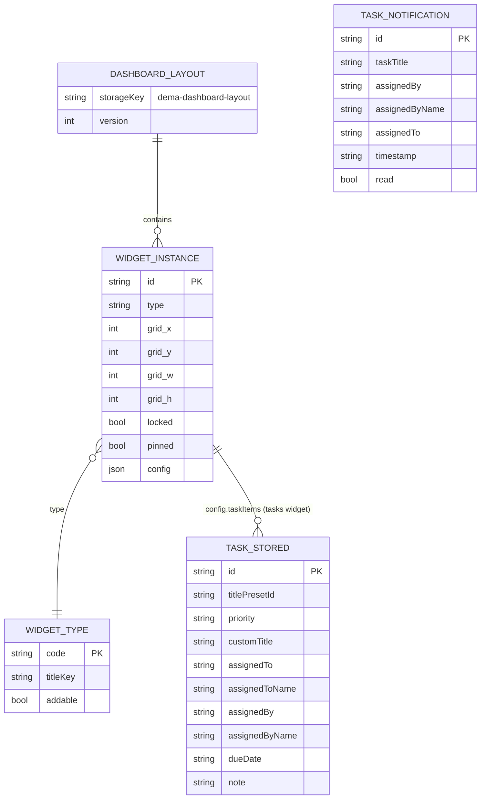
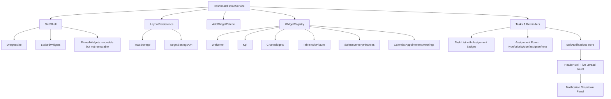
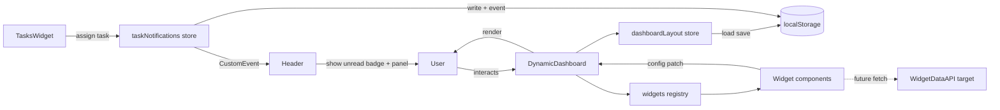
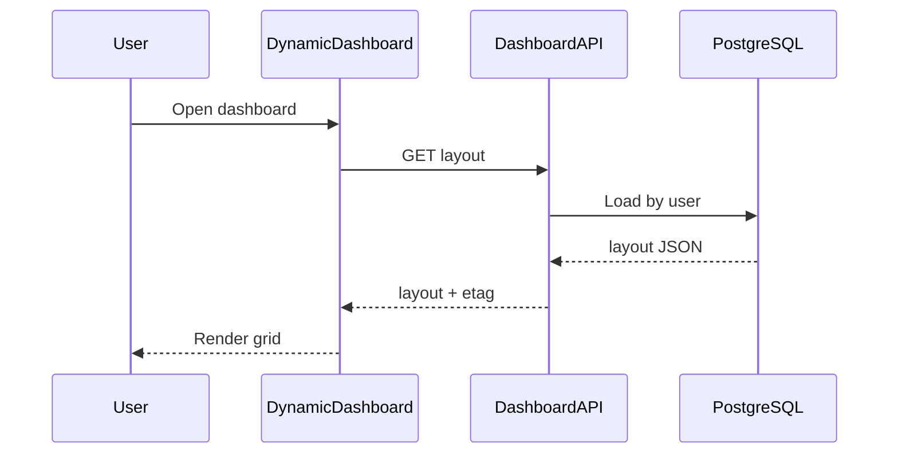
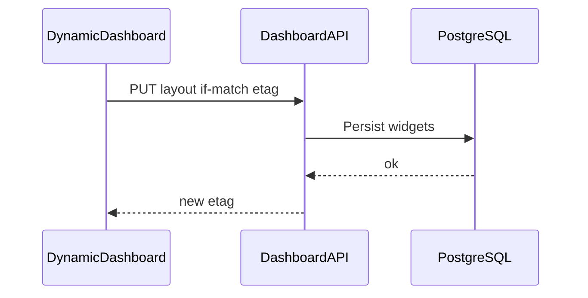
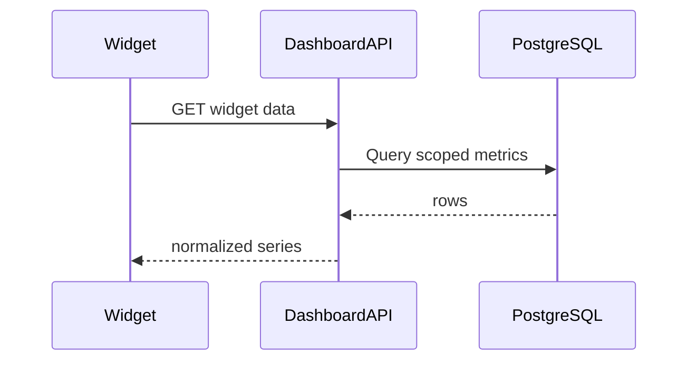
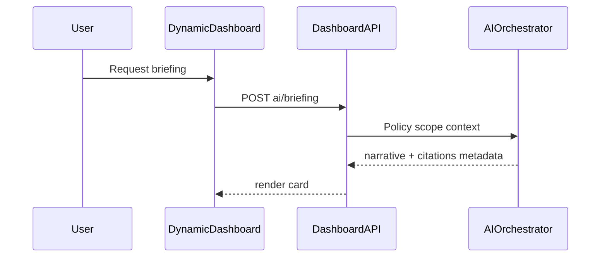

# Dashboard Home Service Specification (Dynamic Dashboard)

**Service:** Dashboard home / dynamic widget grid (`DynamicDashboard`)  
**Module family:** CORE-UX / Analytics shell / Personalization  
**Primary file:** `frontend/src/pages/DynamicDashboard.tsx`  
**Status:** Production-oriented UI with browser-local layout persistence; server-backed layout and live widget data are targets below  
**Version:** 1.3 *(updated 2026-03-25 — pinned widget, task assignment, notifications, dynamic calendar, date-grouped task view)*

---

## 1) Purpose and business value

The Dashboard Home is the default landing experience after authentication. It is a **configurable command center**: users arrange widgets (KPIs, sales/inventory overviews, tasks, calendar, charts, tables) to match their role and daily work.

**Business value**

- Faster orientation: key metrics and actions in one place  
- Self-service layout: less “wrong default” friction and fewer one-off dashboard requests  
- Foundation for org-wide templates, role-based visibility, and governed AI assistance (briefings, layout suggestions)  
- Clear extension point: new modules ship as widgets without rewriting the shell  

---

## 2) Scope: current vs target

### Current (in repository)

- Default route in `frontend/src/App.tsx` renders `DynamicDashboard` when no department route, settings, or chat matches the current path  
- **Grid:** `react-grid-layout` — drag, resize, vertical compaction; locked widgets skip move/resize in layout logic  
- **Persistence:** `localStorage` key `dema-dashboard-layout` via `frontend/src/store/dashboardLayout.ts`  
- **Catalog:** widget types, metadata, palette grouping in `frontend/src/widgets/registry.tsx`  
- **Types:** `WidgetType`, `WidgetInstance`, `DashboardLayout` in `frontend/src/types/dashboard.ts`  
- **i18n:** page strings via `useLanguage()`; widget chrome/palette via `useWidgetLanguage()` in `frontend/src/widgets/useWidgetLanguage.ts`  
- **Widget implementations:** `frontend/src/widgets/*.tsx` (see traceability matrix)  
- **Legacy page:** `frontend/src/pages/Dashboard.tsx` exports a static `Dashboard` with embedded Recharts demos; it is **not** referenced by `App.tsx` or navigation (reference / potential removal candidate)

### Target (enterprise production)

- **Server-backed layouts** per user; optional **role/department default templates** and admin-published layouts  
- **Live data** per widget from APIs with caching, auth, and SLOs  
- **RBAC / ABAC:** which widget types and data scopes a user may add or see  
- **Audit:** layout resets, shared dashboard changes, admin template publishes  
- **Backup/DR:** layouts and widget config stored in PostgreSQL; align with TRD RTO/RPO when persistent  
- **AI layer:** optional briefings and suggestions with human-in-the-loop controls (see §11)  

---

## 3) Feature catalog (what this service does)

### 3.1 Grid shell (DynamicDashboard)

- Render responsive 12-column grid (`COLS = 12`, `ROW_HEIGHT`, margins from `DynamicDashboard.tsx`)  
- Add widget from palette (`getAddableWidgetsByGroup`, grouped by `WIDGET_PALETTE_GROUP_ORDER`)  
- Remove non-locked **and non-pinned** widgets  
- Reset layout to defaults (`getDefaultWidgets`)  
- Persist layout on change (`onLayoutChange` → `applyGridLayout` → `saveLayout`)  
- Persist per-widget config patches (`updateWidgetConfig` + `onUpdateConfig` prop)  
- Drag handle: `.dashboard-drag-handle`; grid remounts on `language` change (`key={language}`)  
- **Pinned widgets** (`pinned: true`): can be dragged and resized but cannot be removed; shown with a "Fixiert" badge in the widget chrome header; the remove button is hidden for pinned widgets  

### 3.2 Widget types (allowed)

Aligned with `VALID_WIDGET_TYPES` in `dashboardLayout.ts` and `WidgetType` in `types/dashboard.ts`:

| Type | Role |
|------|------|
| `welcome` | Top banner (locked default) |
| `kpi` | KPI strip (locked default) |
| `sales` | Sales overview |
| `inventory` | Inventory overview |
| `quick-actions` | Quick actions |
| `tasks` | Tasks / reminders (**pinned** — movable/resizable but cannot be removed; see §3.5) |
| `finances` | Finances block |
| `user-card` | Profile module variant (addable) |
| `profile` | Profile module (default layout includes; also addable) |
| `calendar` | Calendar |
| `appointments` | Appointments |
| `meetings` | Meetings |
| `notes` | Notes |
| `table` | Table widget |
| `todo-list` | Todo list |
| `picture` | Image |
| `graph-line` | Line chart (Recharts via `useDashboardChartData`) |
| `graph-bar` | Bar chart |
| `graph-pie` | Pie chart |
| `graph-area` | Area chart |

### 3.3 Sanitization and safety

- Unknown or legacy widget types dropped on load (`sanitizeWidgets`) so the dashboard always mounts  
- `ensureProfileWidget` ensures a `profile` widget exists after sanitize  
- `ensureTasksWidget` ensures a `tasks` widget is always present; injected at the bottom if missing from a saved layout  
- `upgradePinnedWidgets` retroactively sets `pinned: true` on any existing `tasks` widget loaded from legacy storage

### 3.5 Tasks & Reminders — pinned widget with team assignment

The **Tasks & Reminders** widget (`tasks` type) is a **permanently pinned** workflow module. Key rules:

| Rule | Behaviour |
|------|-----------|
| Cannot be removed | `removeWidget` blocks widgets with `pinned: true`; remove button hidden in chrome |
| Can be moved | drag handle shown; `applyGridLayout` updates position for pinned widgets |
| Can be resized | not marked `static` in react-grid-layout |
| Always present | `ensureTasksWidget` re-injects if absent from saved layout |
| Badge shown | "Fixiert" chip displayed in widget header bar |

**Date-grouped task view** (added 2026-03-25):

The task list no longer shows all items at once. Tasks are organised into **date-bucket filter tabs**:

| Tab | Filter rule | Badge colour |
|-----|-------------|-------------|
| **Heute** | `dueDate === today` (excludes assigned-out) | Blue dot |
| **Diese Woche** | `today < dueDate < today+7` (excludes assigned-out) | Amber dot |
| **Überfällig** | `dueDate < today` and not done (excludes assigned-out) | Red dot |
| **Kein Datum** | `dueDate` absent (excludes assigned-out) | Grey dot |
| **Zugewiesen** | Tasks created by current user and assigned to someone else | Emerald dot |
| **Alle** | All tasks — grouped into collapsible sections including a "Zugewiesen" section | — |

- The **default tab** is auto-selected: Overdue → Today → This Week → No Date → All (first non-empty bucket)
- Within each bucket, tasks are sorted: high priority first, then by due date ascending
- The **"Alle" tab** groups tasks into collapsible sections (Überfällig / Heute / Diese Woche / Später / Kein Datum) with per-section count badges
- Each section collapses/expands; "Später" and "Kein Datum" start collapsed
- A **done checkbox** on each task row marks it complete; done tasks show as strikethrough + muted
- A **done counter pill** in the header toggles visibility of completed tasks
- Edit/delete action buttons appear on row hover (hidden by default) to keep the list clean
- Overdue tasks get a red border + Clock icon on their due-date chip instead of a calendar icon

**Task assignment feature** (added 2026-03-25):

- Any authenticated user can create a task and assign it to any registered team member via a user-picker dropdown  
- Form fields: task type (preset), custom title, priority, due date, "Assign to" (dropdown), note  
- Task list highlights tasks assigned to the current user (blue border); shows "von [Name]" / "→ [Name]" assignment badges  
- Tasks assigned to the current user are sorted to the top of the list  
- When a task is assigned to another user, a `TaskNotification` is written to `localStorage` (`dema-task-notifications`) and a `CustomEvent` (`dema-task-notifications-changed`) is dispatched for real-time UI updates

**Notification system** (`frontend/src/store/taskNotifications.ts`):

| Function | Purpose |
|----------|---------|
| `addTaskNotification` | Persist a new notification and dispatch change event |
| `getNotificationsForUser(email)` | Return all notifications for a user, newest first |
| `getUnreadCountForUser(email)` | Count unread notifications |
| `markNotificationRead(id)` | Mark one notification read |
| `markAllReadForUser(email)` | Bulk mark all as read |  

### 3.4 Internationalization

- Navigation label and help strings: `LanguageContext`  
- Widget titles and palette groups: `titleKey` / `WIDGET_GROUP_I18N_KEY` in registry  

### 3.6 Calendar widget — fully dynamic *(added 2026-03-25)*

The calendar widget (`CalendarWidget.tsx`) was replaced from a static April 2025 hard-code to a **fully interactive monthly calendar**:

| Feature | Detail |
|---------|--------|
| Month navigation | Left / right chevron buttons step ±1 month |
| Month/year picker | Clicking the month label opens a popover with 12-month grid + year ±1 navigation |
| Jump to today | "Heute" / "Today" button resets view and selection to current date |
| Date selection | Clicking any day date highlights it; selected date label shown below grid |
| Today indicator | Today's date is shown with a blue ring (distinct from the filled-blue selected state) |
| Weekend colouring | Saturday and Sunday columns display in rose/red |
| Locale-aware | German (`MONTHS_DE`, `WEEKDAYS_DE`) or English names from `language` context |
| Picker close | Click outside overlay to dismiss |
| No API dependency | Fully self-contained; state lives in component; no config persistence needed |

---

## 4) Technologies used in this service

| Layer | Technology |
|-------|------------|
| UI | React + TypeScript (`DynamicDashboard.tsx`) |
| Layout | `react-grid-layout` (+ default CSS imports in page) |
| Styling | Tailwind utility classes |
| Icons | `lucide-react` |
| Charts (widgets) | `recharts` (in graph widgets) |
| i18n | `useLanguage`, `useWidgetLanguage` |
| Persistence | `localStorage` via `dashboardLayout.ts` |
| Widget registry | `registry.tsx` |
| Target API | FastAPI + Pydantic + SQLAlchemy (per `LLD.md`) |
| Target data | PostgreSQL, Redis (cache / realtime helpers per `HLD.md`) |
| Observability / ops | OpenTelemetry, runbooks per `Project-Report-Technical-Requirements.md` |

---

## 4.1 Framework and platform inventory (traceable)

| Area | Framework / platform | Why used here | Primary files |
|------|----------------------|---------------|---------------|
| SPA shell | React + TypeScript | Composable dashboard and strict typing | `frontend/src/pages/DynamicDashboard.tsx`, `frontend/src/App.tsx` |
| Grid UX | react-grid-layout | Drag/resize dashboard with proven behavior | `frontend/src/pages/DynamicDashboard.tsx` |
| Layout state | Module functions + localStorage | Serialize layout/config per browser | `frontend/src/store/dashboardLayout.ts` |
| Widget plugins | Registry pattern | Add widgets without coupling shell to each module | `frontend/src/widgets/registry.tsx` |
| Widget contracts | Shared TS interfaces | Consistent `config` / `onUpdateConfig` | `frontend/src/types/dashboard.ts` |
| Charts | Recharts | In-widget time series / bars / pies | `frontend/src/widgets/Graph*.tsx`, `useDashboardChartData.ts` |
| i18n | Context hooks | Palette and widget chrome in user language | `frontend/src/contexts/LanguageContext.tsx`, `frontend/src/widgets/useWidgetLanguage.ts` |
| Target backend | FastAPI + PostgreSQL | Durable layouts and widget data with policy | `docs/LLD.md`, `docs/HLD.md` |

---

## 5) Internal data model (current local persistence)

### 5.1 Storage keys and shapes

| Key | Owner | Shape |
|-----|-------|-------|
| `dema-dashboard-layout` | `dashboardLayout.ts` | `DashboardLayout` — `widgets: WidgetInstance[]`, optional `version` |
| `dema-task-notifications` | `taskNotifications.ts` | `TaskNotification[]` — per-user inbox for task assignments |

**`WidgetInstance` fields:** `id`, `type`, `grid { x, y, w, h }`, optional `config`, optional `locked`, optional `pinned`

- `locked: true` → fully static (no move, no resize, no remove)  
- `pinned: true` → movable + resizable, but cannot be removed; always re-ensured on layout load  

**`TaskStored` fields** (widget config item in `config.taskItems[]`):

| Field | Type | Notes |
|-------|------|-------|
| `id` | string | Unique task ID |
| `titlePresetId` | string | Key into `TASK_TITLE_PRESETS` |
| `priority` | `"high" \| "medium" \| "new"` | Drives badge colour |
| `customTitle` | string? | Overrides preset label |
| `assignedTo` | string? | Assignee email |
| `assignedToName` | string? | Assignee display name |
| `assignedBy` | string? | Creator email |
| `assignedByName` | string? | Creator display name |
| `dueDate` | string? | ISO date `YYYY-MM-DD` |
| `note` | string? | Free-text description |
| `done` | boolean? | Marked complete; default false |
| `contextData` | `Record<string, string>`? | Structured preset-specific fields (see below) |

**`contextData` keys per preset** (all values optional; non-empty entries are saved):

| Preset | Keys stored | Source DB |
|--------|-------------|-----------|
| `offer` | `firmenname`, `kunden_nr`, `angebot_nr` | Kunden + Angebote |
| `handover` | `firmenname`, `fabrikat`, `typ`, `fahrgestellnummer` | Kunden + Angebote + Abholauftraege |
| `invoice` | `rechn_nr`, `firmenname`, `kunden_nr` | Rechnungen + Kunden |
| `wash` | `firmenname`, `kennzeichen`, `wasch_programm` | Kunden + KundenWash |
| `callback` | `firmenname`, `telefonnummer`, `ansprechpartner` | Kunden |
| `parts` | `part_name`, `fabrikat`, `firmenname` | Angebote + Abholauftraege + Kunden |

`taskDisplay()` now returns an additional `subtitle` field built from `contextData`, e.g.:
- `offer` → `"Weber GmbH [A-2025-001]"`
- `callback` → `"Schmidt GmbH · 0231-123456"`

Auto-fill behaviour: selecting a `firmenname` from the datalist auto-populates linked fields (e.g. `telefonnummer`, `kunden_nr`, `kennzeichen`) from the live DB when an exact match is found.

**`TaskNotification` fields** (`dema-task-notifications`):

| Field | Type | Notes |
|-------|------|-------|
| `id` | string | Unique notification ID |
| `taskTitle` | string | Resolved task title at time of assignment |
| `assignedBy` | string | Assigner email |
| `assignedByName` | string | Assigner display name |
| `assignedTo` | string | Recipient email |
| `timestamp` | string | ISO-8601 creation time |
| `read` | boolean | False until dismissed |

**Default widgets:** `getDefaultWidgets()` — welcome + kpi locked; `tasks` pinned; core business widgets positioned on first run  

### 5.2 Logical entity model (ER-style)

**Target (server) extension:** `USER`, `ROLE_TEMPLATE`, `DASHBOARD_SHARE`, `AUDIT_EVENT` — see API §10.

---

## 6) Feature diagram (functional decomposition)

---

## 7) DFD (data flow diagram)

---

## 8) Main user flows (high-value)

### 8.1 First load / hydrate layout

1. `DynamicDashboard` mounts with `useState(() => loadLayout())`  
2. `loadLayout` reads `localStorage` or returns `getDefaultWidgets()`  
3. Invalid types stripped; profile widget ensured  
4. `react-grid-layout` receives layout items from `widgetToLayoutItem` + `getWidgetMeta`  

### 8.2 Drag or resize widget

1. User drags handle (non-locked) or resizes  
2. `onLayoutChange` receives new positions  
3. `applyGridLayout` updates only non-locked widgets  
4. `saveLayout` writes JSON to `localStorage`  

### 8.3 Add widget from palette

1. User opens “Add widget”  
2. User picks type; `handleAddWidget` appends with `addWidget` at next `y`  
3. `saveLayout` persists  

### 8.4 Remove widget

1. User clicks remove on non-locked widget header  
2. `removeWidget` filters out; persist  

### 8.5 Reset layout

1. User clicks reset  
2. `getDefaultWidgets()` replaces state; persist  

### 8.6 Widget config update

1. Widget calls `onUpdateConfig(patch)`  
2. `updateWidgetConfig` merges into `config`; persist

### 8.7 Assign a task to a team member

1. User opens Tasks & Reminders and clicks "Aufgabe hinzufügen"  
2. Form displays: task type, optional custom title, priority, due date, **Assign to** dropdown (all registered users), note  
3. User selects a colleague from the "Assign to" dropdown  
4. A hint "Die zugewiesene Person erhält eine Benachrichtigung" appears  
5. User clicks Speichern → `TaskStored` is written with `assignedTo`, `assignedBy`, `dueDate`, `note` fields  
6. `addTaskNotification` writes a `TaskNotification` to `dema-task-notifications` and dispatches `dema-task-notifications-changed`  
7. Task appears in list with a `→ [Assignee name]` badge (violet) for the assigner

### 8.8 Receive a task notification

1. Assignee logs in or is already active in the same browser session  
2. Header bell re-reads unread count on every `dema-task-notifications-changed` event  
3. Blue badge on bell shows count  
4. User clicks bell → notification panel opens listing all assignments  
5. Each item shows: assigner name, task title, relative time ("vor 5 Min.")  
6. User clicks ✕ on an item → `markNotificationRead(id)` marks it read  
7. Or user clicks "Alle lesen" → `markAllReadForUser(email)` bulk-clears badge  
8. Assigned task appears in the Tasks widget highlighted in blue with "von [Assigner name]" badge

### 8.9 Pinned widget — attempt to remove blocked

1. User opens "remove" action on Tasks widget → remove button is **not rendered** (hidden in chrome)  
2. Even if `removeWidget` is called directly, `widget.pinned === true` guard returns layout unchanged  
3. If user resets layout, `getDefaultWidgets()` restores the tasks widget with `pinned: true`  

---

## 8.4 Feature-to-file traceability matrix

| Capability | Status | Primary files | Target ownership |
|------------|--------|---------------|------------------|
| Default route / shell | Live | `frontend/src/App.tsx`, `frontend/src/pages/DynamicDashboard.tsx` | App shell (unchanged) |
| Layout load/save/sanitize | Live | `frontend/src/store/dashboardLayout.ts` | Dashboard layout API |
| Widget registry / palette | Live | `frontend/src/widgets/registry.tsx` | CMS or config service optional |
| Types | Live | `frontend/src/types/dashboard.ts` | Shared SDK / OpenAPI types |
| Welcome widget | Live | `frontend/src/widgets/WelcomeWidget.tsx` | Content / i18n |
| KPI widget | Live | `frontend/src/widgets/KpiWidget.tsx` | Metrics API |
| Sales widget | Live | `frontend/src/widgets/SalesWidget.tsx` | Sales API |
| Inventory widget | Live | `frontend/src/widgets/InventoryWidget.tsx` | Inventory API |
| Quick actions | Live | `frontend/src/widgets/QuickActionsWidget.tsx` | Actions / deep links |
| Tasks widget — pinned, unmovable | Live | `frontend/src/widgets/TasksWidget.tsx`, `frontend/src/store/dashboardLayout.ts` | Tasks API |
| Tasks widget — team assignment form | Live | `frontend/src/widgets/TasksWidget.tsx`, `frontend/src/widgets/dynamicWidgetLists.ts` | Tasks API |
| Tasks widget — assignment badges + sorting | Live | `frontend/src/widgets/TasksWidget.tsx` | Tasks API |
| Tasks widget — date-bucket filter tabs (Today / Week / Overdue / No Date / All) | Live *(2026-03-25)* | `frontend/src/widgets/TasksWidget.tsx` | Tasks API |
| Tasks widget — grouped "All" view with collapsible sections | Live *(2026-03-25)* | `frontend/src/widgets/TasksWidget.tsx` | Tasks API |
| Tasks widget — done checkbox, strikethrough, done counter toggle | Live *(2026-03-25)* | `frontend/src/widgets/TasksWidget.tsx`, `frontend/src/widgets/dynamicWidgetLists.ts` | Tasks API |
| Task notification store | Live | `frontend/src/store/taskNotifications.ts` | Notification API (target) |
| Header bell — live unread count | Live | `frontend/src/components/Header.tsx`, `frontend/src/store/taskNotifications.ts` | Notification API (target) |
| Header bell — notification dropdown panel | Live | `frontend/src/components/Header.tsx` | Notification API (target) |
| Pinned widget concept (WidgetInstance.pinned) | Live | `frontend/src/types/dashboard.ts`, `frontend/src/store/dashboardLayout.ts`, `frontend/src/pages/DynamicDashboard.tsx` | Dashboard layout API |
| Finances widget | Live | `frontend/src/widgets/FinancesWidget.tsx` | Finance API |
| Profile / user-card | Live | `frontend/src/widgets/ProfileModuleWidget.tsx` | User profile API |
| Calendar — fully dynamic (month/year navigation, picker overlay, today, date selection, weekend colouring) | Live *(updated 2026-03-25)* | `frontend/src/widgets/CalendarWidget.tsx` | Calendar API |
| Appointments | Live | `frontend/src/widgets/AppointmentsWidget.tsx` | Scheduling API |
| Meetings | Live | `frontend/src/widgets/MeetingsWidget.tsx` | Meetings API |
| Notes | Live | `frontend/src/widgets/NotesWidget.tsx` | Notes API |
| Table | Live | `frontend/src/widgets/TableWidget.tsx` | Generic data / reporting API |
| Todo list | Live | `frontend/src/widgets/TodoListWidget.tsx` | Tasks API |
| Picture | Live | `frontend/src/widgets/PictureWidget.tsx` | Object storage + CDN |
| Graph line/bar/pie/area | Live | `frontend/src/widgets/GraphLineWidget.tsx`, `GraphBarWidget.tsx`, `GraphPieWidget.tsx`, `GraphAreaWidget.tsx`, `frontend/src/widgets/useDashboardChartData.ts` | Analytics API |
| Legacy static Dashboard page | Unused in router | `frontend/src/pages/Dashboard.tsx` | Deprecate or merge patterns |
| Sidebar nav label | Live | `frontend/src/components/Sidebar.tsx` | N/A |

---

## 9) Security and privacy notes (current + target)

### Current

- Layout and widget `config` live in **browser storage** — device-bound, user can tamper locally  
- No server-side authorization on which widgets exist  
- Widget content may show business-sensitive demo data; production must enforce auth on **data APIs**  

### Target

- Authenticated **layout API**; encode **tenant / user** scope on every read/write  
- **Policy engine:** restrict widget types and data domains by role/department  
- **Audit** admin and shared-dashboard mutations  
- **PII:** minimize widget config in logs; classify dashboards for export/eDiscovery  
- **CSP / sanitization** for any rich HTML widgets in future  

---

## 9.1 Backup, restore, and disaster recovery (production target)

**Scope when server-backed**

- PostgreSQL: user/org layout rows, widget config JSON, template versions  
- Object storage: optional image widget payloads  
- Redis: optional cache only (rebuild from DB)  

**Backup baseline**

- Managed DB automated backups + PITR (per TRD)  
- Config export for templates major versions  

**Restore validation**

- Periodic restore to non-prod; verify layout counts and sample user dashboards  
- Smoke: load dashboard, move widget, save  

**DR**

- RTO/RPO align with [`Project-Report-Technical-Requirements.md`](../Project-Report-Technical-Requirements.md)  
- Runbooks: `RB-DB-BACKUP-RESTORE`, `RB-DR`  

---

## 10) API target design (proposed)

| Method | Endpoint | Purpose |
|--------|----------|---------|
| `GET` | `/api/v1/dashboard/layout` | Fetch layout for current user (or effective template) |
| `PUT` | `/api/v1/dashboard/layout` | Replace layout (with ETag / version) |
| `PATCH` | `/api/v1/dashboard/layout/widgets/{id}` | Update one widget grid/config |
| `POST` | `/api/v1/dashboard/layout/reset` | Reset to role default |
| `GET` | `/api/v1/dashboard/templates` | List allowed templates |
| `POST` | `/api/v1/dashboard/templates/{id}/apply` | Apply template (admin or self-service per policy) |
| `GET` | `/api/v1/dashboard/widgets/{type}/data` | Typed widget data feed (query params for range/filters) |
| `POST` | `/api/v1/dashboard/ai/briefing` | Optional morning briefing (governed) |
| `POST` | `/api/v1/dashboard/ai/suggest-layout` | Optional layout suggestion (governed; no auto-apply) |

---

## 11) AI features to add in Dashboard service

| AI Feature ID | Feature | User value | Suggested phase |
|---------------|---------|------------|-----------------|
| `AI-DASH-01` | Morning briefing | Narrative summary of KPIs and open tasks | Phase 4 |
| `AI-DASH-02` | Layout suggester | Proposes widget set for role (user accepts) | Phase 4 |
| `AI-DASH-03` | KPI anomaly hints | Flags unusual trends with short explanation | Phase 4–5 |
| `AI-DASH-04` | Natural-language “add widget” | Parses intent → suggested widget + placement | Phase 5 |
| `AI-DASH-05` | Semantic search across widgets | “Where did we discuss X?” across linked chats/reports | Later |

### 11.2 AI guardrails

- No **org-wide** or **multi-user** layout publish without admin approval  
- No automatic application of layout changes without explicit user confirm  
- Explain “why this suggestion” where feasible  
- Full **audit** and **cost/token** metadata per TRD AI governance  
- Redact PII in prompts; obey data residency rules  

---

## 12) Gaps and implementation roadmap (Dashboard service)

### Near-term (R1–R2)

- Define OpenAPI for layout + one pilot widget data endpoint  
- Server persistence with migration from `localStorage` (import on first login)  
- Feature flag: server vs local fallback  

### Mid-term (R3–R4)

- Role default templates + admin template editor  
- RBAC on widget types and data scopes  
- E2E tests for add/remove/drag/save  

### Long-term (R5+)

- Shared/team dashboards with audit  
- AI features with pilot groups and budget caps  
- Performance work: virtualize heavy widgets; lazy data loading  

---

## 13) Testing strategy (service-level)

| Layer | Focus |
|-------|--------|
| Unit | `sanitizeWidgets`, `applyGridLayout`, locked/pinned widget rules, config merge, `addTaskNotification`, `getUnreadCountForUser`, `markAllReadForUser` |
| Component | Grid renders, palette, remove button hidden for pinned/locked, "Fixiert" badge shown, task form fields, notification panel render |
| Integration | Language switch remounts widgets; persistence round-trip; task assignment dispatches notification event; header bell re-renders on event |
| E2E | Add widget, drag, refresh, expect positions; assign task → bell badge increments; mark all read → badge clears |
| Security | AuthZ on layout API; no cross-user reads; notifications scoped to `assignedTo` email |
| Performance | Many widgets, chart render time, layout thrashing; notification list with many entries |

---

## 14) KPIs for this service

| KPI | Why it matters |
|-----|----------------|
| Layout save success rate | Reliability of personalization |
| Time-to-first-value (widgets configured) | Onboarding quality |
| Widget data load p95 | Perceived speed |
| Error rate per widget type | Isolation of bad feeds |
| AI suggestion acceptance (future) | Usefulness vs cost |

---

## 15) References

- `frontend/src/pages/DynamicDashboard.tsx`  
- `frontend/src/store/dashboardLayout.ts`  
- `frontend/src/store/taskNotifications.ts` *(added 2026-03-25)*  
- `frontend/src/types/dashboard.ts`  
- `frontend/src/widgets/registry.tsx`  
- `frontend/src/widgets/TasksWidget.tsx` *(updated 2026-03-25 — pinned, assignment, notifications)*  
- `frontend/src/widgets/dynamicWidgetLists.ts` *(updated 2026-03-25 — extended `TaskStored`)*  
- `frontend/src/widgets/*.tsx`  
- `frontend/src/widgets/useWidgetLanguage.ts`  
- `frontend/src/widgets/useDashboardChartData.ts`  
- `frontend/src/contexts/LanguageContext.tsx`  
- `frontend/src/contexts/AuthContext.tsx`  
- `frontend/src/auth/authStorage.ts`  
- `frontend/src/components/Header.tsx` *(updated 2026-03-25 — live notification bell)*  
- `frontend/src/App.tsx`  
- `frontend/src/components/Sidebar.tsx`  
- `frontend/src/pages/Dashboard.tsx` (legacy, not routed)  
- `docs/HLD.md`  
- `docs/LLD.md`  
- `docs/Project-Report-Technical-Requirements.md`  

---

## 15.1 Sequence flows (target)

### Load layout (target)

### Save layout after drag (target)

### Widget data fetch (target)

### AI briefing (target, governed)

---

## 16) Roadmap location

The business-facing version roadmap is maintained in:

- [`docs/roadmap/DashboardHome-Roadmap.md`](../roadmap/DashboardHome-Roadmap.md)

This specification stays technical; rollout and owner gates live in the roadmap file.
