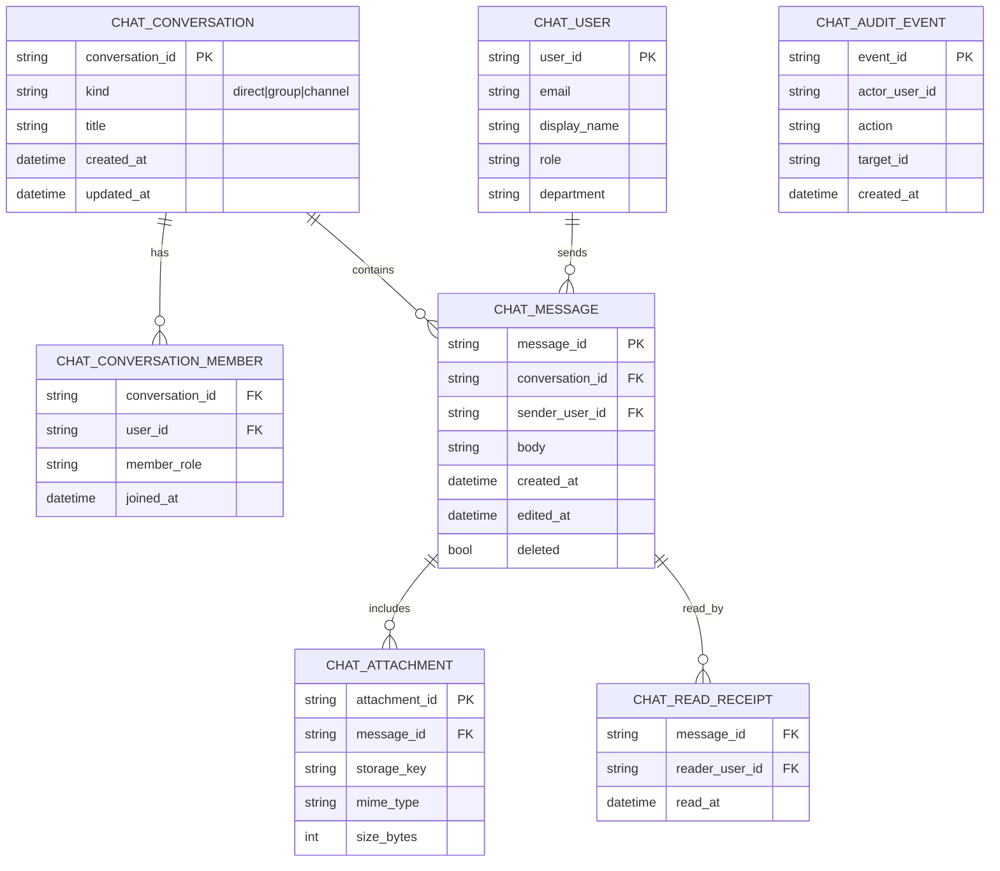
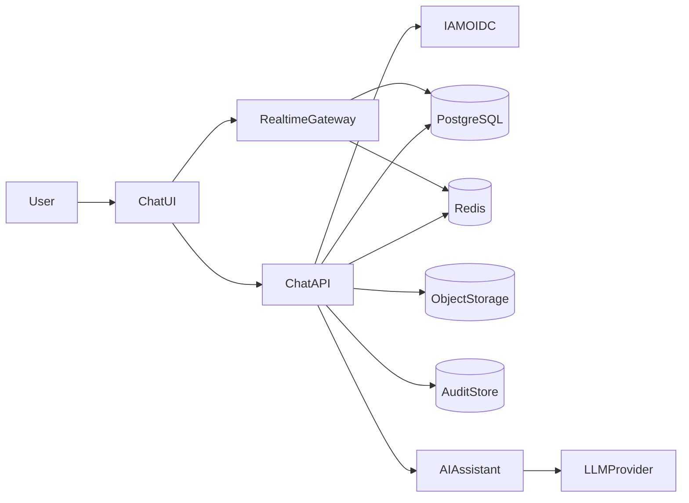
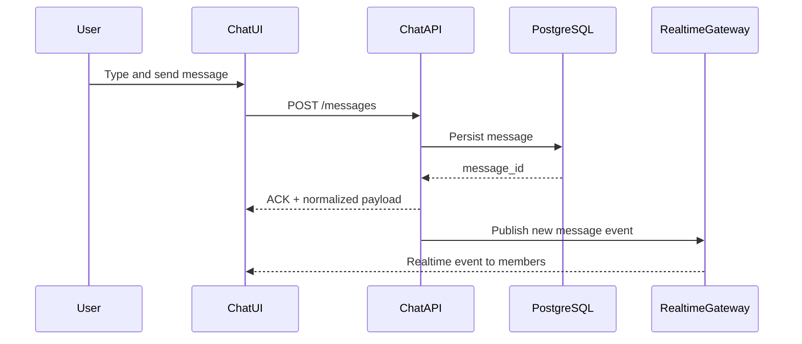
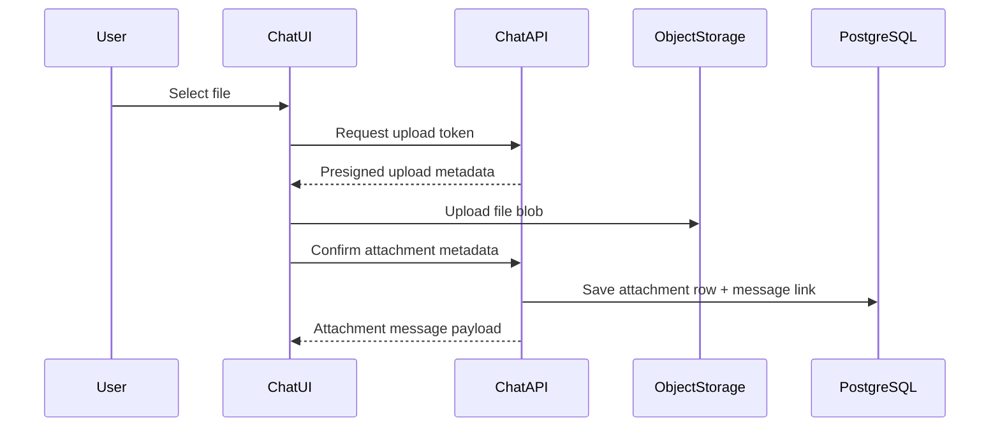
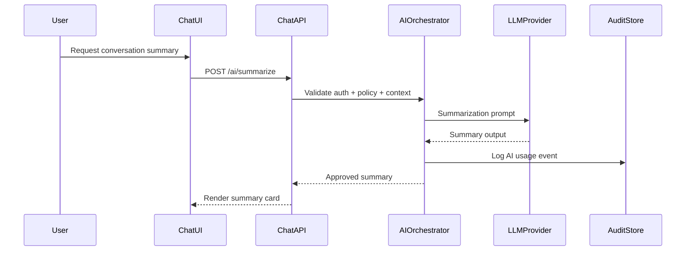

# Internal Chat Service Specification

**Service:** Internal Chat  
**Module family:** Collaboration / Communication Platform  
**Primary frontend file:** `frontend/src/pages/ChatPage.tsx`  
**Status:** UI-rich prototype with local/demo data today; enterprise backend target defined below  
**Version:** 1.0

---

## 1) Purpose and business value

Internal Chat provides real-time communication for teams across Sales, Purchase, Workshop, Wash, HRM, and operations.

Business value:

- Faster coordination between departments
- Lower reliance on external messaging tools
- Better auditability and data control for internal communication
- Foundation for AI-assisted productivity (summaries, smart replies, action extraction)

---

## 2) Scope (current vs target)

### Current (repository baseline)

- Direct chat and group chat UX in `ChatPage`
- Message timeline with delivery/read visual ticks
- Presence indicators and typing-adjacent UX patterns
- Attachment send flow (image/file demo constraints)
- Browser notification prompt and local event-driven behavior
- Chat persistence currently implemented via local/demo store hooks

### Target (enterprise production)

- Chat as backend service with secure APIs + realtime gateway
- Managed database persistence (durable conversations/messages)
- Role-aware access control and channel policies
- Full audit logging, retention controls, legal/compliance exports
- AI assistant layer with governance and explicit user controls

---

## 3) Feature catalog

## 3.1 Core messaging

- 1:1 direct conversations
- Group conversations/channels
- Rich text + attachments
- Read receipts and delivery state
- Search/filter conversations
- Mobile-responsive chat list/thread behavior

## 3.2 Collaboration features (target)

- Threaded replies
- Mentions (`@user`, `@team`)
- Reactions
- Message pin/bookmark
- Shared media/files view

## 3.3 Governance and admin (target)

- Channel membership policy by role/department
- Retention policy by channel type
- Moderation and content-report flows
- eDiscovery/admin export controls
- Audit trails for sensitive actions

## 3.4 AI features (target)

- Conversation summary
- Smart draft replies
- Action-item extraction
- Semantic chat search
- Risk/safety classification and policy checks

---

## 4) Technologies and frameworks

| Layer | Technologies |
|------|--------------|
| Frontend | React + TypeScript, Tailwind, lucide-react |
| Current chat state | local store/hooks (`chatStore`, `useChatSync`, `chatPresence`) |
| Backend target | FastAPI, Pydantic v2, SQLAlchemy 2.x, Alembic |
| Realtime target | WebSocket gateway (FastAPI WS or dedicated realtime service) |
| Database target | PostgreSQL |
| Cache/fan-out target | Redis |
| Attachment storage | Object storage (S3-compatible / Blob) |
| Search target | PostgreSQL FTS initially, optional OpenSearch/Elastic at scale |
| AI target | Backend orchestration + LLM provider abstraction |
| Observability | OpenTelemetry, logs, traces, metrics, alerting |
| DevSecOps | GitHub Actions, Docker, IaC (Terraform/Bicep), SAST/SCA/container scan |

---

## 4.1 Framework and platform inventory (traceable)

| Area | Framework / platform | Why used | Primary files |
|------|----------------------|----------|---------------|
| Frontend app | React + TypeScript | Realtime collaboration UX with strong typing | `frontend/src/pages/ChatPage.tsx` |
| Styling system | Tailwind CSS | Consistent chat layouts and interaction states | `frontend/src/pages/ChatPage.tsx` |
| Frontend chat state | `chatStore`, `chatPresence`, `useChatSync` | Message/presence sync orchestration | `frontend/src/store/chatStore.ts`, `frontend/src/store/chatPresence.ts`, `frontend/src/hooks/useChatSync.ts` |
| Presence UI | React component | Online/offline/readiness visual feedback | `frontend/src/components/PresenceIndicator.tsx` |
| Backend API target | FastAPI + Pydantic + SQLAlchemy | Typed contracts + durable persistence + policy checks | `docs/LLD.md`, `docs/HLD.md` |
| Realtime target | WebSocket gateway + Redis | Event fan-out, presence, typing, read state propagation | `docs/HLD.md`, `docs/LLD.md` |
| Durable storage | PostgreSQL | Conversation, message, membership, audit persistence | `docs/erd.md`, `docs/HLD.md` |
| Attachment storage | Object storage (S3/Blob compatible) | Scalable file handling decoupled from DB blobs | `docs/HLD.md` |
| AI orchestration | Provider abstraction layer | Safe, replaceable AI for summary/smart-reply/extraction | `docs/Project-Report-Technical-Requirements.md` |
| Delivery and controls | GitHub Actions + Docker + IaC | Repeatable releases, scan gates, rollback safety | `docs/Project-Report-Technical-Requirements.md` |

---

## 5) Data model (ER-style target)

---

## 6) Feature diagram

```mermaid
flowchart TB
  chatService[InternalChatService]

  chatService --> core[CoreMessaging]
  chatService --> collab[Collaboration]
  chatService --> govern[GovernanceAndAdmin]
  chatService --> ai[AIEnhancements]

  core --> direct[DirectChats]
  core --> group[GroupChats]
  core --> attach[Attachments]
  core --> receipts[DeliveryReadReceipts]
  core --> search[ConversationSearch]

  collab --> threads[ThreadReplies]
  collab --> mentions[Mentions]
  collab --> reactions[Reactions]
  collab --> pins[PinsBookmarks]

  govern --> rbac[RoleBasedAccess]
  govern --> retention[RetentionPolicies]
  govern --> audit[AuditLogs]
  govern --> export[ComplianceExport]

  ai --> summary[ConversationSummary]
  ai --> smartReply[SmartReplies]
  ai --> actionItems[ActionExtraction]
  ai --> semanticSearch[SemanticSearch]
```

---

## 7) DFD (target)

---

## 8) Sequence flows

### 8.1 Send message

### 8.2 Upload attachment

### 8.3 AI summary request

---

## 8.4 Feature-to-file traceability matrix (current and target)

| Feature | Status | Current implementation files | Target service/API ownership |
|---------|--------|------------------------------|------------------------------|
| Direct chat thread UI | Live (prototype) | `frontend/src/pages/ChatPage.tsx`, `frontend/src/store/chatStore.ts` | Chat conversations/messages APIs |
| Group/channel chat UI | Live (prototype) | `frontend/src/pages/ChatPage.tsx`, `frontend/src/store/chatStore.ts` | Channel policy + membership service |
| Presence indicators | Live (prototype) | `frontend/src/store/chatPresence.ts`, `frontend/src/components/PresenceIndicator.tsx` | Realtime presence gateway |
| Message sync behavior | Live (prototype/local sync) | `frontend/src/hooks/useChatSync.ts` | Realtime event stream + durable persistence |
| Attachment UX | Live (demo-level flow) | `frontend/src/pages/ChatPage.tsx` | Upload URL API + object storage + metadata persistence |
| Read receipts | Live (prototype behavior) | `frontend/src/pages/ChatPage.tsx`, `frontend/src/store/chatStore.ts` | Receipt events + message-read service |
| Audit logs | Target | N/A (not fully implemented in frontend) | Backend audit pipeline + immutable store |
| Role/policy enforcement | Target | N/A | IAM + RBAC/ABAC middleware |
| AI summaries/smart reply | Target | N/A | AI orchestration + policy guardrails |

---

## 9) API and realtime contracts (target)

### REST

- `GET /api/v1/chat/conversations`
- `POST /api/v1/chat/conversations`
- `GET /api/v1/chat/conversations/{id}/messages`
- `POST /api/v1/chat/conversations/{id}/messages`
- `PATCH /api/v1/chat/messages/{id}`
- `DELETE /api/v1/chat/messages/{id}`
- `POST /api/v1/chat/attachments/upload-url`
- `POST /api/v1/chat/ai/summarize`
- `POST /api/v1/chat/ai/smart-reply`

### WebSocket events

- `message.created`
- `message.updated`
- `message.deleted`
- `receipt.read`
- `presence.updated`
- `typing.updated`

---

## 10) Security, compliance, and controls

- OIDC-based auth and short-lived access tokens
- RBAC/ABAC policy check on every conversation/message operation
- Department/channel visibility constraints
- Attachment validation (type, size, malware hook)
- Retention policy enforcement (auto-archive/delete)
- Audit logs for moderation/admin/security actions
- Privacy controls for exports and legal hold support

---

## 10.1 Backup, restore, and disaster recovery (production target)

### Protection scope

- PostgreSQL: conversations, messages, membership, read receipts, audit references
- Object storage: attachments and related metadata pointers
- Realtime state: Redis treated as transient, recoverable from durable stores

### Backup baseline

- Daily full backup + PITR for PostgreSQL
- Object storage versioning + retention controls
- Audit export snapshots aligned to compliance cadence

### Restore and drill baseline

- Monthly restore drill to non-production environment
- Verification checklist:
  - message/thread count reconciliation
  - attachment link integrity sample
  - read-receipt/event consistency checks
  - smoke tests for core send/read flows

### DR baseline

- RTO/RPO inherit enterprise targets from TRD
- Annual failover rehearsal with business and operations sign-off
- Clear incident command authority for cutover/failback

---

## 11) Roadmap location

The complete version-wise roadmap for Internal Chat is maintained in:

- `docs/roadmap/InternalChat-Roadmap.md`

This keeps architecture/spec details and business rollout planning as separate documents.

---

## 12) KPIs and SLO targets

| KPI/SLO | Target direction |
|---------|------------------|
| Message delivery p95 latency | Sub-second UX target |
| Message send failure rate | Near-zero with retries |
| Realtime event lag | Low and stable |
| Attachment upload success rate | High reliability |
| Unread/read consistency | No drift across clients |
| AI summary acceptance rate | Measurable utility |
| Security incident count (chat) | Continuous reduction |

---

## 13) Testing strategy

- Unit tests: message reducers, formatters, permission guards
- API integration tests: conversation/message/attachment workflows
- Realtime tests: event ordering and idempotency
- E2E tests: direct chat, group chat, attachments, read receipts
- Security tests: authZ bypass checks, retention policy behavior
- Performance tests: websocket throughput and hot-conversation load

---

## 14) References

- `frontend/src/pages/ChatPage.tsx`
- `frontend/src/store/chatStore.ts`
- `frontend/src/store/chatPresence.ts`
- `frontend/src/hooks/useChatSync.ts`
- `frontend/src/components/PresenceIndicator.tsx`
- `docs/HLD.md`
- `docs/LLD.md`
- `docs/Project-Report-Technical-Requirements.md`

