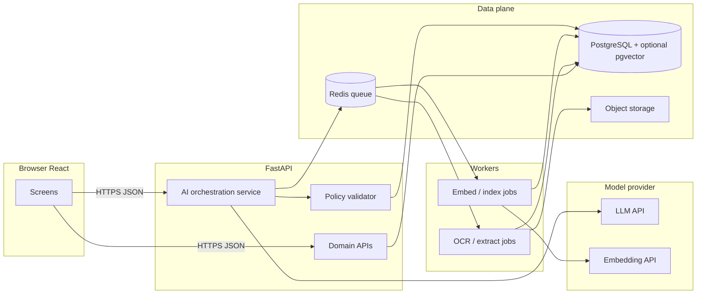
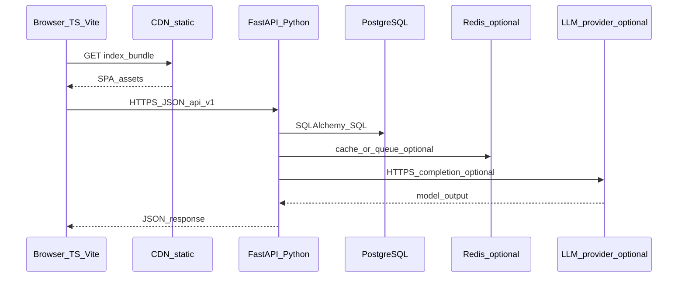

# DEMA Digital Core — High-Level Design (HLD)

**Technology specification: languages, platform, and modules**

| Field | Value |
|-------|--------|
| Document type | High-Level Design (extract) |
| Scope | Target-state application and platform stack |
| Legacy context | Microsoft Access (UI), Microsoft SQL Server (data) — AS-IS |
| Target stack | React (TypeScript) + Python (FastAPI) + managed cloud + PostgreSQL (recommended) |

**PDF export:** Open this file in VS Code / Cursor, or use Pandoc (`pandoc docs/HLD.md -o HLD.pdf`). For Mermaid diagrams, use a renderer that supports Mermaid (e.g. Typora, Obsidian, or print from GitHub preview if enabled).

**Companion:** Low-level contracts and implementation rules are in [LLD.md](./LLD.md). **Technical requirements specification (TRD/TRS):** [Project-Report-Technical-Requirements.md](./Project-Report-Technical-Requirements.md) — governance, delivery/rollback, SLAs, compliance, traceability, ADR register. For the maintained document set, see [README.md](./README.md).

---

## Abstract

DEMA’s evolution replaces Access-bound clients and SQL Server as the sole interactive pattern with a **browser-based React application**, a **Python API layer**, and a **managed cloud database** (PostgreSQL preferred; Azure SQL optional per ADR). This document specifies **languages, products, and patterns per architectural layer**, **API grouping**, **cloud options**, **AI integration** (expanded in **§8** with feature list, execution plan, and governance), **DevOps tooling**, and a **module-by-module technology map** aligned with the DEMA dashboard. Detailed low-level API contracts and migration runbooks live in separate LLD and delivery artefacts.

---

## 1. Languages and runtimes (by architectural layer)

| Layer | Primary language(s) | Runtime / toolchain | Notes |
|-------|---------------------|---------------------|--------|
| Web client | **TypeScript** | Browser (ES modules); bundled by **Vite** | Type safety for UI; no security-authoritative business logic only in the browser |
| Backend services | **Python** 3.12+ (align with org LTS policy) | **FastAPI** on **Uvicorn** (dev); **Gunicorn + Uvicorn workers** (prod option) | One language for API, ETL, ML glue, workers |
| Relational database | **SQL** (PostgreSQL dialect preferred) | Managed **PostgreSQL** 15+ or **Azure SQL** / SQL Server if ADR selects Microsoft stack | DDL evolves via **Alembic** migrations aligned with `database/schema.sql` after reconciliation with legacy SQL Server |
| Infrastructure as code | **YAML** (CI), **HCL** (Terraform) or **Bicep** (Azure) | Pipeline and landing-zone definitions | One IaC standard per cloud choice |
| Legacy (AS-IS) | Access macros/VBA, **T-SQL** | SQL Server | Retired module-by-module after cutover |

**Rule:** Business invariants and authorisation **must** live in **Python services** (or DB constraints where appropriate), not only in the React app.

---

## 2. Master technology stack (TO-BE)

| Concern | Recommended technology | Purpose |
|---------|------------------------|---------|
| UI framework | **React 18** | Component model, ecosystem |
| UI build | **Vite 6** | Fast dev server, production bundles |
| Styling | **Tailwind CSS 3** + **PostCSS** | Design system velocity (`frontend/`) |
| Charts / dashboards | **Recharts** | KPI and trend visualisation |
| Layout / widgets | **react-grid-layout**, **react-resizable** | Dynamic dashboard tiles |
| Icons | **lucide-react** | Icon set |
| Client routing | **Hash-based routes** (`#/sales/...`) | Current SPA pattern; browser router optional later |
| HTTP client | **Native `fetch`** + thin wrapper (to add) | JWT, refresh, error normalisation |
| Server framework | **FastAPI** | Typed routes, DI, **OpenAPI** |
| Validation | **Pydantic v2** | Request/response models |
| ORM | **SQLAlchemy 2.x** (2.0 style) | Models and queries |
| Migrations | **Alembic** | Versioned DDL; gated deploy |
| Auth (enterprise) | **Microsoft Entra ID** (OIDC) | SSO, conditional access, groups |
| Auth (alternative) | **JWT** access + refresh (**python-jose** or **PyJWT**), **argon2-cffi** or **bcrypt** | If IdP deferred |
| Async jobs | **Celery** + **Redis** or **RQ** or **Arq** | Imports, email, OCR, embeddings |
| Caching | **Redis** (optional v1) | Rate limits, denylist, job broker |
| API documentation | **OpenAPI 3** at `/docs` (disabled or auth-gated in prod) | Contracts |
| Logging | **structlog** or **stdlib logging** JSON | Correlation IDs |
| Metrics / traces | **OpenTelemetry** Python SDK | Azure Monitor / X-Ray / Grafana |
| Testing (API) | **pytest**, **httpx** `AsyncClient`, **pytest-asyncio** | Integration tests |
| Testing (UI) | **Vitest** + **React Testing Library** (recommended) | Component tests |
| Lint / format (Py) | **ruff**, optional **mypy** | CI gates |
| Lint (TS) | **ESLint** + **TypeScript** `strict` | Type safety |
| Containers | **Docker** multi-stage | Non-root, pinned bases |
| Orchestration (local) | **Docker Compose** | Postgres + API + Redis |
| Secrets | Cloud **Secret Manager** / **Key Vault** | Never in Git or Vite env exposed to client |

---

## 3. Database tier — detailed HLD

**Primary target (recommended):** **PostgreSQL** (managed, EU region).

**Alternative (ADR):** **Azure SQL** if minimising dialect change from legacy SQL Server or mandating Microsoft-only operations.

| Topic | Design choice |
|-------|----------------|
| Schema ownership | Canonical tables per reconciled model (`database/schema.sql`); legacy IDs in bridge tables during migration |
| Constraints | PK/FK, CHECK, NOT NULL in DDL; do not rely on UI-only validation |
| Indexing | B-tree on lookup keys (`kunden_nr`, dates, status); partial indexes per query patterns |
| Full-text | PostgreSQL **tsvector** / **GIN** for plate and fuzzy customer search if needed |
| Vector / AI | **pgvector** in same Postgres for RAG (optional); single VPC context |
| Pooling | **PgBouncer** (transaction mode) or managed pooler; tune SQLAlchemy pool per replica count |
| Migrations | **Alembic**; backward-compatible expands where possible |
| Backup / PITR | Managed backups; monthly restore test |
| Read scaling | Read replica for heavy reporting if needed |

**Legacy SQL Server:** read-only during migration; ETL via **Python** (`sqlalchemy` + `pyodbc` / `pymssql`) or **ADF/SSIS**.

---

## 4. Backend application — detailed HLD

| Topic | Design choice |
|-------|----------------|
| Packaging | `backend/app/`: `main.py`, `api/v1/`, `core/`, `services/`, `repositories/`, `models/`, `schemas/` |
| API style | **REST** + **HTTPS** + **JSON**; e.g. `/api/v1/kunden`, `/api/v1/anfragen` |
| Versioning | `/api/v1/`; breaking changes → `v2` |
| Error contract | JSON: `code`, `message`, optional `details[]` with `field` |
| Pagination | Cursor-based for large lists; offset only for small admin lists |
| File upload | `multipart/form-data` → **object storage**; metadata in DB |
| Background work | Workers + queue; `202` + `job_id` where appropriate |
| Configuration | **pydantic-settings**; 12-factor env vars |
| Dependency injection | FastAPI `Depends()` for DB session, user, permissions |

**Internal module boundaries:** Python packages by domain: `kunden`, `anfrage`, `angebot`, `bestand`, `rechnung`, `abholauftrag`, `werkstatt`, `wash`, `hrm`, `b2b`, `reports`, `admin`, `ai` (optional). Expose stable public service functions between domains to avoid circular imports.

---

## 5. Frontend application — detailed HLD

| Topic | Design choice |
|-------|----------------|
| Entry | `frontend/src/main.tsx`, `App.tsx` hash routing |
| State | **React Context** (auth, i18n); **TanStack Query** (recommended) for server state when APIs are live |
| Local persistence | **localStorage** for non-authoritative UX only (layout, language); remove for API-backed entities |
| Forms | Controlled components; shared inputs |
| i18n | `frontend/src/contexts/LanguageContext.tsx` pattern |
| Charts / dashboard | **Recharts** in `frontend/src/widgets/` |
| Auth UX | `frontend/src/contexts/AuthContext.tsx` + OIDC or secure refresh pattern |

---

## 6. APIs — detailed HLD

| API group | Typical resources | AuthZ |
|-----------|-------------------|--------|
| `auth` | `POST /token`, `POST /logout`, OIDC callback | Public / system |
| `users` | `GET /users/me`, `PATCH /users/me` | Authenticated |
| `kunden` | CRUD + search + merge (dedupe) | Sales / purchase / werkstatt / wash per policy |
| `anfrage`, `angebot`, `bestand` | CRUD + status transitions | Sales / purchase |
| `rechnung`, `gutschrift` | CRUD + posting rules | Finance |
| `werkstatt/*` | Orders, parts, catalogs, cash | Workshop |
| `wash/*` | Wash jobs, wash customer extension | Wash |
| `hrm/*` | Employees, attendance | HRM, least privilege |
| `b2b/*` | Partner-scoped resources | Partner or B2B role |
| `reports` | Aggregations, async exports | Read + export audit |
| `ai` (phase 2) | `POST /ai/query`, `POST /ai/documents/analyse` | Quota + permission |

**Optional integrations:** outbound **webhooks** (sale, invoice posted); inbound **API keys** + IP allow lists.

---

## 7. Cloud deployment — detailed HLD

**Region:** EU primary (e.g. Germany West Central, eu-central-1, europe-west3).

| Component | Azure (example) | AWS (example) | GCP (example) |
|-----------|-----------------|---------------|-----------------|
| Static SPA | Static Web Apps or Blob + Front Door | S3 + CloudFront | Cloud Storage + Cloud CDN |
| API | Container Apps or AKS | ECS Fargate or EKS | Cloud Run |
| Database | Azure Database for PostgreSQL or Azure SQL | RDS PostgreSQL | Cloud SQL PostgreSQL |
| Secrets | Key Vault | Secrets Manager | Secret Manager |
| Observability | App Insights + Log Analytics | CloudWatch + X-Ray | Cloud Monitoring + Trace |
| WAF | Front Door / App Gateway | ALB WAF / AWS WAF | Cloud Armor |
| CI/CD | GitHub Actions → ACR | Actions → ECR → ECS | Actions → Artifact Registry → Cloud Run |

**Network:** API in private subnet; DB without public IP; private link where available.

---

## 8. AI and intelligent automation — detailed HLD (controlled phase)

This section is the **single source of truth** in this document for **what AI means for DEMA Digital Core**, **which features are in scope**, **how they are executed technically and organisationally**, and **what is not implemented in the current UI prototype**.

### 8.1 Current state vs. target state (repository)

| Aspect | **AS-IS (today in `frontend/`)** | **TO-BE (this HLD)** |
|--------|----------------------------------|----------------------|
| LLM / embeddings | **Not present** — no API keys in browser, no calls to OpenAI/Azure OpenAI/Anthropic | All generative and embedding calls **only from Python** (`backend/`), never from Vite bundle |
| “Smart” UX | **Deterministic**: autocomplete from local/demo data (`SuggestTextInput`, stores), rule-based filters | Same patterns remain for speed; AI **augments** search, drafting, and document understanding **behind** APIs |
| Document AI | Uploads stored locally in demo (e.g. customer files) | Pipeline: object storage → worker → OCR/extract → review queue |
| HLD references | Section 6 (`/ai` APIs), §3 pgvector, module table “AI (optional)” | Expanded below: contracts, phases, governance |

**Implication for stakeholders:** AI features are **roadmapped capabilities** aligned with the FastAPI + worker stack; they are **not** a separate product — they plug into existing domains (`kunden`, `bestand`, `anfrage`, `rechnung`, etc.).

---

### 8.2 Principles (non-negotiable)

1. **Server-side only:** The React app receives **already-scoped, audited responses** (text, structured JSON, job IDs). No provider secrets in the client.
2. **Human in the loop for high-risk outputs:** Draft emails, extracted invoice fields, merge suggestions — **user confirms** before persistence where policy requires it.
3. **Tenant and role isolation:** RAG retrieval and tool calls are filtered by **organisation, site, and RBAC** (same as REST APIs).
4. **Observability:** Every AI request logs `correlation_id`, `user_id`, `route`, **token usage** (if available), and outcome — no raw PII in logs where avoidable.
5. **Provider abstraction:** Internal interface (`CompletionPort`, `EmbeddingPort`) so Azure OpenAI vs. OpenAI vs. Anthropic is a **configuration**, not a rewrite.

---

### 8.3 Feature catalogue (what we plan to offer)

Below: **feature ID**, **user-facing value**, **primary integration point**, **pattern**, **phase** (indicative).

| ID | Feature | User value | Integrates with | Technical pattern | Phase |
|----|---------|------------|-----------------|-------------------|-------|
| **AI-SEARCH-01** | Natural-language **inventory / parts** query | “Show me all MAN axles under €X from last month” | `bestand`, dashboard | RAG over curated product/stock docs + **structured SQL tool** (LLM proposes query; validator executes) | 2 |
| **AI-SEARCH-02** | **Semantic customer / company** search | Find customers by fuzzy description when spelling differs | `kunden` | Embeddings on name + address + notes; hybrid with **PostgreSQL FTS** | 2 |
| **AI-FAQ-01** | **Internal FAQ / process** assistant | “How do we post a Gutschrift in DEMA?” | Wiki/SOP markdown in repo or CMS | RAG with **citations** (source path + chunk id) | 2 |
| **AI-LEAD-01** | **Inquiry triage** | Suggest category, urgency, duplicate customer | `anfrage` | Classification + optional embedding similarity to open leads | 2 |
| **AI-LEAD-02** | **Draft reply** to inquiry (email) | Speed up first response | `anfrage`, email outbound | Prompt + RAG (product snippets, SLA text); **editable draft only** | 3 |
| **AI-OFFER-01** | **Offer text draft** | Boilerplate + line descriptions from template | `angebot` | Template slots + LLM; user edits before PDF | 3 |
| **AI-DOC-01** | **Invoice / receipt understanding** | Pre-fill line items or totals for review | `rechnung`, uploads | OCR (Tesseract / Azure DI) + **structured extraction** schema (Pydantic) | 2–3 |
| **AI-DOC-02** | **Document summary** for long PDFs | Short summary + key dates/amounts | Attachments on customer/vehicle | Chunked summarisation; store summary in DB after approval | 3 |
| **AI-DEDUP-01** | **Duplicate customer hints** | Suggest possible merges (not auto-merge) | `kunden`, dedupe UI | Embedding similarity + rules; **merge stays explicit user action** | 2 |
| **AI-REP-01** | **Report narratives** | One-paragraph explanation of KPI chart | `reports`, dashboard | LLM on **aggregated numbers only** (no row-level PII in prompt unless allowed) | 3 |
| **AI-B2B-01** | **B2B catalogue Q&A** | Partner asks about listed vehicles/specs | `b2b` | Scoped RAG on public/partner-safe corpus only | 3 |
| **AI-SEC-01** | **Login risk signals** (optional) | Unusual pattern flagging | `auth` | Rules + optional classifier on metadata (not password content) | Later |
| **AI-OGT-01** | **Route / task hints** (optional) | Suggest ordering of stops | On-ground team | Optimisation APIs first; LLM only for natural-language explanations | Later |

**Out of scope for v1 AI:** fully autonomous posting to accounting, unsupervised customer merge, medical/legal advice, training on **customer PII** without DPA and retention policy.

---

### 8.4 Architecture (how it runs)

**Request path (synchronous “ask”):** `POST /api/v1/ai/query` → authZ → rate limit → load **allowed tools** (e.g. `search_kunden`, `sql_readonly`) → build prompt with **retrieved chunks** → LLM → **output validation** (JSON schema / length) → audit log → response.

**Request path (async “analyse document”):** `POST /api/v1/ai/documents/analyse` → returns `job_id` → worker runs OCR/extract → result stored → `GET /api/v1/ai/jobs/{id}` or webhook.

---

### 8.5 API surface (high level; LLD will define schemas)

| Method | Path | Purpose |
|--------|------|---------|
| `POST` | `/api/v1/ai/query` | NL question with optional `context` (e.g. `module=bestand`); returns answer + citations |
| `POST` | `/api/v1/ai/documents/analyse` | Submit `document_id` or upload handle; returns `job_id` |
| `GET` | `/api/v1/ai/jobs/{job_id}` | Poll extraction / summarisation status |
| `POST` | `/api/v1/ai/embeddings/reindex` | Admin: trigger re-embed for corpus scope (protected) |
| `GET` | `/api/v1/ai/health` | Provider connectivity + model version (no secrets) |

**Authorisation:** Same JWT/OIDC as REST; additional `ai:query`, `ai:documents`, `ai:admin` permissions where needed.

---

### 8.6 RAG and knowledge bases

| Corpus | Content | Refresh | Storage |
|--------|---------|---------|---------|
| **Product / stock help** | Sanitised descriptions, OEM notes, internal SKU docs | On article change + nightly | Chunks in DB + **pgvector** |
| **SOP / FAQ** | Markdown in repo or headless CMS | CI or webhook on publish | Versioned chunks; cite `source_uri` |
| **Customer-facing B2B** | Only public/partner-approved text | Editorial workflow | Separate index namespace |

**Retrieval:** hybrid **BM25 (Postgres FTS) + vector** top-k; **re-rank** optional second stage; **max chunks** and **max tokens** enforced per request.

---

### 8.7 Security, privacy, compliance

| Topic | Control |
|-------|---------|
| Data residency | EU deployment; **Azure OpenAI in EU** or EU-processed endpoint per contract |
| PII | Redact or hash before logging; **minimise** what enters the prompt; field-level allow lists per feature |
| Prompt injection | System prompt hardening; **tool allow list**; no arbitrary URL fetch from model output |
| Retention | Configurable TTL for prompts/responses in DB; default **short** for debugging only |
| DPA | Subprocessor list includes chosen LLM provider; customer consent for optional features |

---

### 8.8 Cost, quotas, and abuse prevention

| Mechanism | Implementation |
|-----------|----------------|
| Per-user / per-tenant **daily token budget** | Redis counter + DB rollup |
| **Rate limiting** | Middleware (e.g. slowapi) per IP + per user |
| **Model choice** | Cheaper model for classification; premium for long documents |
| **Caching** | Hash of (normalised question + corpus version) → cached answer TTL 5–60 min where safe |
| **Billing visibility** | Internal table: `ai_usage(user_id, tenant_id, tokens, cost_estimate, feature_id, ts)` |

---

### 8.9 Quality assurance and evaluation

| Activity | Detail |
|----------|--------|
| **Golden sets** | Curated Q&A + expected citations / SQL shapes for `AI-SEARCH-01`, `AI-FAQ-01` |
| **Regression** | CI job runs prompts against stub or recorded responses; fail on major drift |
| **Human review** | Sample rate of production queries reviewed weekly in early phase |
| **Model upgrades** | Pin versions; run golden set before bump; document in changelog |

---

### 8.10 Execution roadmap (how we deliver)

**Phase 0 — Foundations (no user-visible AI)**  
- FastAPI `ai` package skeleton: `CompletionPort`, `EmbeddingPort`, feature flags.  
- Postgres: `ai_usage`, `ai_job`, optional `pgvector` extension migration.  
- Secrets: Key Vault / env; **no** keys in frontend.  
- Observability: structured logs + metric counters.

**Phase 1 — Read-only assist**  
- `AI-FAQ-01` on static SOP corpus (internal).  
- `AI-SEARCH-01` prototype: NL → **validated read-only SQL** or search API (no writes).  
- UI: single “**Ask DEMA**” side panel or header entry (behind feature flag).

**Phase 2 — Domain-integrated**  
- `AI-LEAD-01`, `AI-DEDUP-01`, `AI-DOC-01` (job-based) wired to `anfrage`, `kunden`, `rechnung`.  
- Embeddings incremental pipeline on worker.

**Phase 3 — Drafting and narratives**  
- `AI-LEAD-02`, `AI-OFFER-01`, `AI-REP-01`, `AI-DOC-02` with strict **confirm to save**.

**Dependencies:** stable REST APIs for each domain, object storage for documents, Redis (or equivalent) for queues, legal sign-off on provider and data flow.

---

### 8.11 Mapping: module table ↔ AI features

Cross-reference to **§9** (module mapping): cells that mention “RAG”, “draft”, “OCR”, “Fuzzy”, “Narratives” correspond to the feature IDs above. Purchase (`PUR-*`) inherits the same AI features as Sales where the **same backend service** applies, with **stricter RBAC** and purchase-specific corpora/filters.

---

### 8.12 Summary table (capabilities × technologies)

| Capability | Pattern | Technologies (typical) |
|------------|---------|-------------------------|
| NL inventory / FAQ | RAG + citations + optional tools | Azure OpenAI / OpenAI / Anthropic; **pgvector**; Postgres FTS |
| Embeddings | Batch + incremental | Provider embedding models; worker queue |
| Documents | Upload → worker → OCR + structured extraction → human review | PyMuPDF, pdfplumber; **Azure Document Intelligence** optional |
| Guardrails | Versioned prompts; PII redaction; output schema validation | FastAPI middleware; Pydantic |
| Cost / abuse | Quotas, rate limits, usage ledger | Redis + PostgreSQL |
| Evaluation | Golden sets; CI regression | pytest; recorded fixtures (YAML/JSON) |

**Orchestration language:** Python only for AI workflows touching data. Prompts and eval fixtures versioned in Git (`/prompts`, `/evals` or similar).

---

## 9. Module-by-module technology mapping

| Module ID | Frontend (TS/React) | Backend (Python) | Database (SQL) | Async / integrations | AI (optional) |
|-----------|---------------------|------------------|----------------|----------------------|---------------|
| CORE-AUTH | Login/signup, OIDC | JWT/OIDC, refresh | `mitarbeiter`, `app_user`, Redis denylist | Entra webhooks | Risk scoring (later) |
| CORE-ADMIN | Roles UI, settings | RBAC middleware | Role/permission tables | Audit log | — |
| DASH | Dynamic dashboard, widgets | Metrics endpoints | Summaries / careful live SQL | Scheduled jobs | NL KPI summary |
| B2B | B2B portal | Scoped routes, partner JWT/mTLS | Partner views | Email | Catalogue assistant |
| SALES-CUST | Customers, dedupe | `kunden` service, merge | `kunden`, `kunden_rollen`, `kunden_wash` | Dedupe batch | Fuzzy match |
| SALES-INV | Bestand UI | `bestand` CRUD | `bestand`, links | — | NL RAG search |
| SALES-OFF | Offers | `angebot` state machine | `angebot`, lines | PDF jobs | Draft text |
| SALES-LEAD | Inquiries | `anfrage` pipeline | `anfrage` | Email ingest | Triage / draft reply |
| SALES-SOLD | Verkaufter Bestand | Sales history APIs | Sold views | — | — |
| SALES-PICK | Abholaufträge | `abholauftrag` | `abholauftrag` | Calendar | — |
| SALES-PLATE | Kennzeichen | Search / external adapter | FTS or external | Gov API if licensed | — |
| SALES-AR | Rechnungen | `rechnung`, `gutschrift` | Line tables | Accounting export | Doc summary |
| SALES-BI | Auswertungen | `/reports` | Aggregates / replica | Async export | Narratives |
| PUR-* | Purchase routes | Same domains, purchase policy | Same tables, filters | — | — |
| WS-ORD | Workshop orders | Order lifecycle | TBD from discovery | Supplier APIs | — |
| WS-PARTS | Parts | Parts APIs | Articles | Print jobs | — |
| WS-SVC | Service catalogs | Catalog CRUD | Rates | — | — |
| WS-AR | Cash, accounting | Financial service layer | AR/cash | POS optional | Receipt OCR |
| WS-SUPP | Suppliers | Supplier CRUD | `lieferanten` equiv. | — | — |
| WASH | Waschanlage | Wash + `kunden_wash` | Extension tables | — | — |
| HRM | HRM pages | HRM APIs + audit | Payroll TBD | Payroll files | — |
| OGT | On-ground team | Tasks, drivers, schedules | OGT TBD | Push (future) | Routing (future) |

---

## 10. DevOps, quality, and security toolchain

| Stage | Technology | Gate |
|-------|------------|------|
| Source | Git (GitHub / GitLab / Azure Repos) | Branch protection, reviews |
| CI | GitHub Actions | `npm ci && npm run build`; Docker image |
| Python CI | ruff, pytest | Fail on lint/test |
| TS CI | `tsc --noEmit`, ESLint | Fail on type/lint |
| SCA | pip-audit / Dependabot | Block critical CVEs |
| Container scan | Trivy / Grype | Block critical base issues |
| CD | Staging → prod | Manual prod approval |
| IaC scan | checkov / tfsec | Misconfiguration |

---

## 11. End-to-end data and request flow

<strong>Technologies in this diagram:</strong> 

---

## Document history

| Version | Notes |
|---------|--------|
| 1.0 | Standalone extract for stakeholder PDFs; paths relative to repository root |
| 1.1 | Expanded **§8 AI**: current vs target state, feature catalogue (AI-SEARCH-01 …), architecture, APIs, RAG, security, cost, QA, execution roadmap, module cross-reference |

*This HLD is aligned with the master delivery blueprint stored in the project planning artefact (`e2e_python_to_cloud` plan). For C4 context diagrams and LLD-level API standards, refer to that blueprint.*
