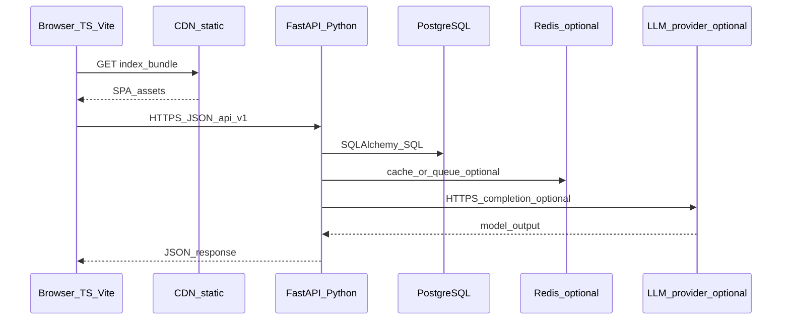

# DEMA Digital Core — High-Level Design (HLD)

**Technology specification: languages, platform, and modules**

| Field | Value |
|-------|--------|
| Document type | High-Level Design (extract) |
| Scope | Target-state application and platform stack |
| Legacy context | Microsoft Access (UI), Microsoft SQL Server (data) — AS-IS |
| Target stack | React (TypeScript) + Python (FastAPI) + managed cloud + PostgreSQL (recommended) |

**PDF export:** Open this file in VS Code / Cursor, or use Pandoc (`pandoc docs/HLD.md -o HLD.pdf`). For Mermaid diagrams, use a renderer that supports Mermaid (e.g. Typora, Obsidian, or print from GitHub preview if enabled).

---

## Abstract

DEMA’s evolution replaces Access-bound clients and SQL Server as the sole interactive pattern with a **browser-based React application**, a **Python API layer**, and a **managed cloud database** (PostgreSQL preferred; Azure SQL optional per ADR). This document specifies **languages, products, and patterns per architectural layer**, **API grouping**, **cloud options**, **AI integration**, **DevOps tooling**, and a **module-by-module technology map** aligned with the DEMA dashboard. Detailed low-level API contracts and migration runbooks live in separate LLD and delivery artefacts.

---

## 1. Languages and runtimes (by architectural layer)

| Layer | Primary language(s) | Runtime / toolchain | Notes |
|-------|---------------------|---------------------|--------|
| Web client | **TypeScript** | Browser (ES modules); bundled by **Vite** | Type safety for UI; no security-authoritative business logic only in the browser |
| Backend services | **Python** 3.12+ (align with org LTS policy) | **FastAPI** on **Uvicorn** (dev); **Gunicorn + Uvicorn workers** (prod option) | One language for API, ETL, ML glue, workers |
| Relational database | **SQL** (PostgreSQL dialect preferred) | Managed **PostgreSQL** 15+ or **Azure SQL** / SQL Server if ADR selects Microsoft stack | DDL evolves via **Alembic** migrations aligned with `database/schema.sql` after reconciliation with legacy SQL Server |
| Infrastructure as code | **YAML** (CI), **HCL** (Terraform) or **Bicep** (Azure) | Pipeline and landing-zone definitions | One IaC standard per cloud choice |
| Legacy (AS-IS) | Access macros/VBA, **T-SQL** | SQL Server | Retired module-by-module after cutover |

**Rule:** Business invariants and authorisation **must** live in **Python services** (or DB constraints where appropriate), not only in the React app.

---

## 2. Master technology stack (TO-BE)

| Concern | Recommended technology | Purpose |
|---------|------------------------|---------|
| UI framework | **React 18** | Component model, ecosystem |
| UI build | **Vite 6** | Fast dev server, production bundles |
| Styling | **Tailwind CSS 3** + **PostCSS** | Design system velocity (`frontend/`) |
| Charts / dashboards | **Recharts** | KPI and trend visualisation |
| Layout / widgets | **react-grid-layout**, **react-resizable** | Dynamic dashboard tiles |
| Icons | **lucide-react** | Icon set |
| Client routing | **Hash-based routes** (`#/sales/...`) | Current SPA pattern; browser router optional later |
| HTTP client | **Native `fetch`** + thin wrapper (to add) | JWT, refresh, error normalisation |
| Server framework | **FastAPI** | Typed routes, DI, **OpenAPI** |
| Validation | **Pydantic v2** | Request/response models |
| ORM | **SQLAlchemy 2.x** (2.0 style) | Models and queries |
| Migrations | **Alembic** | Versioned DDL; gated deploy |
| Auth (enterprise) | **Microsoft Entra ID** (OIDC) | SSO, conditional access, groups |
| Auth (alternative) | **JWT** access + refresh (**python-jose** or **PyJWT**), **argon2-cffi** or **bcrypt** | If IdP deferred |
| Async jobs | **Celery** + **Redis** or **RQ** or **Arq** | Imports, email, OCR, embeddings |
| Caching | **Redis** (optional v1) | Rate limits, denylist, job broker |
| API documentation | **OpenAPI 3** at `/docs` (disabled or auth-gated in prod) | Contracts |
| Logging | **structlog** or **stdlib logging** JSON | Correlation IDs |
| Metrics / traces | **OpenTelemetry** Python SDK | Azure Monitor / X-Ray / Grafana |
| Testing (API) | **pytest**, **httpx** `AsyncClient`, **pytest-asyncio** | Integration tests |
| Testing (UI) | **Vitest** + **React Testing Library** (recommended) | Component tests |
| Lint / format (Py) | **ruff**, optional **mypy** | CI gates |
| Lint (TS) | **ESLint** + **TypeScript** `strict` | Type safety |
| Containers | **Docker** multi-stage | Non-root, pinned bases |
| Orchestration (local) | **Docker Compose** | Postgres + API + Redis |
| Secrets | Cloud **Secret Manager** / **Key Vault** | Never in Git or Vite env exposed to client |

---

## 3. Database tier — detailed HLD

**Primary target (recommended):** **PostgreSQL** (managed, EU region).

**Alternative (ADR):** **Azure SQL** if minimising dialect change from legacy SQL Server or mandating Microsoft-only operations.

| Topic | Design choice |
|-------|----------------|
| Schema ownership | Canonical tables per reconciled model (`database/schema.sql`); legacy IDs in bridge tables during migration |
| Constraints | PK/FK, CHECK, NOT NULL in DDL; do not rely on UI-only validation |
| Indexing | B-tree on lookup keys (`kunden_nr`, dates, status); partial indexes per query patterns |
| Full-text | PostgreSQL **tsvector** / **GIN** for plate and fuzzy customer search if needed |
| Vector / AI | **pgvector** in same Postgres for RAG (optional); single VPC context |
| Pooling | **PgBouncer** (transaction mode) or managed pooler; tune SQLAlchemy pool per replica count |
| Migrations | **Alembic**; backward-compatible expands where possible |
| Backup / PITR | Managed backups; monthly restore test |
| Read scaling | Read replica for heavy reporting if needed |

**Legacy SQL Server:** read-only during migration; ETL via **Python** (`sqlalchemy` + `pyodbc` / `pymssql`) or **ADF/SSIS**.

---

## 4. Backend application — detailed HLD

| Topic | Design choice |
|-------|----------------|
| Packaging | `backend/app/`: `main.py`, `api/v1/`, `core/`, `services/`, `repositories/`, `models/`, `schemas/` |
| API style | **REST** + **HTTPS** + **JSON**; e.g. `/api/v1/kunden`, `/api/v1/anfragen` |
| Versioning | `/api/v1/`; breaking changes → `v2` |
| Error contract | JSON: `code`, `message`, optional `details[]` with `field` |
| Pagination | Cursor-based for large lists; offset only for small admin lists |
| File upload | `multipart/form-data` → **object storage**; metadata in DB |
| Background work | Workers + queue; `202` + `job_id` where appropriate |
| Configuration | **pydantic-settings**; 12-factor env vars |
| Dependency injection | FastAPI `Depends()` for DB session, user, permissions |

**Internal module boundaries:** Python packages by domain: `kunden`, `anfrage`, `angebot`, `bestand`, `rechnung`, `abholauftrag`, `werkstatt`, `wash`, `hrm`, `b2b`, `reports`, `admin`, `ai` (optional). Expose stable public service functions between domains to avoid circular imports.

---

## 5. Frontend application — detailed HLD

| Topic | Design choice |
|-------|----------------|
| Entry | `frontend/src/main.tsx`, `App.tsx` hash routing |
| State | **React Context** (auth, i18n); **TanStack Query** (recommended) for server state when APIs are live |
| Local persistence | **localStorage** for non-authoritative UX only (layout, language); remove for API-backed entities |
| Forms | Controlled components; shared inputs |
| i18n | `frontend/src/contexts/LanguageContext.tsx` pattern |
| Charts / dashboard | **Recharts** in `frontend/src/widgets/` |
| Auth UX | `frontend/src/contexts/AuthContext.tsx` + OIDC or secure refresh pattern |

---

## 6. APIs — detailed HLD

| API group | Typical resources | AuthZ |
|-----------|-------------------|--------|
| `auth` | `POST /token`, `POST /logout`, OIDC callback | Public / system |
| `users` | `GET /users/me`, `PATCH /users/me` | Authenticated |
| `kunden` | CRUD + search + merge (dedupe) | Sales / purchase / werkstatt / wash per policy |
| `anfrage`, `angebot`, `bestand` | CRUD + status transitions | Sales / purchase |
| `rechnung`, `gutschrift` | CRUD + posting rules | Finance |
| `werkstatt/*` | Orders, parts, catalogs, cash | Workshop |
| `wash/*` | Wash jobs, wash customer extension | Wash |
| `hrm/*` | Employees, attendance | HRM, least privilege |
| `b2b/*` | Partner-scoped resources | Partner or B2B role |
| `reports` | Aggregations, async exports | Read + export audit |
| `ai` (phase 2) | `POST /ai/query`, `POST /ai/documents/analyse` | Quota + permission |

**Optional integrations:** outbound **webhooks** (sale, invoice posted); inbound **API keys** + IP allow lists.

---

## 7. Cloud deployment — detailed HLD

**Region:** EU primary (e.g. Germany West Central, eu-central-1, europe-west3).

| Component | Azure (example) | AWS (example) | GCP (example) |
|-----------|-----------------|---------------|-----------------|
| Static SPA | Static Web Apps or Blob + Front Door | S3 + CloudFront | Cloud Storage + Cloud CDN |
| API | Container Apps or AKS | ECS Fargate or EKS | Cloud Run |
| Database | Azure Database for PostgreSQL or Azure SQL | RDS PostgreSQL | Cloud SQL PostgreSQL |
| Secrets | Key Vault | Secrets Manager | Secret Manager |
| Observability | App Insights + Log Analytics | CloudWatch + X-Ray | Cloud Monitoring + Trace |
| WAF | Front Door / App Gateway | ALB WAF / AWS WAF | Cloud Armor |
| CI/CD | GitHub Actions → ACR | Actions → ECR → ECS | Actions → Artifact Registry → Cloud Run |

**Network:** API in private subnet; DB without public IP; private link where available.

---

## 8. AI and intelligent automation — detailed HLD (controlled phase)

All model calls are **server-side** only.

| Capability | Pattern | Technologies (typical) |
|------------|---------|-------------------------|
| NL inventory / FAQ | **RAG** + citations | OpenAI / Azure OpenAI / Anthropic; token limits |
| Embeddings | Batch + incremental | Provider embedding models; **pgvector** |
| Documents | Upload → worker → OCR + structured extraction → human review | PyMuPDF, pdfplumber; optional Azure Document Intelligence |
| Guardrails | Versioned prompts; PII redaction | FastAPI middleware |
| Cost / abuse | Quotas, rate limits, token billing table | Redis + DB |
| Evaluation | Golden sets; regression before model upgrades | pytest |

Orchestration: **Python**; fixtures: **YAML/JSON**.

---

## 9. Module-by-module technology mapping

| Module ID | Frontend (TS/React) | Backend (Python) | Database (SQL) | Async / integrations | AI (optional) |
|-----------|---------------------|------------------|----------------|----------------------|---------------|
| CORE-AUTH | Login/signup, OIDC | JWT/OIDC, refresh | `mitarbeiter`, `app_user`, Redis denylist | Entra webhooks | Risk scoring (later) |
| CORE-ADMIN | Roles UI, settings | RBAC middleware | Role/permission tables | Audit log | — |
| DASH | Dynamic dashboard, widgets | Metrics endpoints | Summaries / careful live SQL | Scheduled jobs | NL KPI summary |
| B2B | B2B portal | Scoped routes, partner JWT/mTLS | Partner views | Email | Catalogue assistant |
| SALES-CUST | Customers, dedupe | `kunden` service, merge | `kunden`, `kunden_rollen`, `kunden_wash` | Dedupe batch | Fuzzy match |
| SALES-INV | Bestand UI | `bestand` CRUD | `bestand`, links | — | NL RAG search |
| SALES-OFF | Offers | `angebot` state machine | `angebot`, lines | PDF jobs | Draft text |
| SALES-LEAD | Inquiries | `anfrage` pipeline | `anfrage` | Email ingest | Triage / draft reply |
| SALES-SOLD | Verkaufter Bestand | Sales history APIs | Sold views | — | — |
| SALES-PICK | Abholaufträge | `abholauftrag` | `abholauftrag` | Calendar | — |
| SALES-PLATE | Kennzeichen | Search / external adapter | FTS or external | Gov API if licensed | — |
| SALES-AR | Rechnungen | `rechnung`, `gutschrift` | Line tables | Accounting export | Doc summary |
| SALES-BI | Auswertungen | `/reports` | Aggregates / replica | Async export | Narratives |
| PUR-* | Purchase routes | Same domains, purchase policy | Same tables, filters | — | — |
| WS-ORD | Workshop orders | Order lifecycle | TBD from discovery | Supplier APIs | — |
| WS-PARTS | Parts | Parts APIs | Articles | Print jobs | — |
| WS-SVC | Service catalogs | Catalog CRUD | Rates | — | — |
| WS-AR | Cash, accounting | Financial service layer | AR/cash | POS optional | Receipt OCR |
| WS-SUPP | Suppliers | Supplier CRUD | `lieferanten` equiv. | — | — |
| WASH | Waschanlage | Wash + `kunden_wash` | Extension tables | — | — |
| HRM | HRM pages | HRM APIs + audit | Payroll TBD | Payroll files | — |
| OGT | On-ground team | Tasks, drivers, schedules | OGT TBD | Push (future) | Routing (future) |

---

## 10. DevOps, quality, and security toolchain

| Stage | Technology | Gate |
|-------|------------|------|
| Source | Git (GitHub / GitLab / Azure Repos) | Branch protection, reviews |
| CI | GitHub Actions | `npm ci && npm run build`; Docker image |
| Python CI | ruff, pytest | Fail on lint/test |
| TS CI | `tsc --noEmit`, ESLint | Fail on type/lint |
| SCA | pip-audit / Dependabot | Block critical CVEs |
| Container scan | Trivy / Grype | Block critical base issues |
| CD | Staging → prod | Manual prod approval |
| IaC scan | checkov / tfsec | Misconfiguration |

---

## 11. End-to-end data and request flow

---

## Document history

| Version | Notes |
|---------|--------|
| 1.0 | Standalone extract for stakeholder PDFs; paths relative to repository root |

*This HLD is aligned with the master delivery blueprint stored in the project planning artefact (`e2e_python_to_cloud` plan). For C4 context diagrams and LLD-level API standards, refer to that blueprint.*
