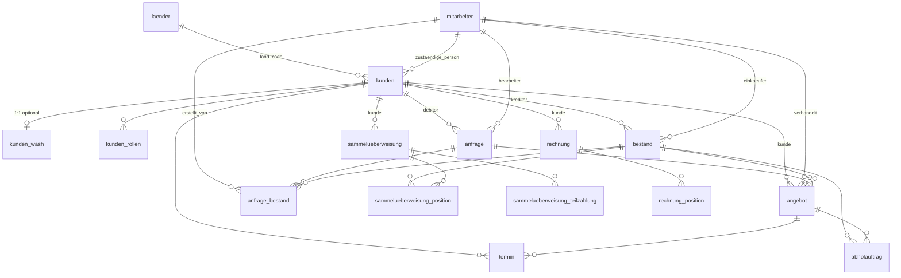

# DEMA – Datenmodell (Übersicht)

Siehe `database/schema.sql` für die vollständige PostgreSQL-DDL.

## Mermaid (Beziehungen)

## Kundenlösung

- **`kunden`**: ein Stammsatz für Verkauf, Einkauf, Werkstatt.
- **`kunden_wash`**: optionale 1:1-Erweiterung für die Waschanlage (gleiche `kunden_id`).
- Frontend-Demo: Persistenz in `localStorage` unter `dema-kunden-db`.
