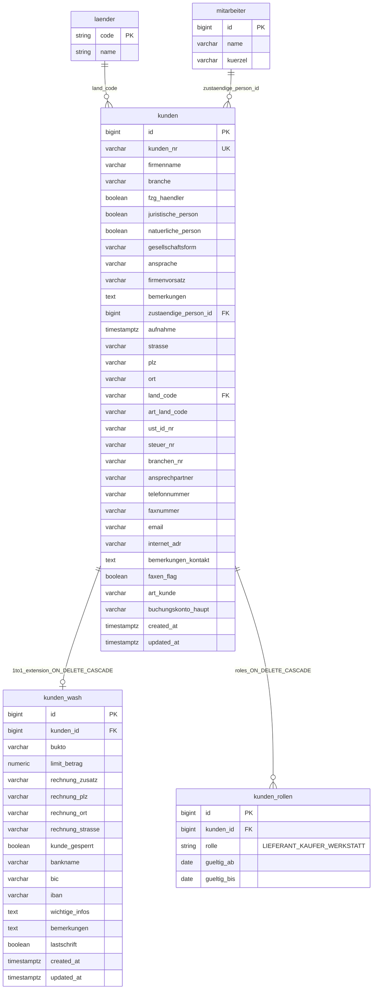
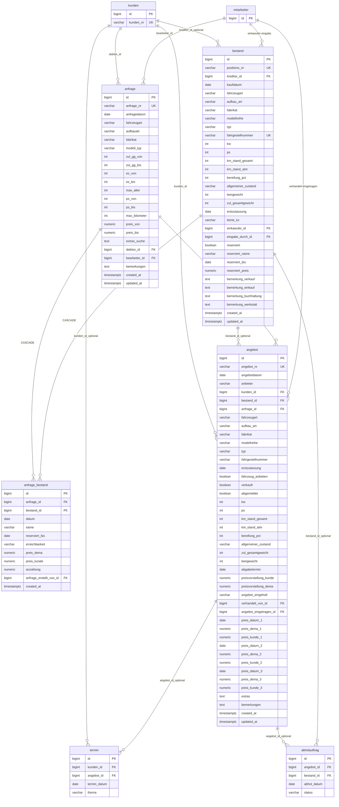
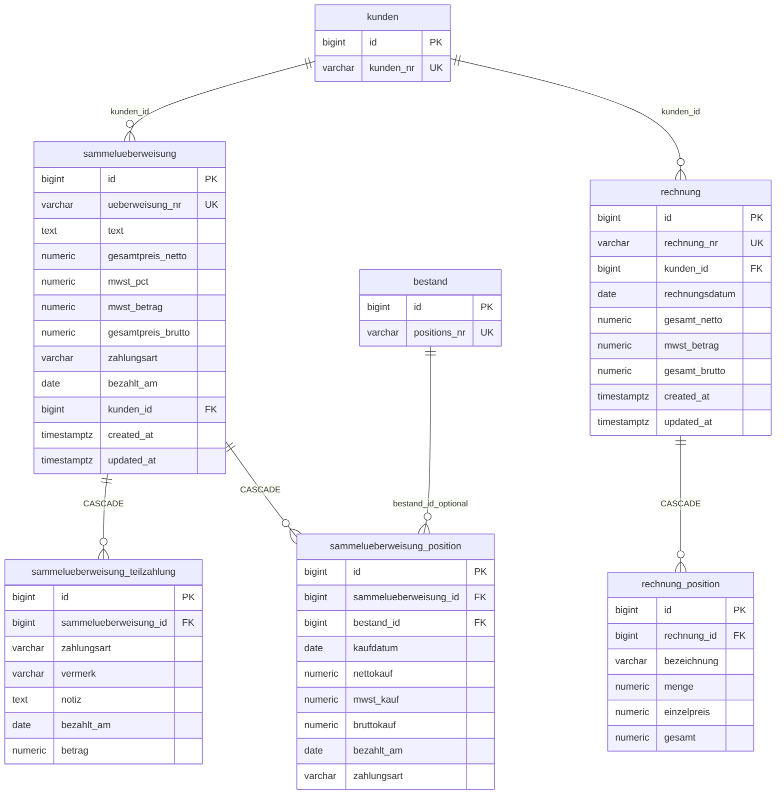

# DEMA — Logical / physical data model (ERD)

**Normative source:** [`database/schema.sql`](../database/schema.sql) (PostgreSQL DDL).

This document describes **entities, attributes, keys, relationships, referential actions, indexing**, and how **ACID** applies in the target database. It is intended for architects, backend engineers, and migration teams (SQL Server → PostgreSQL).

---

## 1. Conventions and notation

| Symbol / term | Meaning |
|-----------------|--------|
| **PK** | Primary key (unique row identifier; enforced `NOT NULL` + `UNIQUE`) |
| **FK** | Foreign key (references parent PK or unique column) |
| **UK** | Alternate key (`UNIQUE` constraint, may be `NULL` unless `NOT NULL`) |
| **1:1** | One parent row maps to at most one child row |
| **1:N** | One parent row maps to many child rows |
| **N:1** | Many child rows reference one parent (same as 1:N from parent view) |
| **CHECK** | Domain constraint on column values |
| **`ON DELETE CASCADE`** | Deleting parent deletes dependent rows (see integrity table) |

**Mermaid `erDiagram` cardinality** (used below):

- `||--||` — exactly one to exactly one  
- `||--o|` — one to zero or one  
- `||--o{` — one to zero or many  
- `}|--||` — many to one (child to parent)

---

## 2. ACID properties (PostgreSQL)

The operational database is **PostgreSQL** (see project HLD). PostgreSQL provides **ACID-compliant** transactions for DDL executed via this schema and for all DML executed inside a transaction.

| Property | Definition in this model |
|----------|---------------------------|
| **Atomicity** | A transaction’s changes **all commit** or **all roll back**. Multi-table operations (e.g. creating `rechnung` + multiple `rechnung_position` rows) **must** run in a **single** `BEGIN … COMMIT` in the application or a single stored procedure; partial writes that violate business rules **must not** be visible. |
| **Consistency** | **Declarative rules** in the schema enforce valid states: `NOT NULL`, `PRIMARY KEY`, `FOREIGN KEY`, `UNIQUE`, and `CHECK` (e.g. `kunden_rollen.rolle IN ('LIEFERANT','KAUFER','WERKSTATT')`). Application logic must not rely on weaker checks alone. |
| **Isolation** | Default is typically **READ COMMITTED** per session; use **explicit locking** (`SELECT … FOR UPDATE`) or **serializable** where concurrent updates to the same aggregate (e.g. `bestand` reservation) require stronger guarantees. |
| **Durability** | After `COMMIT`, changes survive server crash **once** the WAL is flushed (managed Postgres configuration). Backups and PITR are operational concerns outside this file. |

**Design implication:** Critical money and stock flows (`bestand`, `angebot`, `sammelueberweisung`, `rechnung`) should be updated through **short transactions** and **optimistic concurrency** (`updated_at` / version column in LLD) where concurrent edits are expected.

---

## 3. Entity inventory and keys

### 3.1 Reference and staff

| Table | PK | Unique / UK | FK references |
|-------|-----|-------------|----------------|
| `laender` | `code` (CHAR(2)) | — | — |
| `mitarbeiter` | `id` (BIGSERIAL) | — | — |

### 3.2 Customer core

| Table | PK | Unique / UK | FK references |
|-------|-----|-------------|----------------|
| `kunden` | `id` | `kunden_nr` | `zustaendige_person_id` → `mitarbeiter(id)`; `land_code` → `laender(code)` |
| `kunden_wash` | `id` | `kunden_id` (1:1) | `kunden_id` → `kunden(id)` **ON DELETE CASCADE** |
| `kunden_rollen` | `id` | `(kunden_id, rolle)` | `kunden_id` → `kunden(id)` **ON DELETE CASCADE** |

### 3.3 Sales / logistics

| Table | PK | Unique / UK | FK references |
|-------|-----|-------------|----------------|
| `anfrage` | `id` | `anfrage_nr` | `debitor_id` → `kunden(id)`; `bearbeiter_id` → `mitarbeiter(id)` |
| `bestand` | `id` | `positions_nr`, `fahrgestellnummer` (nullable UK) | `kreditor_id` → `kunden(id)`; `einkaeufer_id`, `eingabe_durch_id` → `mitarbeiter(id)` |
| `anfrage_bestand` | `id` | `(anfrage_id, bestand_id)` | `anfrage_id` → `anfrage(id)` **CASCADE**; `bestand_id` → `bestand(id)` **CASCADE**; `anfrage_erstellt_von_id` → `mitarbeiter(id)` |
| `angebot` | `id` | `angebot_nr` | `kunden_id` → `kunden(id)`; `bestand_id` → `bestand(id)`; `anfrage_id` → `anfrage(id)`; `verhandelt_von_id`, `angebot_eingetragen_id` → `mitarbeiter(id)` |
| `termin` | `id` | — | `kunden_id` → `kunden(id)`; `angebot_id` → `angebot(id)` |
| `abholauftrag` | `id` | — | `angebot_id` → `angebot(id)`; `bestand_id` → `bestand(id)` |

### 3.4 Finance

| Table | PK | Unique / UK | FK references |
|-------|-----|-------------|----------------|
| `sammelueberweisung` | `id` | `ueberweisung_nr` | `kunden_id` → `kunden(id)` |
| `sammelueberweisung_teilzahlung` | `id` | — | `sammelueberweisung_id` → `sammelueberweisung(id)` **ON DELETE CASCADE** |
| `sammelueberweisung_position` | `id` | — | `sammelueberweisung_id` → `sammelueberweisung(id)` **ON DELETE CASCADE**; `bestand_id` → `bestand(id)` |
| `rechnung` | `id` | `rechnung_nr` | `kunden_id` → `kunden(id)` |
| `rechnung_position` | `id` | — | `rechnung_id` → `rechnung(id)` **ON DELETE CASCADE** |

---

## 4. Referential integrity (`ON DELETE` behaviour)

| From (child) | To (parent) | ON DELETE | Interpretation |
|--------------|-------------|-----------|----------------|
| `kunden_wash` | `kunden` | **CASCADE** | Deleting a customer removes wash extension row. |
| `kunden_rollen` | `kunden` | **CASCADE** | Deleting a customer removes role rows. |
| `anfrage_bestand` | `anfrage`, `bestand` | **CASCADE** | Deleting inquiry or stock link removes the link row. |
| `sammelueberweisung_teilzahlung` | `sammelueberweisung` | **CASCADE** | Deleting header removes partial payments. |
| `sammelueberweisung_position` | `sammelueberweisung` | **CASCADE** | Deleting header removes positions. |
| `rechnung_position` | `rechnung` | **CASCADE** | Deleting invoice removes lines. |
| Most other FKs | various | **NO ACTION** (default) | Cannot delete parent while child rows exist. |

**Join / query implication:** Use explicit `JOIN` on the FK columns listed in §3. **Inner join** enforces existence of parent; **left join** preserves optional FKs (e.g. `bestand.kreditor_id` is nullable).

---

## 5. Indexes (as in DDL)

| Index name | Table | Columns | Purpose |
|------------|-------|---------|---------|
| `idx_kunden_firmenname` | `kunden` | `firmenname` | Search / sort by company name |
| `idx_kunden_plz_ort` | `kunden` | `plz`, `ort` | Geographic filtering |
| `idx_kunden_rollen_kunde` | `kunden_rollen` | `kunden_id` | Role lookup by customer |
| `idx_anfrage_debitor` | `anfrage` | `debitor_id` | Inquiries by debtor customer |

Additional indexes may be added for reporting and API pagination (see LLD).

---

## 6. Relationship diagram — reference, staff, customer

**Join keys:** `kunden.land_code` = `laender.code`; `kunden.zustaendige_person_id` = `mitarbeiter.id`; `kunden_wash.kunden_id` = `kunden.id`; `kunden_rollen.kunden_id` = `kunden.id`.



---

## 7. Relationship diagram — inquiry, inventory, offer, pickup

**Logical flow:** Customer (`kunden`) places **inquiry** (`anfrage` via `debitor_id`). **Stock** (`bestand`) may link to supplier customer (`kreditor_id`). **Link table** `anfrage_bestand` connects inquiries to vehicles (N:M resolved). **Offer** (`angebot`) ties customer + optional `bestand` + optional `anfrage`. **Appointment** (`termin`) and **pickup order** (`abholauftrag`) hang off customer / offer / stock.



---

## 8. Relationship diagram — collective transfer and invoicing

**Join keys:** `sammelueberweisung.kunden_id` → `kunden.id`; positions reference `bestand.id` where applicable. Invoice lines always reference `rechnung.id`.



---

## 9. Example SQL joins (documentation)

**Customer with country and optional wash profile**

```sql
SELECT k.id, k.kunden_nr, k.firmenname, l.name AS land,
       w.limit_betrag, w.iban
FROM kunden k
LEFT JOIN laender l ON l.code = k.land_code
LEFT JOIN kunden_wash w ON w.kunden_id = k.id
WHERE k.id = :kunden_id;
```

**Inquiry with linked stock rows**

```sql
SELECT a.anfrage_nr, b.positions_nr, ab.preis_dema, ab.preis_kunde
FROM anfrage a
JOIN anfrage_bestand ab ON ab.anfrage_id = a.id
JOIN bestand b ON b.id = ab.bestand_id
WHERE a.id = :anfrage_id;
```

**Invoice with lines (1:N)**

```sql
SELECT r.rechnung_nr, p.bezeichnung, p.menge, p.gesamt
FROM rechnung r
JOIN rechnung_position p ON p.rechnung_id = r.id
WHERE r.id = :rechnung_id
ORDER BY p.id;
```

---

## 10. Normalisation note

The model is predominantly **3NF**: repeating domain concepts are split into `kunden`, `kunden_wash`, `kunden_rollen`, and line tables (`rechnung_position`, `sammelueberweisung_position`, …). **Snapshot columns** on `angebot` (vehicle attributes) intentionally **duplicate** attributes from `bestand` / inquiry for historical offer PDFs — document that as a **denormalisation** for business traceability if you extend the schema.

---

## Document control

| Item | Value |
|------|--------|
| Schema file | `database/schema.sql` |
| Engine | PostgreSQL |
| Diagrams | Mermaid `erDiagram` (GitHub / many Markdown viewers) |
