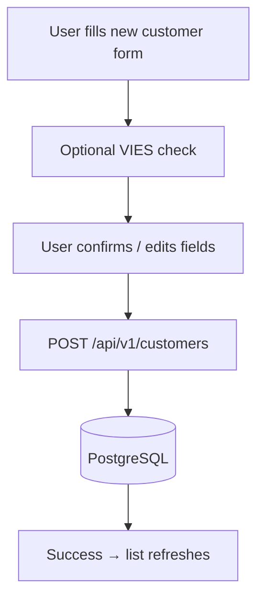
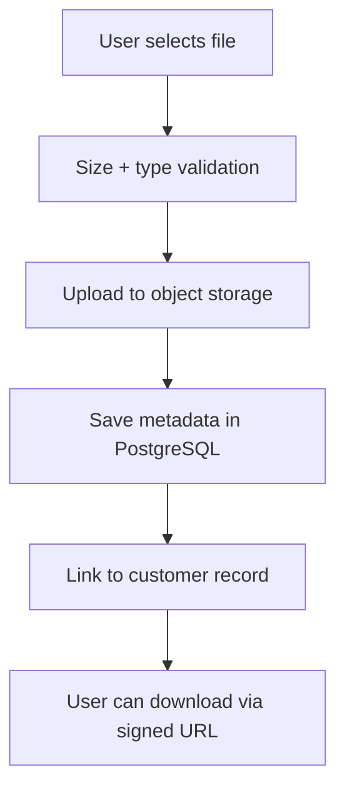
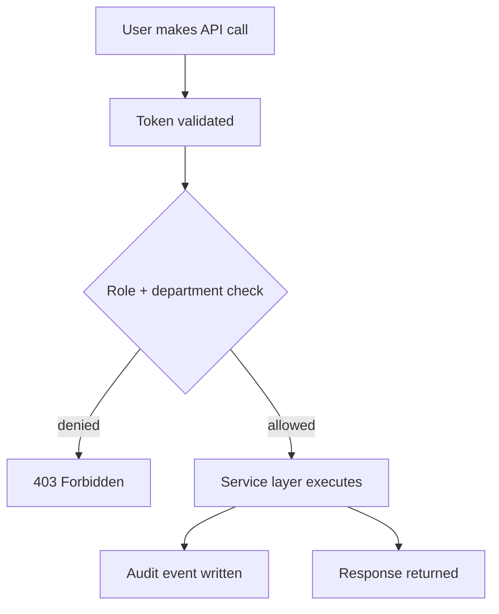
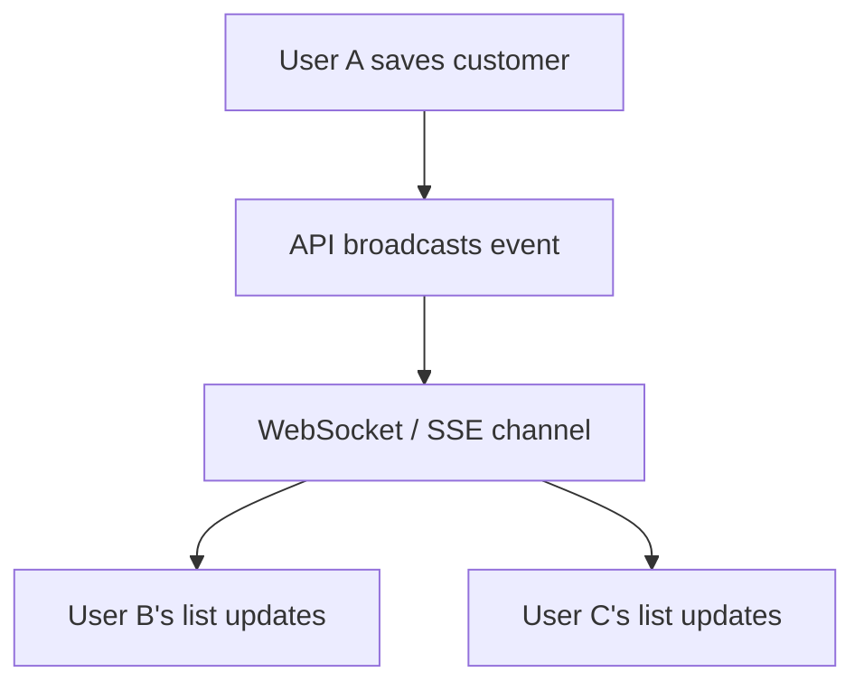
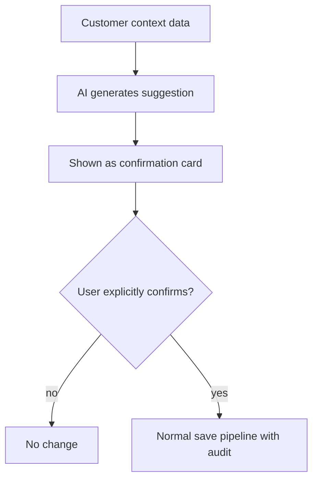
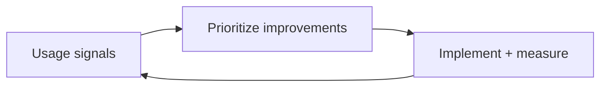
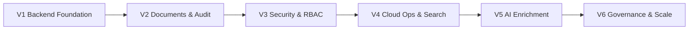

# Customers Roadmap (Business-Friendly)

**Audience:** Owners, business stakeholders, operations leaders, non-technical reviewers  
**Service:** Customer Master Data Management (Customers / Kundenverwaltung)  
**Related technical specification:** [`docs/Detailed report/CustomersPage-Service-Spec.md`](../Detailed%20report/CustomersPage-Service-Spec.md)  
**Version:** 1.0

---

## 1) Why this roadmap exists

This roadmap explains, in simple language, how the Customers service will grow from a local/demo experience into a secure, cloud-backed, AI-enhanced enterprise customer management system.

It covers:

- what each version delivers to real users and departments
- why it matters to business outcomes
- which technology powers each stage
- how we decide readiness to move to the next version

---

## 2) Technology overview

| Layer | Technology | Role in Customers |
|-------|------------|-------------------|
| UI | React, TypeScript | Customer list, detail drawer, create/edit modal, Waschanlage profile |
| API | Python, FastAPI | Customer CRUD, department scoping, document handling, VAT proxy |
| EU VAT | EC VIES API (REST + SOAP) | Real-time EU VAT number validation and company data enrichment |
| Data | PostgreSQL | Customer master records, wash profiles, appointments, relationships |
| Document storage | Object storage (S3/R2) | Binary files attached to customer records |
| Cache / search | Redis + full-text index | Fast filtered list queries, autocomplete suggestions |
| Containers / CI | Docker, GitHub Actions | Build, test, deploy pipelines |
| Identity (later) | OIDC / IAM | RBAC scoping per department, audit-ready identity |
| AI (later phases) | Orchestration layer | Enrichment, duplicate detection, health scoring — never auto-applied without confirm |
| Hosting | Cloud platform | Secrets, scaling, backups, PITR |

---

## 2.1 Current feature baseline and source traceability

| Capability | Current status | Primary source file(s) |
|-----------|----------------|-------------------------|
| Customer list (filters, sort, search) | Live | `frontend/src/pages/CustomersPage.tsx`, `frontend/src/store/customerFieldSuggestions.ts` |
| Create / edit customer modal | Live | `frontend/src/components/NewCustomerModal.tsx` |
| EU VAT / VIES check (backend proxy) | Live | `backend/main.py`, `frontend/src/components/NewCustomerModal.tsx` |
| Waschanlage wash profile | Live | `frontend/src/components/NewCustomerModal.tsx`, `frontend/src/store/kundenStore.ts` |
| Document upload / download / delete | Live (base64/localStorage) | `frontend/src/pages/CustomersPage.tsx`, `frontend/src/store/kundenStore.ts` |
| Appointments CRUD | Live | `frontend/src/pages/CustomersPage.tsx`, `frontend/src/store/kundenStore.ts` |
| Customer relationships | Live | `frontend/src/pages/CustomersPage.tsx`, `frontend/src/store/kundenStore.ts` |
| Shared demo state sync | Live | `frontend/src/store/kundenStore.ts`, `backend/main.py` |
| Duplicate detection view | Live | `frontend/src/pages/DoppelteKundenPage.tsx` |
| Full technical service definition | Live doc | `docs/Detailed report/CustomersPage-Service-Spec.md` |

---

## 3) End goal

At the end of this roadmap, the Customers service should be:

- fully cloud-backed with reliable multi-user access across all departments
- secure with RBAC so each department sees only its own customer scope
- complete with document storage, appointments, and relationships in proper relational tables
- auditable with full change history per customer record
- enhanced with AI enrichment and health scoring that remains human-approved
- compliant with EU VAT record-keeping and GDPR data handling requirements

---

## 4) Version-wise roadmap (V1 to final goal)

### V1 — Reliable backend foundation (Weeks 1-8)

#### Feature summary

| # | Feature | What users get | Business value |
|---|---------|----------------|----------------|
| 1 | PostgreSQL customer CRUD | Create, edit, delete customer records stored server-side | Data survives browser refresh, device change, cache clear |
| 2 | Department routing and scoping | Sales sees buyers, Werkstatt sees workshop clients, Waschanlage sees wash customers | No cross-department data leaks; each team sees their list |
| 3 | Waschanlage wash profile persisted | Bank, SEPA, wash programme, fleet all in DB | No more lost wash settings when cache clears |
| 4 | Consistent data across team | Multiple users see the same records in real time | No more duplicate data entry or conflicting records |

#### Flow (create customer)

#### Technology focus

- FastAPI + PostgreSQL + Pydantic schemas for customer CRUD

#### Version gate

- Customer save success rate high
- No customer data loss incidents
- All departments can list and view their own records

---

### V2 — Document storage and audit trail (Weeks 9-16)

#### Feature summary

| # | Feature | What users get | Business value |
|---|---------|----------------|----------------|
| 1 | Real document storage | Attach files to customer records stored in cloud | No more 2 MB base64 limit; files survive across devices |
| 2 | Audit trail | Every change recorded with who/when/what | Compliance-ready history for disputes or audits |
| 3 | Appointments and relationships in DB | Appointments and links between companies in relational tables | Reliable scheduling and corporate hierarchy tracking |
| 4 | Soft-delete | Deleting a customer marks inactive, never destroys record | Recover accidentally deleted records; audit integrity |

#### Flow (document upload)

#### Technology focus

- Object storage (S3/R2) + signed URLs + document metadata table + audit event pipeline

#### Version gate

- Document upload success rate high
- All changes appear in audit trail
- Signed URL expiry enforced

---

### V3 — Security and RBAC (Weeks 17-24)

#### Feature summary

| # | Feature | What users get | Business value |
|---|---------|----------------|----------------|
| 1 | Department-scoped access control | Users only see records relevant to their department | Prevents cross-department data exposure |
| 2 | JWT / session authentication | All customer API calls require valid login | No unauthenticated access to customer PII |
| 3 | PII encryption at rest | IBAN, email, phone encrypted in DB | GDPR and compliance baseline |
| 4 | Secure VAT logging | Raw VAT numbers masked before any log line | EU regulation compliance; no sensitive IDs in logs |

#### Flow (authenticated request)

#### Technology focus

- OIDC / IAM integration + RBAC middleware + field-level encryption + audit logging

#### Version gate

- Unauthorized cross-department access blocked server-side
- All sensitive actions appear in audit logs
- PII encryption active and key rotation tested

---

### V4 — Cloud operations maturity (Weeks 25-32)

#### Feature summary

| # | Feature | What users get | Business value |
|---|---------|----------------|----------------|
| 1 | Real-time list updates | New/changed customers appear without page reload | No stale lists; fast team collaboration |
| 2 | Full-text search | Search by name, address, phone across all fields | Faster customer lookup; less manual filtering |
| 3 | Monitoring and alerts | Issues visible before users flood support | Lower MTTR; fewer support escalations |
| 4 | Backup/restore verified | Tested restore drill for customer data | Confidence in data durability |

#### Flow (real-time update)

#### Technology focus

- WebSocket or SSE broadcast + Redis pub/sub + full-text index + SLO dashboards

#### Version gate

- Real-time updates visible within 2 seconds
- Full-text search latency under 200ms
- SLO dashboards active; rollback drill successful

---

### V5 — AI enrichment and intelligence (Weeks 33-44)

#### Feature summary

| # | Feature | What users get | Business value |
|---|---------|----------------|----------------|
| 1 | Smart duplicate detection | AI flags likely duplicates before save | Reduces data quality debt; fewer support issues |
| 2 | Company data enrichment | Suggests missing fields after VAT check from public registries | Faster, more complete data entry |
| 3 | Customer health score | Risk indicator per customer based on activity and payment patterns | Proactive account management |
| 4 | Appointment suggestions | Suggest follow-up date based on last interaction | Higher customer engagement; fewer missed follow-ups |
| 5 | Document auto-classification | Uploaded files labelled as contract, invoice, registration, etc. | Less manual filing; faster document retrieval |

#### Flow (AI suggestion — never auto-apply)

**Important guardrail:** AI suggestions are never auto-applied without user confirmation.

#### Technology focus

- AI orchestration + enrichment APIs + recommendation log + usage/cost tracking

#### Version gate

- Duplicate suggestion precision accepted by pilot users
- Enrichment suggestions confirmed useful by department heads
- AI cost and governance within approved limits

---

### V6 — Governance, compliance, and enterprise scale (Weeks 45+)

#### Feature summary

| # | Feature | What users get | Business value |
|---|---------|----------------|----------------|
| 1 | GDPR data export and deletion | User-level data export and right-to-erasure tooling | EU compliance; legal risk reduction |
| 2 | Evidence export for audits | Filter and export change history for compliance cycles | Easier audit cycles; fewer manual evidence requests |
| 3 | CRM pipeline stages | Track sales/service stage per customer | Better pipeline visibility across departments |
| 4 | Customer 360 view | Single view combining Sales, Werkstatt, and Waschanlage activity | Full picture of each customer relationship |
| 5 | Department-aware AI tuning | AI tuned to each department's specific patterns and terminology | Higher relevance; better suggestions per team |

#### Flow (continuous improvement)

#### Technology focus

- GDPR tooling + compliance evidence workflows + CRM pipeline stage model + AI tuning

---

## 5) Visual timeline (versions)

---

## 6) Cross-version comparison

| Version | Focus | Main user-visible wins | Main risk reduced |
|---------|--------|------------------------|-------------------|
| V1 | Persistence | Data follows the user across devices | Lost customer records |
| V2 | Documents + audit | Files never lost; full change history | Compliance gaps, file loss |
| V3 | Security | RBAC, PII encryption, masked logs | Data exposure, regulation breach |
| V4 | Operations | Real-time, full-text search, monitoring | Slow/stale UI, bad deploys |
| V5 | AI | Enrichment, duplicate detection, health score | Data quality debt, manual effort |
| V6 | Enterprise | GDPR tools, 360 view, CRM stages | Compliance risk, fragility at scale |

---

## 7) Owner decision checklist (each version)

Before approving progression:

1. Are promised user outcomes delivered and verified?
2. Are security and compliance controls acceptable?
3. Is operations/support ready (runbook, on-call, comms)?
4. Are timeline and cost still aligned?
5. Is the next scope realistic for team capacity?

Mandatory continuity checks:

6. Has backup/restore validation been completed for this phase?
7. Are DR responsibilities and escalation contacts confirmed?
8. Is GDPR data handling reviewed and approved by leadership?
9. Are AI guardrails reviewed and acceptance confirmed by pilot department?

---

## 8) Non-technical success indicators

| Indicator | Why it matters |
|-----------|----------------|
| Customer record completeness rate | Indicates quality of data entry flow and VAT enrichment |
| Duplicate customer ratio | Data quality health; lower is better |
| Document attachment adoption | Indicates users trust the file storage reliability |
| VAT check success rate | Critical path for new customer creation |
| Average time to create customer | UX and operational efficiency |
| Support tickets for lost data | Reliability and trust signal |
| AI suggestion acceptance rate (phase 5+) | Value of AI recommendations |

---

## 9) Document history

| Version | Date | Notes |
|---------|------|-------|
| 1.0 | 2026-03-30 | Initial Customers roadmap — V1 through V6; full architecture, AI, GDPR, cloud ops |
