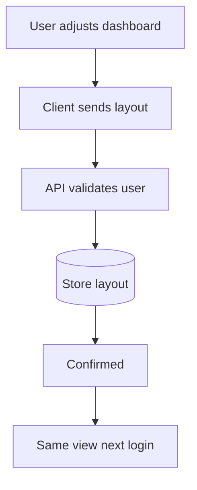
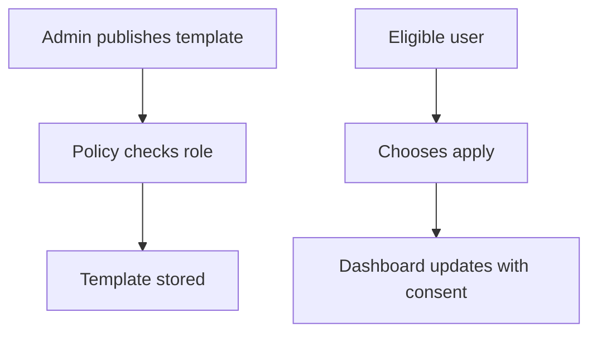
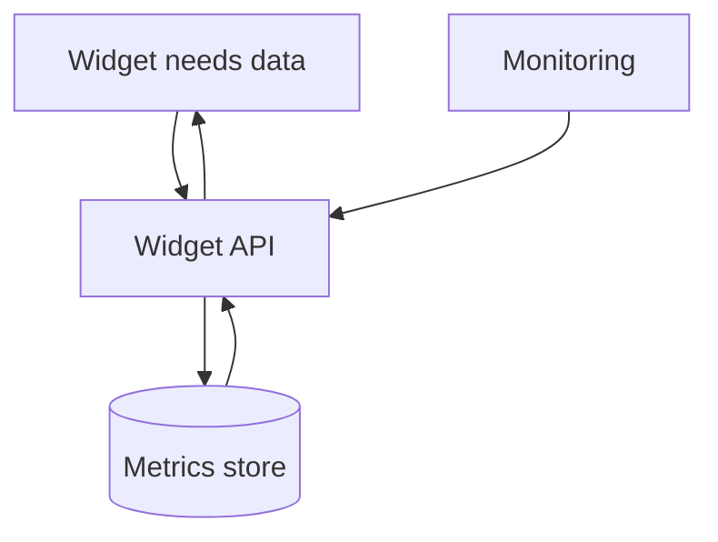
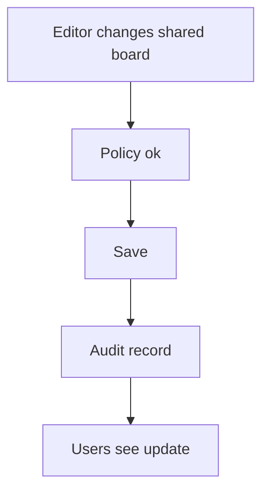
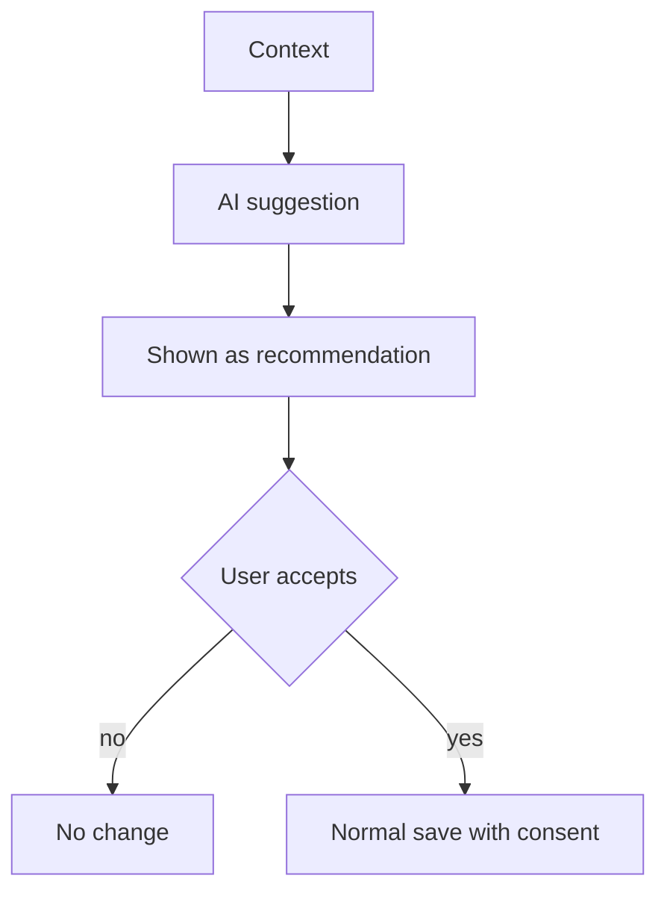
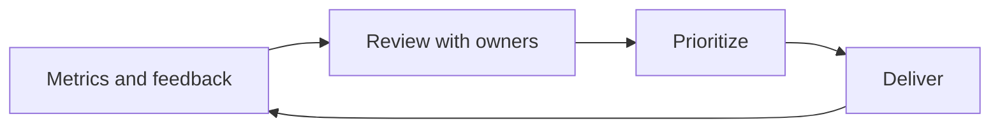
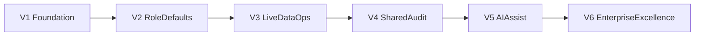

# Dashboard Home Roadmap (Business-Friendly)

**Audience:** Owners, business stakeholders, operations leaders, non-technical reviewers  
**Service:** Dashboard home (`DynamicDashboard`)  
**Related technical specification:** [`docs/Detailed report/DashboardHome-Service-Spec.md`](../Detailed%20report/DashboardHome-Service-Spec.md)  
**Version:** 1.0

---

## 1) Why this roadmap exists

This roadmap explains how the **dashboard home page** evolves from a flexible, browser-stored layout today into a **secure, data-backed, enterprise command center**—including optional AI assistance that stays under human and policy control.

It answers:

- What each version delivers in plain language  
- Why it matters for the business  
- What must be true before moving to the next version  
- Where continuity (backups, recovery readiness) fits in  

---

## 2) Technology overview

| Layer | Technology | Role in Dashboard Home |
|-------|------------|-------------------------|
| UI | React, TypeScript | Dashboard shell and widgets |
| Grid | react-grid-layout | Drag, resize, arrange modules |
| Widgets | Registry + per-widget components | KPIs, charts, tables, calendar, etc. |
| Data (current) | Local demo / hooks in widgets | Placeholder until APIs |
| Data (target) | FastAPI + PostgreSQL | Layout + live widget metrics |
| Cache (target) | Redis | Speed and rate safety for hot widgets |
| Delivery | Docker, GitHub Actions | Build, test, deploy discipline |
| Observability (target) | Metrics, traces, alerts | Reliability and SLOs |
| AI (later) | Orchestration + policy | Briefings and suggestions—not auto-chaos |

---

## 2.1 Current feature baseline and source traceability

| Capability | Status | Primary source file(s) |
|-----------|--------|-------------------------|
| Default landing dashboard | Live | `frontend/src/App.tsx`, `frontend/src/pages/DynamicDashboard.tsx` |
| Save/load layout in browser | Live | `frontend/src/store/dashboardLayout.ts` |
| Add / remove / reset widgets | Live | `frontend/src/pages/DynamicDashboard.tsx`, `dashboardLayout.ts` |
| Widget catalog and palette | Live | `frontend/src/widgets/registry.tsx` |
| Widget types and config | Live | `frontend/src/types/dashboard.ts`, `frontend/src/widgets/*.tsx` |
| **Pinned widget concept** — Tasks & Reminders permanently on dashboard; movable + resizable but not removable; "Fixiert" badge in chrome | **Live** *(2026-03-25)* | `frontend/src/types/dashboard.ts`, `frontend/src/store/dashboardLayout.ts`, `frontend/src/pages/DynamicDashboard.tsx` |
| **Task assignment to team members** — assign tasks with due date, note, priority, assignee picker; assignment badges on task items; assigned tasks sorted to top | **Live** *(2026-03-25)* | `frontend/src/widgets/TasksWidget.tsx`, `frontend/src/widgets/dynamicWidgetLists.ts` |
| **Task notification system** — localStorage inbox; real-time bell badge; dropdown panel with sender, title, relative time; individual and bulk mark-read | **Live** *(2026-03-25)* | `frontend/src/store/taskNotifications.ts`, `frontend/src/components/Header.tsx` |
| **Dynamic Calendar widget** — navigate any month/year; month picker overlay; today button; date selection; weekend colouring; locale-aware (DE/EN) | **Live** *(2026-03-25)* | `frontend/src/widgets/CalendarWidget.tsx` |
| **Tasks date-grouped view** — filter tabs (Today / This Week / Overdue / No Date / All); grouped collapsible sections in All view; done checkbox with counter; smart default tab; hover-reveal actions | **Live** *(2026-03-25)* | `frontend/src/widgets/TasksWidget.tsx`, `frontend/src/widgets/dynamicWidgetLists.ts` |
| **Tasks DB-backed context fields** — per-preset structured fields with live datalist suggestions from Kunden/Angebote/Rechnungen/Abholauftraege/KundenWash DBs; auto-fill on customer/invoice selection; `contextData` persisted in task; subtitle shown on task row | **Live** *(2026-03-25)* | `frontend/src/widgets/TaskContextFields.tsx`, `frontend/src/widgets/dynamicWidgetLists.ts` |
| Legacy static dashboard (not main route) | Reference only | `frontend/src/pages/Dashboard.tsx` |
| Full technical definition | Live doc | `docs/Detailed report/DashboardHome-Service-Spec.md` |

---

## 3) End goal

By the end of this roadmap, the dashboard should be:

- **Reliable:** layouts and preferences follow the user appropriately across devices (where policy allows)  
- **Trustworthy:** only authorized people see each dataset and widget type  
- **Fast:** key widgets load within agreed performance targets  
- **Governed:** admin templates and shared boards have clear ownership and audit  
- **AI-ready:** optional insights and layout help with explicit approval, not silent changes  

---

## 4) Version-wise roadmap (V1 to final goal)

### V1 - Reliable foundation (Weeks 1-6)

#### Feature summary

| # | Feature | What users get | Business value |
|---|---------|----------------|----------------|
| 1 | Server-backed layout | Dashboard survives device/browser refresh strategy cleanly | Fewer “lost my dashboard” moments |
| 2 | Widget catalog unchanged | Familiar modules, safer rollout | Lower training cost |
| 3 | Migration path | Existing layout can be imported once | Smooth upgrade |

#### Flow (layout saved)

#### Technology focus

- FastAPI + PostgreSQL + authenticated layout API

#### Version gate

- High success rate saving layout  
- No meaningful data loss in pilot migration  

---

### V2 - Role-aware defaults (Weeks 7-14)

#### Feature summary

| # | Feature | What users get | Business value |
|---|---------|----------------|----------------|
| 1 | Role/department defaults | New users start useful, not empty | Faster onboarding |
| 2 | Allowed widget types | Teams only see what they should | Less clutter and leakage risk |
| 3 | Admin template publish | Consistent “gold” layouts per function | One best practice, many users |

#### Flow (template apply)

#### Technology focus

- Policy middleware + template tables

#### Version gate

- Security review OK for “who can see what widget”  
- Pilot departments confirm usefulness  

---

### V3 - Live data and operations maturity (Weeks 15-24)

#### Feature summary

| # | Feature | What users get | Business value |
|---|---------|----------------|----------------|
| 1 | Real KPIs in widgets | Numbers match operational reality | Trust |
| 2 | Monitoring and alerts | Problems visible early | Less silent failure |
| 3 | Safer releases | Rollback tested | Less fear of shipping |

#### Flow (widget data)

#### Technology focus

- Widget data APIs, caching, SLO dashboards, rollback runbooks

#### Version gate

- Widget data p95 within target  
- First **backup/restore validation** completed for layout and template data  

---

### V4 - Shared boards and audit (Weeks 25-34)

#### Feature summary

| # | Feature | What users get | Business value |
|---|---------|----------------|----------------|
| 1 | Team dashboards | Shared visibility for a unit | Alignment |
| 2 | Audit trail | Who changed what | Accountability |
| 3 | Export / snapshot | Reporting for reviews | Easier leadership oversight |

#### Flow (shared change)

#### Technology focus

- Audit pipeline, shared layout permissions

#### Version gate

- Audit completeness accepted by leadership  
- Data classification rules agreed  

---

### V5 - AI assist layer (Weeks 35-44)

#### Feature summary

| # | Feature | What users get | Business value |
|---|---------|----------------|----------------|
| 1 | Morning briefing | Short narrative of what matters | Saves reading time |
| 2 | Smart layout suggest | Recommendations user can accept or ignore | Faster personalization |
| 3 | Anomaly hints | “Unusual change” nudges on KPIs | Earlier intervention |

#### Flow (human-in-the-loop)

**Control rule:** No silent application of layout or sharing changes from AI.

#### Technology focus

- AI orchestration, usage/cost tracking, content safety posture (per TRD)

#### Version gate

- Pilot satisfaction and cost within budget  
- **DR rehearsal** or equivalent continuity sign-off per enterprise program (aligns with scale phase)  

---

### V6 - Enterprise excellence (Continuous)

#### Feature summary

| # | Feature | What users get | Business value |
|---|---------|----------------|----------------|
| 1 | Personalization at scale | Better relevance by role/region | Productivity |
| 2 | Cost and quality controls | Sustainable AI usage | Predictable spend |
| 3 | Executive health metrics | Adoption and trust signals | Steering without noise |

#### Flow (improve loop)

#### Technology focus

- Performance tuning, analytics (privacy-aware), governed AI iteration

---

## 5) Visual timeline (versions)

---

## 6) Cross-version comparison

| Version | Focus | Main user-visible wins | Main risk reduced |
|---------|--------|-------------------------|-------------------|
| V1 | Persistence | Layout follows the user | Lost personalization |
| V2 | Policy & templates | Sensible defaults | Wrong access or clutter |
| V3 | Live data & ops | Trusted numbers | Silent bad data |
| V4 | Sharing & audit | Team alignment | Uncontrolled change |
| V5 | AI assist | Time savings | Un-governed automation |
| V6 | Scale & tuning | Fit at enterprise size | Fragility and cost drift |

---

## 7) Owner decision checklist (each version)

Before approving progression:

1. Are promised user outcomes visible in production or pilot?  
2. Is security and policy posture acceptable for wider rollout?  
3. Are operations and support ready (communications, runbooks)?  
4. Are timeline and budget still aligned?  
5. Is team capacity realistic for the next scope?  

**Continuity checks (mandatory as you scale):**

6. Is there evidence of **backup/restore validation** for data that matters in this phase?  
7. Are **DR roles** and escalation paths confirmed?  
8. Is the **incident communication** approach clear for dashboard outages?  

---

## 8) Non-technical success indicators

| Indicator | Why it matters |
|-----------|----------------|
| Active dashboard usage | Are people living in the product? |
| Time to configure for new hires | Onboarding friction |
| Trust in on-screen numbers | Decision quality |
| Support tickets about layout/data | Operational load |
| AI usefulness score (pilots) | Value vs cost of assist features |

---

## 9) Document history

| Version | Date | Notes |
|---------|------|-------|
| 1.0 | 2026-03-24 | Initial Dashboard Home roadmap; pairs with Detailed report spec |
| 1.1 | 2026-03-25 | Added: pinned widget concept; Tasks & Reminders team assignment; task notification bell |
| 1.2 | 2026-03-25 | Added: fully dynamic Calendar widget (month/year navigation, picker overlay, today, date selection) |
| 1.3 | 2026-03-25 | Added: Tasks date-bucket filter tabs; grouped "All" view with collapsible sections; done checkbox; smart default tab |
| 1.4 | 2026-03-25 | Added: "Zugewiesen" tab isolates tasks assigned to others; date tabs show only own/received tasks |
| 1.5 | 2026-03-25 | Added: DB-backed context fields per task preset; auto-fill; contextData persistence; subtitle on task row |
