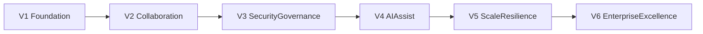

# Internal Chat Roadmap (Business-Friendly)

**Audience:** Owners, business stakeholders, operations leaders, non-technical reviewers  
**Service:** Internal Chat  
**Related technical spec:** `docs/Detailed report/InternalChat-Service-Spec.md`  
**Version:** 1.0

---

## 1) What this roadmap is for

This roadmap explains, in simple language, how Internal Chat will grow from the current prototype into a full enterprise communication platform.

It answers:

- What we deliver in each version
- Why each version matters to the business
- Which technologies support each stage
- What success looks like before moving to the next stage

---

## 2) Technology stack at a glance (with logos)

  
  
  
  
  
  
  
  
  
  

---

## 3) End goal (simple view)

By the end of this roadmap, Internal Chat should be:

- Reliable for daily team communication
- Secure and policy-controlled
- Searchable and auditable
- Ready for enterprise growth
- Enhanced by AI assistants that remain human-controlled

---

## 4) Version roadmap (V1 to final goal)

## V1 - Stable foundation (Weeks 1-6)

### What users get

- Chat messages saved reliably (not just browser/demo data)
- Better stability when refreshing or re-logging in
- Core direct and group messaging with consistent history

### Business value

- Immediate trust in message persistence
- Reduced communication loss risk
- Better adoption by internal teams

### Primary technologies

- FastAPI + PostgreSQL + React integration

### Move-to-next-version criteria

- Message save reliability is high
- No major data loss incidents
- Core chat UX works consistently

---

## V2 - Team collaboration maturity (Weeks 7-14)

### What users get

- Better group/channel experience
- Read receipts and improved presence behavior
- Attachment handling with cloud storage
- Better conversation search

### Business value

- Faster team coordination
- More context-rich communication
- Better discoverability of past discussions

### Primary technologies

- Realtime gateway + Redis + object storage + search indexing

### Move-to-next-version criteria

- Attachment workflow is stable
- Search quality is acceptable for everyday use
- Group collaboration pain points reduced

---

## V3 - Security and governance (Weeks 15-22)

### What users get

- Role-based access to channels and actions
- Stronger policy enforcement
- Reliable audit records for sensitive operations

### Business value

- Better compliance posture
- Clear accountability
- Lower risk of unauthorized access

### Primary technologies

- IAM/OIDC integration + policy middleware + audit pipeline

### Move-to-next-version criteria

- Security review passes agreed threshold
- Audit records complete for key actions
- Governance controls accepted by leadership/compliance

---

## V4 - AI assistant layer (Weeks 23-32)

### What users get

- Conversation summary suggestions
- Smart reply suggestions
- Action-item extraction support

### Business value

- Time saved for managers and teams
- Faster response quality in busy chats
- Better conversion of discussion into action

### Important control rule

- AI recommendations are suggestions, not automatic final decisions

### Primary technologies

- AI orchestration service + provider abstraction + usage tracking

### Move-to-next-version criteria

- AI quality acceptable to pilot users
- AI usage cost under budget
- Governance controls verified

---

## V5 - Scale and resilience (Weeks 33-42)

### What users get

- Better performance during high activity
- Stronger reliability and disaster readiness
- Improved responsiveness under load

### Business value

- Lower operational risk
- Better user confidence across departments
- Strong foundation for company-wide rollout

### Primary technologies

- Performance tuning + queue/backpressure + DR drills

### Move-to-next-version criteria

- SLO targets met consistently
- DR rehearsal completed successfully
- No critical reliability blockers

---

## V6 - Enterprise excellence (Continuous)

### What users get

- Mature, policy-led chat platform
- Advanced analytics and insights
- AI tuned by department/language needs

### Business value

- Strategic internal communication platform
- Better productivity intelligence
- Sustainable long-term operating model

---

## 5) Visual timeline

---

## 6) Decision gates for owners (every version)

Before approving the next version, leadership should confirm:

1. Business value from current version is visible
2. Risk and security posture is acceptable
3. Reliability and support readiness are in place
4. Budget and timeline are still aligned
5. Team capacity is sufficient for next scope

---

## 7) Success metrics (non-technical view)

- Team adoption rate
- Communication turnaround time
- Reliability perception score
- Security incident trend
- AI usefulness feedback score (from pilot users)

---

## 8) Document history

| Version | Date | Notes |
|---------|------|-------|
| 1.0 | 2026-03-20 | Initial non-technical Internal Chat roadmap with version-wise rollout and logos |

