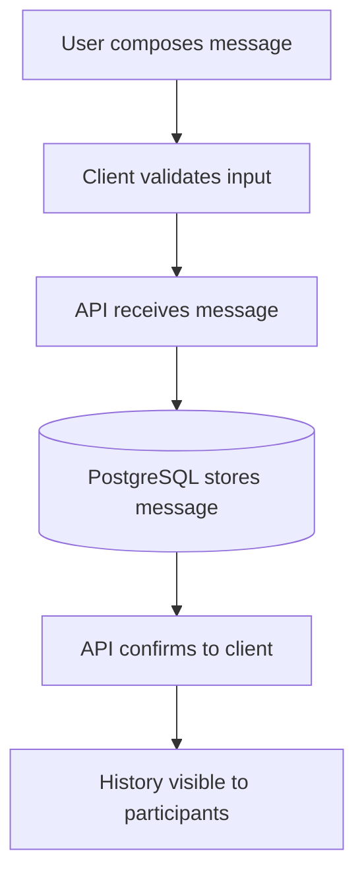
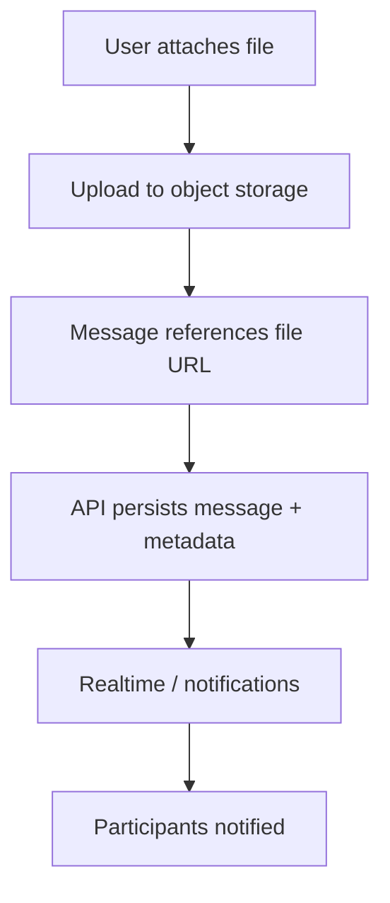
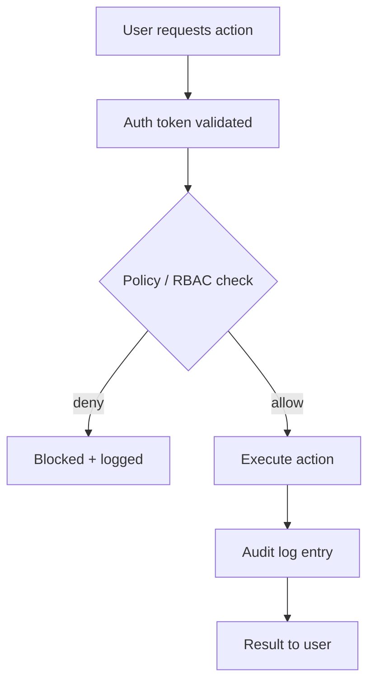
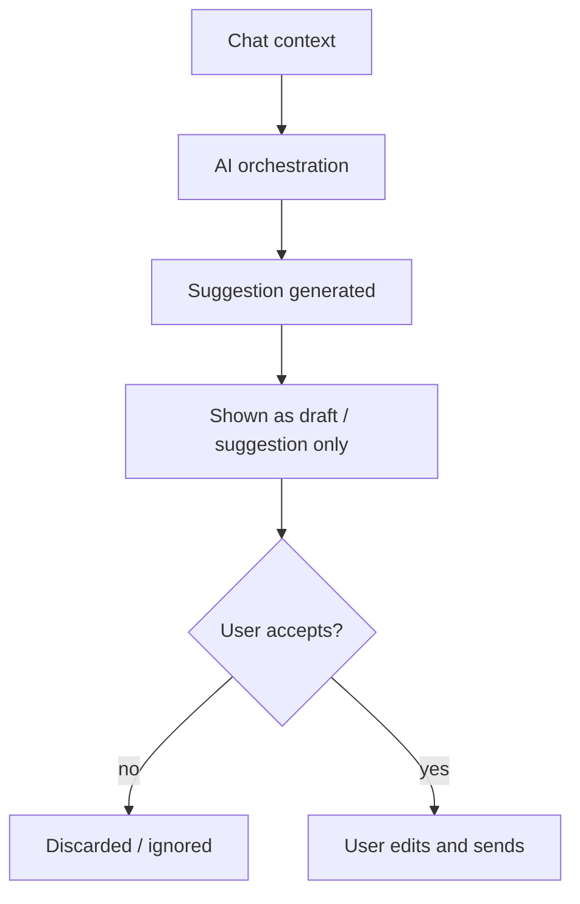
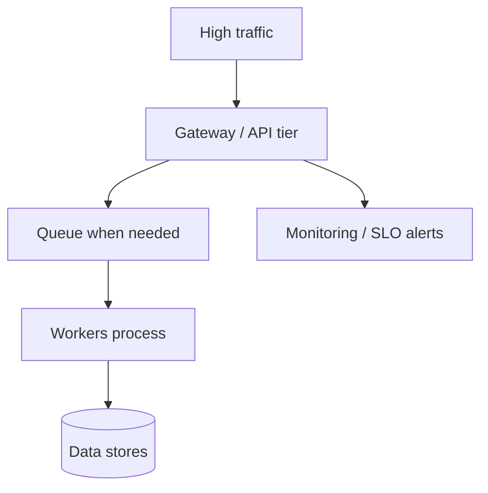
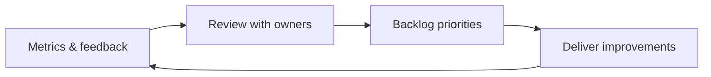
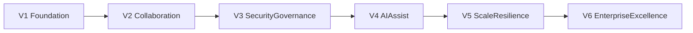

# Internal Chat Roadmap (Business-Friendly)

**Audience:** Owners, business stakeholders, operations leaders, non-technical reviewers  
**Service:** Internal Chat  
**Related technical spec:** [`docs/Detailed report/InternalChat-Service-Spec.md`](../Detailed%20report/InternalChat-Service-Spec.md)  
**Version:** 1.1

---

## 1) What this roadmap is for

This roadmap explains, in simple language, how Internal Chat will grow from the current prototype into a full enterprise communication platform.

It answers:

- What we deliver in each version
- Why each version matters to the business
- Which technologies support each stage
- What success looks like before moving to the next stage

---

## 2) Technology stack at a glance

| Layer | Technology | Role in Internal Chat |
|-------|------------|------------------------|
| UI | React, TypeScript | Chat screens, composer, threads, attachments UX |
| API | Python, FastAPI | REST/WebSocket endpoints, validation, orchestration |
| Data | PostgreSQL | Messages, channels, membership, audit references |
| Cache / realtime | Redis | Presence, typing, rate limits, pub/sub helpers |
| Containers / CI | Docker, GitHub Actions | Repeatable builds, automated checks and deploys |
| AI (later phases) | Provider abstraction | Summaries, smart replies, extraction (human-approved) |
| Hosting | Cloud platform | Networking, secrets, scaling, backups |

---

## 2.1 Current feature baseline and source traceability

This section is for onboarding so new members can map capabilities to code quickly.

| Capability | Current status | Primary source file(s) |
|-----------|----------------|-------------------------|
| Chat screen and core UX | Live prototype | `frontend/src/pages/ChatPage.tsx` |
| Local message state handling | Live prototype | `frontend/src/store/chatStore.ts` |
| Presence behavior | Live prototype | `frontend/src/store/chatPresence.ts`, `frontend/src/components/PresenceIndicator.tsx` |
| Sync orchestration | Live prototype | `frontend/src/hooks/useChatSync.ts` |
| Enterprise backend/realtime contracts | Targeted | `docs/Detailed report/InternalChat-Service-Spec.md` |

---

## 3) End goal (simple view)

By the end of this roadmap, Internal Chat should be:

- Reliable for daily team communication
- Secure and policy-controlled
- Searchable and auditable
- Ready for enterprise growth
- Enhanced by AI assistants that remain human-controlled

---

## 4) Version roadmap (V1 to final goal)

### V1 - Stable foundation (Weeks 1-6)

#### Feature summary

| # | Feature | What users get | Business value |
|---|---------|----------------|----------------|
| 1 | Persistent messaging | Messages and history survive refresh and re-login | Trust; no “lost chat” perception |
| 2 | Direct & group threads | Consistent 1:1 and small-group conversations | Teams can coordinate without workarounds |
| 3 | Basic delivery reliability | Clear success/failure for send operations | Fewer support escalations |

#### Delivery flow (message lifecycle)

#### Primary technologies

- FastAPI + PostgreSQL + React integration

#### Move-to-next-version criteria

- Message save reliability is high
- No major data loss incidents
- Core chat UX works consistently

---

### V2 - Team collaboration maturity (Weeks 7-14)

#### Feature summary

| # | Feature | What users get | Business value |
|---|---------|----------------|----------------|
| 1 | Channels / groups | Clear spaces for team topics | Less noise; faster alignment |
| 2 | Presence & read receipts | See who is active and what was read | Fewer duplicate pings |
| 3 | Attachments | Files stored in object storage, linked to messages | Richer context in one place |
| 4 | Search | Find past messages by text/metadata | Reduces repeated questions |

#### Flow (attachment + notify)

#### Primary technologies

- Realtime gateway + Redis + object storage + search indexing

#### Move-to-next-version criteria

- Attachment workflow is stable
- Search quality is acceptable for everyday use
- Group collaboration pain points reduced

---

### V3 - Security and governance (Weeks 15-22)

#### Feature summary

| # | Feature | What users get | Business value |
|---|---------|----------------|----------------|
| 1 | Role-based access | Only allowed users see channels/actions | Lower leakage risk |
| 2 | Policy enforcement | Server-side checks on sensitive operations | Consistent rules, not “UI-only” |
| 3 | Audit trail | Records for joins, deletes, admin actions | Accountability and investigations |

#### Flow (protected action)

#### Primary technologies

- IAM/OIDC integration + policy middleware + audit pipeline

#### Move-to-next-version criteria

- Security review passes agreed threshold
- Audit records complete for key actions
- Governance controls accepted by leadership/compliance

---

### V4 - AI assistant layer (Weeks 23-32)

#### Feature summary

| # | Feature | What users get | Business value |
|---|---------|----------------|----------------|
| 1 | Conversation summaries | Optional recap of long threads | Managers save reading time |
| 2 | Smart reply suggestions | Draft replies user can edit/send | Faster responses |
| 3 | Action-item hints | Suggested follow-ups from chat | Discussion turns into work |

#### Flow (human-in-the-loop AI)

**Important control rule:** AI recommendations are suggestions, not automatic final decisions.

#### Primary technologies

- AI orchestration service + provider abstraction + usage tracking

#### Move-to-next-version criteria

- AI quality acceptable to pilot users
- AI usage cost under budget
- Governance controls verified

---

### V5 - Scale and resilience (Weeks 33-42)

#### Feature summary

| # | Feature | What users get | Business value |
|---|---------|----------------|----------------|
| 1 | Performance under load | Stable latency at peak usage | Confidence for wider rollout |
| 2 | Backpressure & queues | Graceful handling of spikes | Fewer outages during events |
| 3 | DR readiness | Tested recovery paths | Lower business continuity risk |

#### Flow (high-load path)

#### Primary technologies

- Performance tuning + queue/backpressure + DR drills

#### Move-to-next-version criteria

- SLO targets met consistently
- DR rehearsal completed successfully
- No critical reliability blockers
- backup restore validation passes agreed checklist

---

### V6 - Enterprise excellence (Continuous)

#### Feature summary

| # | Feature | What users get | Business value |
|---|---------|----------------|----------------|
| 1 | Policy-led platform | Mature defaults per org/department | Sustainable operations |
| 2 | Analytics & insights | Adoption and health signals (privacy-aware) | Data-driven improvements |
| 3 | Tuned AI | Language/department-aware assistance | Better fit without losing control |

#### Flow (continuous improvement loop)

#### Primary technologies

- Scale optimization, analytics pipelines, governed AI tuning

---

## 5) Visual timeline (versions)

---

## 6) Cross-version comparison

| Version | Focus | Main user-visible wins | Main risk reduced |
|---------|--------|-------------------------|-------------------|
| V1 | Persistence & core chat | Reliable history | Data loss / mistrust |
| V2 | Collaboration | Groups, files, search | Fragmented tools |
| V3 | Security & audit | RBAC, audit | Unauthorized access |
| V4 | AI assist | Summaries, drafts | Time cost of reading |
| V5 | Scale & DR | Speed at peak, recovery | Outages at scale |
| V6 | Maturity | Insights, tuning | Stagnation / one-size-fits-all |

---

## 7) Decision gates for owners (every version)

Before approving the next version, leadership should confirm:

1. Business value from current version is visible
2. Risk and security posture is acceptable
3. Reliability and support readiness are in place
4. Budget and timeline are still aligned
5. Team capacity is sufficient for next scope

Continuity checks that must be explicitly signed off:

6. Backup/restore drill evidence is available
7. DR command roles and communication chain are confirmed
8. Customer/user communication templates are ready for incidents

---

## 8) Success metrics (non-technical view)

| Metric | What it tells you |
|--------|-------------------|
| Team adoption rate | Are people actually using chat? |
| Communication turnaround time | Is coordination faster? |
| Reliability perception score | Do users trust the system? |
| Security incident trend | Is governance working? |
| AI usefulness feedback (pilots) | Is assist layer worth the cost? |

---

## 9) Document history

| Version | Date | Notes |
|---------|------|-------|
| 1.0 | 2026-03-20 | Initial non-technical Internal Chat roadmap |
| 1.1 | 2026-03-24 | Tables per version; per-feature mermaid flows; logos removed |
