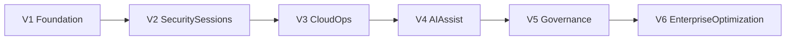

# Settings Roadmap (Business-Friendly)

**Audience:** Owners, business stakeholders, operations leaders, non-technical reviewers  
**Service:** Settings and Profile Preferences  
**Related technical specification:** `docs/services/SettingsPage-Service-Spec.md`  
**Version:** 1.0

---

## 1) Why this roadmap exists

This roadmap explains, in simple language, how the Settings service will grow from a local/demo experience into a secure, cloud-connected, AI-enabled enterprise capability.

It covers:

- what each version delivers
- why it matters to business users
- which technology powers each stage
- how we decide readiness to move to the next version

---

## 2) Technology overview (with logos)

  
  
  
  
  
  
  
  
  
  

---

## 3) End goal

At the end of this roadmap, Settings should be:

- fully cloud-backed and reliable across devices
- secure for sensitive actions (password, MFA, sessions)
- auditable and policy-controlled
- easy for users to personalize
- enhanced with AI recommendations that remain human-approved

---

## 4) Version-wise roadmap (V1 to final goal)

## V1 - Reliable foundation (Weeks 1-6)

### What users get

- Settings saved to backend instead of only browser storage
- profile details synchronized more reliably
- consistent behavior after logout/login and browser refresh

### Business value

- users trust that preferences persist
- lower support tickets for “settings reset” issues

### Technology focus

- FastAPI + PostgreSQL + frontend API integration

### Version gate

- high settings save success rate
- no major preference-loss incidents

---

## V2 - Security and session controls (Weeks 7-14)

### What users get

- backend-based password update flow
- real MFA management flow
- active session/device list with revoke capability

### Business value

- stronger account security posture
- better control over account access events

### Technology focus

- IAM/OIDC integration + policy middleware + audit logging

### Version gate

- all sensitive actions audited
- unauthorized settings actions blocked server-side

---

## V3 - Cloud operations maturity (Weeks 15-22)

### What users get

- better reliability during releases
- improved responsiveness under real workload
- stronger recovery posture

### Business value

- reduced operational risk
- improved confidence for production scaling

### Technology focus

- IaC + monitoring + alerting + rollback runbooks

### Version gate

- SLO dashboards active
- rollback drill successful
- incident readiness verified

---

## V4 - AI assistant for settings (Weeks 23-32)

### What users get

- smart suggestions for preferences
- security posture guidance
- quiet-hours recommendations

### Business value

- easier self-service settings decisions
- better productivity with less manual setup

### Important guardrail

- AI suggestions are never auto-applied without user confirmation

### Technology focus

- AI orchestration + recommendation logs + usage/cost tracking

### Version gate

- recommendation quality accepted by pilot users
- AI cost and governance within target limits

---

## V5 - Governance and compliance readiness (Weeks 33-40)

### What users get

- stronger policy consistency
- cleaner compliance evidence trail
- better admin control visibility

### Business value

- easier audits and compliance reporting
- reduced policy drift risk

### Technology focus

- policy-as-code checks + evidence export workflows

### Version gate

- compliance checklist pass
- access review process operational

---

## V6 - Enterprise optimization (Continuous)

### What users get

- seamless cross-device settings behavior
- improved reliability at scale
- department-aware AI personalization improvements

### Business value

- stable long-term platform capability
- measurable productivity and security gains

### Technology focus

- scale optimization, resilience patterns, AI tuning

---

## 5) Visual timeline

---

## 6) Owner decision checklist (each version)

Before approving progression:

1. Are promised user outcomes delivered?
2. Are security and compliance controls acceptable?
3. Is operations/support ready?
4. Are timeline and cost still aligned?
5. Is the next scope realistic for team capacity?

---

## 7) Non-technical success indicators

- User satisfaction with settings experience
- Reduction in settings-related support tickets
- Security event trend for account settings
- Time-to-configure for new users
- AI suggestion usefulness score (from pilot feedback)

---

## 8) Document history

| Version | Date | Notes |
|---------|------|-------|
| 1.0 | 2026-03-20 | Initial non-technical Settings roadmap (separate from technical service spec) |

