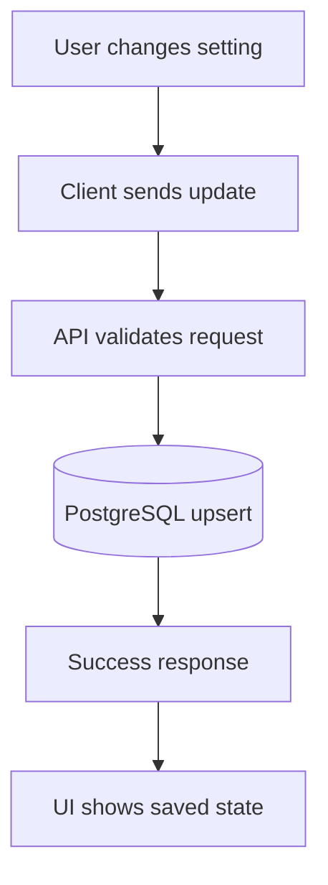
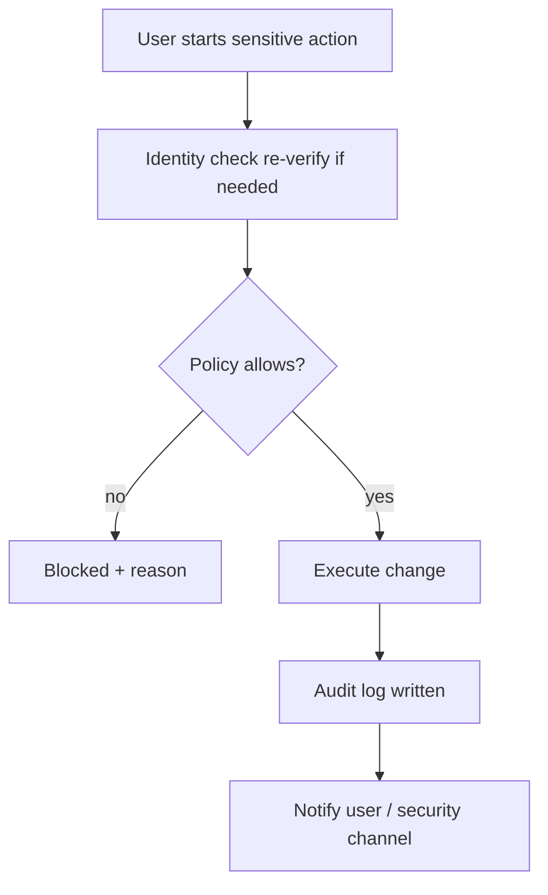
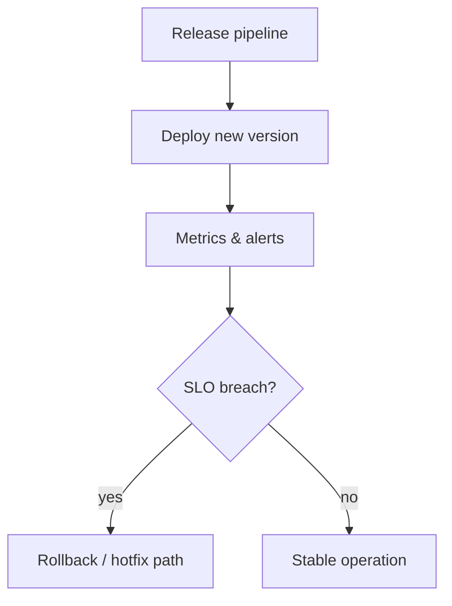
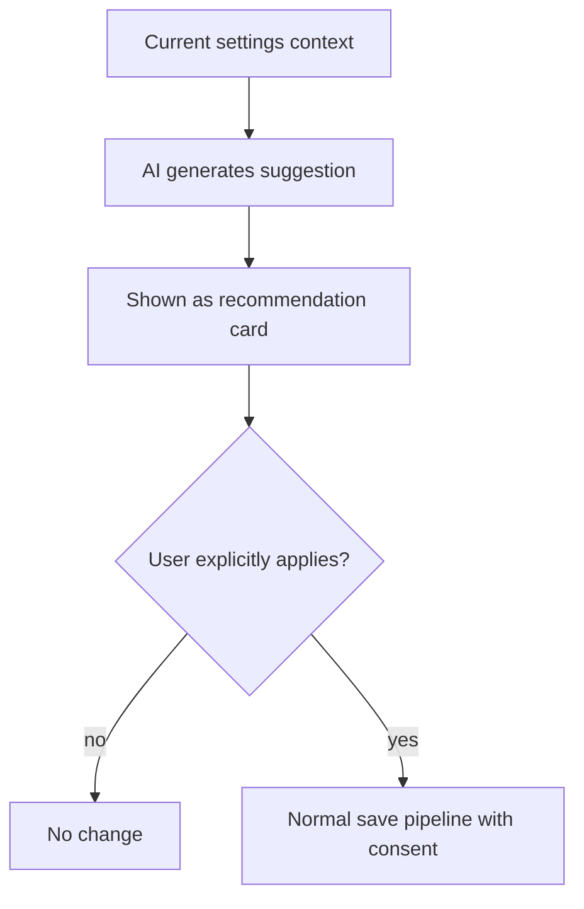
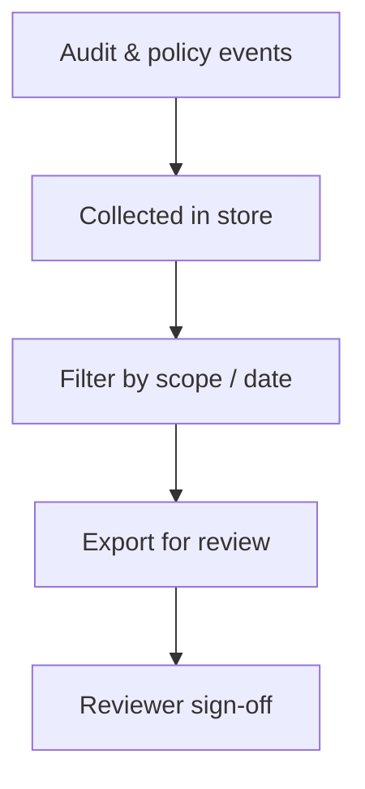
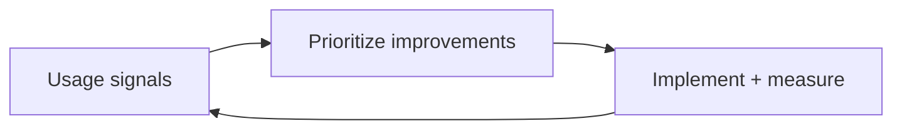
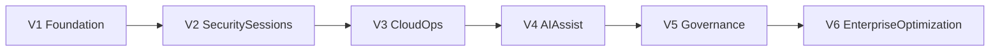

# Settings Roadmap (Business-Friendly)

**Audience:** Owners, business stakeholders, operations leaders, non-technical reviewers  
**Service:** Settings and Profile Preferences  
**Related technical specification:** `docs/Detailed report/SettingsPage-Service-Spec.md`  
**Version:** 1.1

---

## 1) Why this roadmap exists

This roadmap explains, in simple language, how the Settings service will grow from a local/demo experience into a secure, cloud-connected, AI-enabled enterprise capability.

It covers:

- what each version delivers
- why it matters to business users
- which technology powers each stage
- how we decide readiness to move to the next version

---

## 2) Technology overview

| Layer | Technology | Role in Settings |
|-------|------------|------------------|
| UI | React, TypeScript | Profile, preferences, security screens |
| API | Python, FastAPI | Save/load settings, sensitive action orchestration |
| Data | PostgreSQL | User preferences, profile fields, audit references |
| Cache / sessions | Redis | Session hints, rate limiting where applicable |
| Containers / CI | Docker, GitHub Actions | Build, test, deploy pipelines |
| Identity (later) | OIDC / IAM | MFA, SSO alignment, token validation |
| AI (later phases) | Orchestration layer | Suggestions only; never auto-applied without confirm |
| Hosting | Cloud platform | Secrets, scaling, backups |

---

## 3) End goal

At the end of this roadmap, Settings should be:

- fully cloud-backed and reliable across devices
- secure for sensitive actions (password, MFA, sessions)
- auditable and policy-controlled
- easy for users to personalize
- enhanced with AI recommendations that remain human-approved

---

## 4) Version-wise roadmap (V1 to final goal)

### V1 - Reliable foundation (Weeks 1-6)

#### Feature summary

| # | Feature | What users get | Business value |
|---|---------|----------------|----------------|
| 1 | Backend-backed preferences | Theme, language, and profile fields stored server-side | Preferences follow the user across devices |
| 2 | Consistent after login | Same settings after logout/login and refresh | Fewer “it reset” support tickets |
| 3 | Clear save feedback | Users know when changes succeeded or failed | Less confusion and retries |

#### Flow (save settings)

#### Technology focus

- FastAPI + PostgreSQL + frontend API integration

#### Version gate

- high settings save success rate
- no major preference-loss incidents

---

### V2 - Security and session controls (Weeks 7-14)

#### Feature summary

| # | Feature | What users get | Business value |
|---|---------|----------------|----------------|
| 1 | Password change flow | Guided, verified password updates | Stronger account hygiene |
| 2 | MFA management | Enroll/disable MFA with proper checks | Reduced account takeover risk |
| 3 | Session & device list | See active sessions; revoke suspicious ones | Faster incident response |

#### Flow (sensitive action)

#### Technology focus

- IAM/OIDC integration + policy middleware + audit logging

#### Version gate

- all sensitive actions audited
- unauthorized settings actions blocked server-side

---

### V3 - Cloud operations maturity (Weeks 15-22)

#### Feature summary

| # | Feature | What users get | Business value |
|---|---------|----------------|----------------|
| 1 | Safer releases | Rollback paths tested | Less downtime fear |
| 2 | Monitoring & alerts | Issues visible before users flood support | Lower MTTR |
| 3 | Performance under load | Settings API stays responsive | Ready for more users |

#### Flow (deploy / observe)

#### Technology focus

- IaC + monitoring + alerting + rollback runbooks

#### Version gate

- SLO dashboards active
- rollback drill successful
- incident readiness verified

---

### V4 - AI assistant for settings (Weeks 23-32)

#### Feature summary

| # | Feature | What users get | Business value |
|---|---------|----------------|----------------|
| 1 | Preference suggestions | e.g. language/timezone hints | Faster onboarding |
| 2 | Security tips | Contextual guidance in plain language | Better self-service security |
| 3 | Quiet-hours ideas | Optional scheduling recommendations | Less after-hours noise |

#### Flow (AI suggestion — never auto-apply)

**Important guardrail:** AI suggestions are never auto-applied without user confirmation.

#### Technology focus

- AI orchestration + recommendation logs + usage/cost tracking

#### Version gate

- recommendation quality accepted by pilot users
- AI cost and governance within target limits

---

### V5 - Governance and compliance readiness (Weeks 33-40)

#### Feature summary

| # | Feature | What users get | Business value |
|---|---------|----------------|----------------|
| 1 | Policy consistency | Same rules in UI and API | Less “bypass” risk |
| 2 | Evidence export | Reports for audits | Easier compliance cycles |
| 3 | Admin visibility | Clear view of risky settings patterns | Proactive governance |

#### Flow (compliance evidence)

#### Technology focus

- policy-as-code checks + evidence export workflows

#### Version gate

- compliance checklist pass
- access review process operational

---

### V6 - Enterprise optimization (Continuous)

#### Feature summary

| # | Feature | What users get | Business value |
|---|---------|----------------|----------------|
| 1 | Cross-device parity | Same experience on web/mobile targets | Higher satisfaction |
| 2 | Scale hardening | Stable at company-wide rollout | Lower operational stress |
| 3 | Department-aware AI | Tuned suggestions by team/locale | Better relevance, still governed |

#### Flow (continuous optimization)

#### Technology focus

- scale optimization, resilience patterns, AI tuning

---

## 5) Visual timeline (versions)

---

## 6) Cross-version comparison

| Version | Focus | Main user-visible wins | Main risk reduced |
|---------|--------|-------------------------|-------------------|
| V1 | Persistence | Settings follow the user | Lost preferences |
| V2 | Security | MFA, sessions, password flow | Account takeover |
| V3 | Operations | Alerts, rollback | Bad deploy impact |
| V4 | AI assist | Smart suggestions | Setup friction |
| V5 | Compliance | Evidence, policy | Audit gaps |
| V6 | Enterprise scale | Parity + tuning | Fragility at scale |

---

## 7) Owner decision checklist (each version)

Before approving progression:

1. Are promised user outcomes delivered?
2. Are security and compliance controls acceptable?
3. Is operations/support ready?
4. Are timeline and cost still aligned?
5. Is the next scope realistic for team capacity?

---

## 8) Non-technical success indicators

| Indicator | Why it matters |
|-----------|----------------|
| User satisfaction with settings | Direct product quality signal |
| Settings-related support tickets | Operational load |
| Security events on account settings | Safety posture |
| Time-to-configure for new users | Onboarding efficiency |
| AI suggestion usefulness (pilots) | Value of assist features |

---

## 9) Document history

| Version | Date | Notes |
|---------|------|-------|
| 1.0 | 2026-03-20 | Initial non-technical Settings roadmap |
| 1.1 | 2026-03-24 | Tables per version; per-feature mermaid flows; logos removed; spec link to Detailed report |
