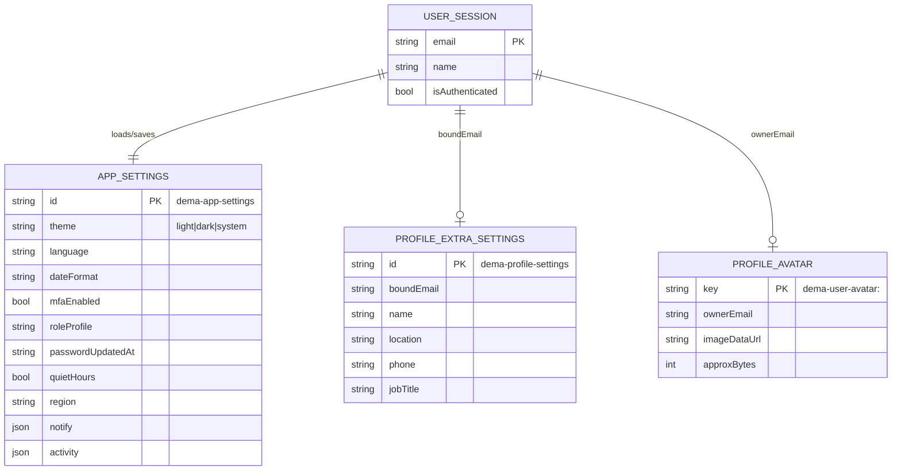
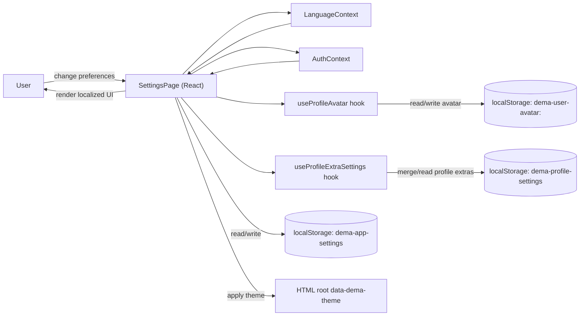

# Settings Service Specification (SettingsPage)

**Service:** Settings and profile preferences (`SettingsPage`)  
**Module family:** CORE-ADMIN / CORE-AUTH / UX personalization  
**Primary file:** `frontend/src/pages/SettingsPage.tsx`  
**Status:** Frontend-rich, local persistence today; API-backed target defined below  
**Version:** 1.0

---

## 1) Purpose and business value

The Settings service is the control center for user personalization and account-level preferences.  
It allows each user to manage:

- Profile presentation (avatar, display name, contact details, job title)
- Dashboard display behavior (theme, language, date format)
- Notification behavior (module-level toggles, quiet hours)
- Security actions (password flow, 2FA toggle simulation, role review jump)
- Session/device awareness (demo list of recent devices)

Business value:

- Reduces support workload by making common user controls self-service
- Improves adoption with language/theme personalization
- Prepares production-grade security and policy controls in one place
- Provides a single UX surface for future AI-assisted preference management

---

## 2) Scope: current vs target

### Current (in repository)

- Full UI and interaction logic in `SettingsPage`
- Persistence via browser storage (`localStorage`)
- Theme applied via `document.documentElement.dataset.demaTheme`
- Language controlled by `LanguageContext` and synchronized to app settings
- Per-user avatar and profile extras stored with helper hooks
- “Sessions & devices” and several security actions are demo-mode behaviors

### Target (production-grade)

- Settings persisted through authenticated backend APIs (`/api/v1/users/me/settings`)
- Server-enforced policy for sensitive settings (security, role-affecting options)
- Real session and device list from auth/session store
- Audit logs for sensitive actions (password, MFA, permission profile updates)

---

## 3) Feature catalog (what this service does)

## 3.1 Profile & account

- Upload/remove profile avatar
- Edit display name, location, phone, job title
- Show read-only sign-in email and internal metadata
- Save profile detail snapshot

## 3.2 Display preferences

- Theme: `light` / `dark` / `system`
- Language switch (multilingual options from `LanguageContext`)
- Date format toggle

## 3.3 Notifications

- Sales alerts
- HRM approvals
- Payroll errors
- B2B leads
- Weekly digest
- Quiet hours configuration

## 3.4 Security actions

- Password update modal with validation
- 2FA toggle (demo state)
- Role profile switch (employee/manager demo profile)
- Notification rules modal
- Region/language modal

## 3.5 Sessions & activity

- Show/hide recent devices list (demo)
- Remove a listed session item (demo)
- Surface recent setting actions in “Live Activity”

---

## 4) Technologies used in this service

| Layer | Technology |
|------|------------|
| UI component | React + TypeScript (`SettingsPage.tsx`) |
| Styling | Tailwind utility classes |
| Icons | `lucide-react` |
| State management | React `useState`, `useEffect`, `useRef` |
| i18n | `useLanguage()` from `LanguageContext` |
| Auth/session context | `useAuth()` from `AuthContext` |
| Client persistence | `localStorage` |
| Theme application | `html[data-dema-theme]` attribute |
| Profile avatar utilities | `useProfileAvatar` hook (`data:image/...` URLs) |
| Extra profile settings | `useProfileExtraSettings` hook |

---

## 5) Internal data model (current local persistence)

### 5.1 Storage keys

- `dema-app-settings`
- `dema-profile-settings`
- `dema-user-avatar:<normalized-email>`
- Legacy fallback: `dema-user-avatar`

### 5.2 Logical entity model (ER-style)

---

## 6) Feature diagram (functional decomposition)

```mermaid
flowchart TB
  Settings["Settings Service"]

  Settings --> Profile["Profile & Account"]
  Settings --> Display["Display Preferences"]
  Settings --> Notify["Notifications"]
  Settings --> Security["Security Controls"]
  Settings --> Sessions["Sessions & Devices"]
  Settings --> Activity["Live Activity Feed"]

  Profile --> Avatar["Avatar upload/remove"]
  Profile --> Details["Name/location/phone/job title"]

  Display --> Theme["Theme: light/dark/system"]
  Display --> Language["Language selection"]
  Display --> DateFormat["Date format"]

  Notify --> Toggles["Module toggles"]
  Notify --> Quiet["Quiet hours"]
  Notify --> Digest["Weekly digest"]

  Security --> Password["Change password flow"]
  Security --> MFA["2FA toggle (demo)"]
  Security --> Role["Role profile switch (demo)"]
  Security --> Region["Region & locale policy"]

  Sessions --> DeviceList["Recent devices list (demo)"]
  Sessions --> Revoke["Revoke session row (demo)"]

  Activity --> Hint["Action hint toast"]
  Activity --> Log["Recent action trail (local)"]
```

---

## 7) DFD (data flow diagram)

---

## 8) Main user flows (high-value)

### 8.1 Theme change flow

1. User selects Light/Dark/System
2. `theme` state updates
3. Settings snapshot writes to `dema-app-settings`
4. `data-dema-theme` updates on `<html>`
5. CSS theme rules re-render app visuals

### 8.2 Avatar upload flow

1. User picks image file
2. File validated by type/size (`MAX_FILE_BYTES`)
3. Converted to data URL
4. Saved to user-scoped avatar key
5. Event dispatch updates any listeners across app

### 8.3 Password update flow (current behavior)

1. User opens password action
2. Client-side validation (required fields, min length, confirmation match)
3. Password-updated timestamp set in local state/storage
4. Success hint and activity event logged

> Note: In production target, password change must call backend auth API and never be treated as local-only.

---

## 9) Security and privacy notes (current + target)

### Current

- No backend call for sensitive actions yet (demo-style for some controls)
- Preference and profile extras are in browser storage
- Avatar stored as base64 data URL (size-limited)

### Target hardening

- Move sensitive operations to backend:
  - password change
  - MFA enrollment/toggle
  - session revocation
  - role-affecting settings
- Add audit logs with correlation IDs
- Add policy enforcement by role and department
- Minimize PII in client-stored values

---

## 10) API target design (proposed)

| Method | Endpoint | Purpose |
|--------|----------|---------|
| `GET` | `/api/v1/users/me/settings` | Fetch full user settings bundle |
| `PATCH` | `/api/v1/users/me/settings` | Update non-sensitive settings (theme, language, notify, region) |
| `PATCH` | `/api/v1/users/me/profile` | Update profile details |
| `POST` | `/api/v1/users/me/avatar` | Upload/update avatar |
| `DELETE` | `/api/v1/users/me/avatar` | Remove avatar |
| `POST` | `/api/v1/auth/password/change` | Secure password update |
| `POST` | `/api/v1/auth/mfa/toggle` | Enable/disable 2FA |
| `GET` | `/api/v1/auth/sessions` | List active sessions/devices |
| `DELETE` | `/api/v1/auth/sessions/{session_id}` | Revoke a specific session |

---

## 11) AI features to add in Settings service

The Settings service is a strong place for high-trust, explainable AI.

### 11.1 Planned AI features (service-specific)

| AI Feature ID | Feature | User value | Suggested phase |
|---------------|---------|------------|-----------------|
| `AI-SET-01` | Smart preference assistant | Suggest optimal notification profile by role/activity | Phase 2 |
| `AI-SET-02` | Security posture coach | Explain weak settings and suggest safer defaults | Phase 2 |
| `AI-SET-03` | Quiet-hours optimizer | Recommend quiet-hour windows based on activity patterns | Phase 3 |
| `AI-SET-04` | Natural-language settings command | “Set theme to dark and mute payroll alerts at night” | Phase 3 |
| `AI-SET-05` | Session anomaly hints | Flag unusual device/session pattern for review | Phase 3/Later |

### 11.2 AI guardrails

- No autonomous security changes without user confirmation
- Explainable recommendations (“why this suggestion”)
- Role-aware recommendations (manager vs employee)
- Full audit for accepted/rejected AI suggestions

---

## 12) Gaps and implementation roadmap (Settings service)

### Near-term (R1-R2)

- Introduce backend settings endpoints and migrate from localStorage to API
- Keep local fallback only for non-sensitive UX continuity
- Add server-backed session list/revoke
- Replace demo role/security toggles with real policy-backed operations

### Mid-term (R3-R4)

- Add per-setting audit trail
- Add settings schema versioning and migration strategy
- Add E2E tests for auth-sensitive settings flows

### Long-term (R5+)

- Integrate AI setting recommendations
- Add cross-device settings sync with conflict resolution

---

## 13) Testing strategy (service-level)

| Layer | Focus |
|------|-------|
| Unit (frontend) | Validation logic, toggle reducers, serialization/deserialization safety |
| Component | Settings sections render correctly per state and language |
| Integration | Settings persistence sync with contexts/hooks |
| E2E | Theme/language persistence, profile save, password workflow, session actions |
| Security tests | Ensure sensitive actions require backend auth and are audited |

---

## 14) KPIs for this service

| KPI | Why it matters |
|-----|----------------|
| Settings save success rate | Reliability of preference updates |
| Time to complete key tasks | UX efficiency (e.g., update profile, change theme) |
| Session revoke completion rate | Security responsiveness |
| Password change failure reasons | Input quality and UX clarity |
| AI suggestion acceptance rate (future) | Practical value of AI recommendations |

---

## 15) References

- `frontend/src/pages/SettingsPage.tsx`
- `frontend/src/contexts/LanguageContext.tsx`
- `frontend/src/contexts/AuthContext.tsx`
- `frontend/src/hooks/useProfileAvatar.ts`
- `frontend/src/hooks/useProfileExtraSettings.ts`
- `docs/HLD.md`
- `docs/Project-Report-Technical-Requirements.md`

