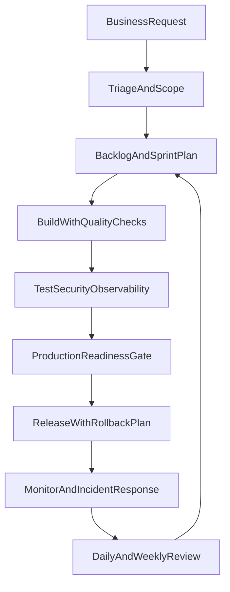

# Solo IT Operating Model

This model is for one-person delivery with enterprise-grade discipline from zero documentation baseline.

## 0) Required artifacts (minimum formalities)
- PRD (requirement document) for each major feature.
- Acceptance criteria per backlog item.
- ADR (architecture decision record) for non-trivial technical decisions.
- Change record for each production deployment.
- Incident record + post-incident actions for production issues.
- Weekly review note + monthly audit note.

## 1) End-to-end workflow

## 2) Daily execution standard
- Start: define top 3 outcomes in `todo/YYYY-MM-DD.md`.
- Execute in 3 focus blocks with WIP limit <= 3.
- Log blockers within 15 minutes of discovery.
- End: done/not-done, carry-forward, tomorrow first task.
- Cadence: Monday-Friday office execution schedule.
- Weekend policy: optional review/catch-up only unless production incident or planned release.

## 3) Production readiness gate (must pass before live)
- Code quality: lint + tests pass in CI.
- Release safety: rollback plan documented and validated.
- Security: secrets not in code, dependencies scanned, vulnerabilities triaged.
- Observability: error tracking, uptime checks, and release annotations enabled.
- Runbook: owner and response steps available for top failure scenarios.
- Staged deployment: validate in staging before production.
- Verification window: 30-60 minutes with explicit go/no-go result.

## 4) DORA baseline metrics
Track each release in a simple table:

| Date | Deployment Frequency | Lead Time for Changes | Change Failure Rate | MTTR | Notes |
|---|---|---|---|---|---|
|  |  |  |  |  |  |

Definitions:
- Deployment Frequency: how often production gets updates.
- Lead Time: commit-to-production elapsed time.
- Change Failure Rate: percent of releases causing incident/hotfix.
- MTTR: average time to restore service after incident.

## 5) Secure development baseline (SSDF-lite)
- Prepare: define security owner, coding standards, and release checklist.
- Protect: manage secrets and access with least privilege.
- Produce: test dependencies and validate input handling.
- Respond: track vulnerabilities and patch deadlines.

## 6) Weekly and monthly cadence

### Weekly review (45-60 min)
- Backlog grooming and reprioritization.
- DORA trend check.
- Blocker root-cause analysis.
- Learning gaps linked to next week tasks.

### Monthly review (90 min)
- Milestone completion status.
- Production reliability summary.
- Security and technical debt review.
- Scope reset for the next month.

## 7) Standard operating procedures (SOP)

### Intake SOP
1. Capture request, business outcome, and deadline.
2. Convert to backlog item with acceptance criteria.
3. Assign priority and milestone.

### Build SOP
1. Pick from backlog only.
2. Implement with tests and evidence.
3. Update status and risk notes continuously.

### Release SOP
1. Complete release checklist and rollback plan.
2. Deploy to staging, verify, then production.
3. Monitor during verification window and record outcome.

### Incident SOP
1. Log incident ID, severity, impact, and start time.
2. Apply fix or rollback fast.
3. Document root cause and prevention action within 24 hours.

## 8) What to do / what not to do

### Do
- Ship in small increments.
- Keep one source of truth (`todo/backlog.md`).
- Make learning output directly support current backlog.

### Do not
- Skip tests to save time.
- Start unplanned tasks without logging backlog delta.
- Keep blocked tasks without escalation owner and next action.
